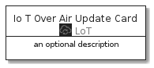
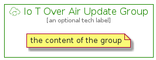

# IoTOverAirUpdate


```text
aws-20210131/Resource/LoT/IoTOverAirUpdate
```

```text
include('aws-20210131/Resource/LoT/IoTOverAirUpdate')
```


| Illustration | IoTOverAirUpdate | IoTOverAirUpdateCard | IoTOverAirUpdateGroup |
| :---: | :---: | :---: | :---: |
|  |  |  |  |


## IoTOverAirUpdate

### Load remotely
```plantuml
@startuml
' configures the library
!global $LIB_BASE_LOCATION="https://github.com/tmorin/plantuml-libs/distribution"

' loads the library's bootstrap
!include $LIB_BASE_LOCATION/bootstrap.puml

' loads the package bootstrap
include('aws-20210131/bootstrap')

' loads the Item which embeds the element IoTOverAirUpdate
include('aws-20210131/Resource/LoT/IoTOverAirUpdate')

' renders the element
IoTOverAirUpdate('IoTOverAirUpdate', 'Io T Over Air Update', 'an optional tech label')
@enduml
```

### Load locally
```plantuml
@startuml
' configures the library
!global $INCLUSION_MODE="local"
!global $LIB_BASE_LOCATION="../../.."

' loads the library's bootstrap
!include $LIB_BASE_LOCATION/bootstrap.puml

' loads the package bootstrap
include('aws-20210131/bootstrap')

' loads the Item which embeds the element IoTOverAirUpdate
include('aws-20210131/Resource/LoT/IoTOverAirUpdate')

' renders the element
IoTOverAirUpdate('IoTOverAirUpdate', 'Io T Over Air Update', 'an optional tech label')
@enduml
```

## IoTOverAirUpdateCard

### Load remotely
```plantuml
@startuml
' configures the library
!global $LIB_BASE_LOCATION="https://github.com/tmorin/plantuml-libs/distribution"

' loads the library's bootstrap
!include $LIB_BASE_LOCATION/bootstrap.puml

' loads the package bootstrap
include('aws-20210131/bootstrap')

' loads the Item which embeds the element IoTOverAirUpdateCard
include('aws-20210131/Resource/LoT/IoTOverAirUpdate')

' renders the element
IoTOverAirUpdateCard('IoTOverAirUpdateCard', 'Io T Over Air Update Card', 'an optional description')
@enduml
```

### Load locally
```plantuml
@startuml
' configures the library
!global $INCLUSION_MODE="local"
!global $LIB_BASE_LOCATION="../../.."

' loads the library's bootstrap
!include $LIB_BASE_LOCATION/bootstrap.puml

' loads the package bootstrap
include('aws-20210131/bootstrap')

' loads the Item which embeds the element IoTOverAirUpdateCard
include('aws-20210131/Resource/LoT/IoTOverAirUpdate')

' renders the element
IoTOverAirUpdateCard('IoTOverAirUpdateCard', 'Io T Over Air Update Card', 'an optional description')
@enduml
```

## IoTOverAirUpdateGroup

### Load remotely
```plantuml
@startuml
' configures the library
!global $LIB_BASE_LOCATION="https://github.com/tmorin/plantuml-libs/distribution"

' loads the library's bootstrap
!include $LIB_BASE_LOCATION/bootstrap.puml

' loads the package bootstrap
include('aws-20210131/bootstrap')

' loads the Item which embeds the element IoTOverAirUpdateGroup
include('aws-20210131/Resource/LoT/IoTOverAirUpdate')

' renders the element
IoTOverAirUpdateGroup('IoTOverAirUpdateGroup', 'Io T Over Air Update Group', 'an optional tech label') {
    note as note
        the content of the group
    end note
}
@enduml
```

### Load locally
```plantuml
@startuml
' configures the library
!global $INCLUSION_MODE="local"
!global $LIB_BASE_LOCATION="../../.."

' loads the library's bootstrap
!include $LIB_BASE_LOCATION/bootstrap.puml

' loads the package bootstrap
include('aws-20210131/bootstrap')

' loads the Item which embeds the element IoTOverAirUpdateGroup
include('aws-20210131/Resource/LoT/IoTOverAirUpdate')

' renders the element
IoTOverAirUpdateGroup('IoTOverAirUpdateGroup', 'Io T Over Air Update Group', 'an optional tech label') {
    note as note
        the content of the group
    end note
}
@enduml
```

