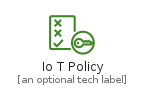
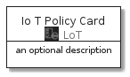
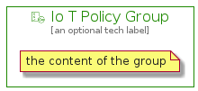

# IoTPolicy


```text
aws-20210131/Resource/LoT/IoTPolicy
```

```text
include('aws-20210131/Resource/LoT/IoTPolicy')
```


| Illustration | IoTPolicy | IoTPolicyCard | IoTPolicyGroup |
| :---: | :---: | :---: | :---: |
|  |  |  |  |


## IoTPolicy

### Load remotely
```plantuml
@startuml
' configures the library
!global $LIB_BASE_LOCATION="https://github.com/tmorin/plantuml-libs/distribution"

' loads the library's bootstrap
!include $LIB_BASE_LOCATION/bootstrap.puml

' loads the package bootstrap
include('aws-20210131/bootstrap')

' loads the Item which embeds the element IoTPolicy
include('aws-20210131/Resource/LoT/IoTPolicy')

' renders the element
IoTPolicy('IoTPolicy', 'Io T Policy', 'an optional tech label')
@enduml
```

### Load locally
```plantuml
@startuml
' configures the library
!global $INCLUSION_MODE="local"
!global $LIB_BASE_LOCATION="../../.."

' loads the library's bootstrap
!include $LIB_BASE_LOCATION/bootstrap.puml

' loads the package bootstrap
include('aws-20210131/bootstrap')

' loads the Item which embeds the element IoTPolicy
include('aws-20210131/Resource/LoT/IoTPolicy')

' renders the element
IoTPolicy('IoTPolicy', 'Io T Policy', 'an optional tech label')
@enduml
```

## IoTPolicyCard

### Load remotely
```plantuml
@startuml
' configures the library
!global $LIB_BASE_LOCATION="https://github.com/tmorin/plantuml-libs/distribution"

' loads the library's bootstrap
!include $LIB_BASE_LOCATION/bootstrap.puml

' loads the package bootstrap
include('aws-20210131/bootstrap')

' loads the Item which embeds the element IoTPolicyCard
include('aws-20210131/Resource/LoT/IoTPolicy')

' renders the element
IoTPolicyCard('IoTPolicyCard', 'Io T Policy Card', 'an optional description')
@enduml
```

### Load locally
```plantuml
@startuml
' configures the library
!global $INCLUSION_MODE="local"
!global $LIB_BASE_LOCATION="../../.."

' loads the library's bootstrap
!include $LIB_BASE_LOCATION/bootstrap.puml

' loads the package bootstrap
include('aws-20210131/bootstrap')

' loads the Item which embeds the element IoTPolicyCard
include('aws-20210131/Resource/LoT/IoTPolicy')

' renders the element
IoTPolicyCard('IoTPolicyCard', 'Io T Policy Card', 'an optional description')
@enduml
```

## IoTPolicyGroup

### Load remotely
```plantuml
@startuml
' configures the library
!global $LIB_BASE_LOCATION="https://github.com/tmorin/plantuml-libs/distribution"

' loads the library's bootstrap
!include $LIB_BASE_LOCATION/bootstrap.puml

' loads the package bootstrap
include('aws-20210131/bootstrap')

' loads the Item which embeds the element IoTPolicyGroup
include('aws-20210131/Resource/LoT/IoTPolicy')

' renders the element
IoTPolicyGroup('IoTPolicyGroup', 'Io T Policy Group', 'an optional tech label') {
    note as note
        the content of the group
    end note
}
@enduml
```

### Load locally
```plantuml
@startuml
' configures the library
!global $INCLUSION_MODE="local"
!global $LIB_BASE_LOCATION="../../.."

' loads the library's bootstrap
!include $LIB_BASE_LOCATION/bootstrap.puml

' loads the package bootstrap
include('aws-20210131/bootstrap')

' loads the Item which embeds the element IoTPolicyGroup
include('aws-20210131/Resource/LoT/IoTPolicy')

' renders the element
IoTPolicyGroup('IoTPolicyGroup', 'Io T Policy Group', 'an optional tech label') {
    note as note
        the content of the group
    end note
}
@enduml
```

