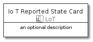
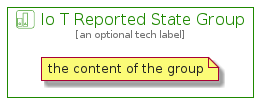

# IoTReportedState


```text
aws-20210131/Resource/LoT/IoTReportedState
```

```text
include('aws-20210131/Resource/LoT/IoTReportedState')
```


| Illustration | IoTReportedState | IoTReportedStateCard | IoTReportedStateGroup |
| :---: | :---: | :---: | :---: |
|  |  |  |  |


## IoTReportedState

### Load remotely
```plantuml
@startuml
' configures the library
!global $LIB_BASE_LOCATION="https://github.com/tmorin/plantuml-libs/distribution"

' loads the library's bootstrap
!include $LIB_BASE_LOCATION/bootstrap.puml

' loads the package bootstrap
include('aws-20210131/bootstrap')

' loads the Item which embeds the element IoTReportedState
include('aws-20210131/Resource/LoT/IoTReportedState')

' renders the element
IoTReportedState('IoTReportedState', 'Io T Reported State', 'an optional tech label')
@enduml
```

### Load locally
```plantuml
@startuml
' configures the library
!global $INCLUSION_MODE="local"
!global $LIB_BASE_LOCATION="../../.."

' loads the library's bootstrap
!include $LIB_BASE_LOCATION/bootstrap.puml

' loads the package bootstrap
include('aws-20210131/bootstrap')

' loads the Item which embeds the element IoTReportedState
include('aws-20210131/Resource/LoT/IoTReportedState')

' renders the element
IoTReportedState('IoTReportedState', 'Io T Reported State', 'an optional tech label')
@enduml
```

## IoTReportedStateCard

### Load remotely
```plantuml
@startuml
' configures the library
!global $LIB_BASE_LOCATION="https://github.com/tmorin/plantuml-libs/distribution"

' loads the library's bootstrap
!include $LIB_BASE_LOCATION/bootstrap.puml

' loads the package bootstrap
include('aws-20210131/bootstrap')

' loads the Item which embeds the element IoTReportedStateCard
include('aws-20210131/Resource/LoT/IoTReportedState')

' renders the element
IoTReportedStateCard('IoTReportedStateCard', 'Io T Reported State Card', 'an optional description')
@enduml
```

### Load locally
```plantuml
@startuml
' configures the library
!global $INCLUSION_MODE="local"
!global $LIB_BASE_LOCATION="../../.."

' loads the library's bootstrap
!include $LIB_BASE_LOCATION/bootstrap.puml

' loads the package bootstrap
include('aws-20210131/bootstrap')

' loads the Item which embeds the element IoTReportedStateCard
include('aws-20210131/Resource/LoT/IoTReportedState')

' renders the element
IoTReportedStateCard('IoTReportedStateCard', 'Io T Reported State Card', 'an optional description')
@enduml
```

## IoTReportedStateGroup

### Load remotely
```plantuml
@startuml
' configures the library
!global $LIB_BASE_LOCATION="https://github.com/tmorin/plantuml-libs/distribution"

' loads the library's bootstrap
!include $LIB_BASE_LOCATION/bootstrap.puml

' loads the package bootstrap
include('aws-20210131/bootstrap')

' loads the Item which embeds the element IoTReportedStateGroup
include('aws-20210131/Resource/LoT/IoTReportedState')

' renders the element
IoTReportedStateGroup('IoTReportedStateGroup', 'Io T Reported State Group', 'an optional tech label') {
    note as note
        the content of the group
    end note
}
@enduml
```

### Load locally
```plantuml
@startuml
' configures the library
!global $INCLUSION_MODE="local"
!global $LIB_BASE_LOCATION="../../.."

' loads the library's bootstrap
!include $LIB_BASE_LOCATION/bootstrap.puml

' loads the package bootstrap
include('aws-20210131/bootstrap')

' loads the Item which embeds the element IoTReportedStateGroup
include('aws-20210131/Resource/LoT/IoTReportedState')

' renders the element
IoTReportedStateGroup('IoTReportedStateGroup', 'Io T Reported State Group', 'an optional tech label') {
    note as note
        the content of the group
    end note
}
@enduml
```

