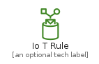
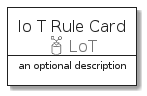
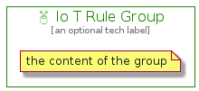

# IoTRule


```text
aws-20210131/Resource/LoT/IoTRule
```

```text
include('aws-20210131/Resource/LoT/IoTRule')
```


| Illustration | IoTRule | IoTRuleCard | IoTRuleGroup |
| :---: | :---: | :---: | :---: |
|  |  |  |  |


## IoTRule

### Load remotely
```plantuml
@startuml
' configures the library
!global $LIB_BASE_LOCATION="https://github.com/tmorin/plantuml-libs/distribution"

' loads the library's bootstrap
!include $LIB_BASE_LOCATION/bootstrap.puml

' loads the package bootstrap
include('aws-20210131/bootstrap')

' loads the Item which embeds the element IoTRule
include('aws-20210131/Resource/LoT/IoTRule')

' renders the element
IoTRule('IoTRule', 'Io T Rule', 'an optional tech label')
@enduml
```

### Load locally
```plantuml
@startuml
' configures the library
!global $INCLUSION_MODE="local"
!global $LIB_BASE_LOCATION="../../.."

' loads the library's bootstrap
!include $LIB_BASE_LOCATION/bootstrap.puml

' loads the package bootstrap
include('aws-20210131/bootstrap')

' loads the Item which embeds the element IoTRule
include('aws-20210131/Resource/LoT/IoTRule')

' renders the element
IoTRule('IoTRule', 'Io T Rule', 'an optional tech label')
@enduml
```

## IoTRuleCard

### Load remotely
```plantuml
@startuml
' configures the library
!global $LIB_BASE_LOCATION="https://github.com/tmorin/plantuml-libs/distribution"

' loads the library's bootstrap
!include $LIB_BASE_LOCATION/bootstrap.puml

' loads the package bootstrap
include('aws-20210131/bootstrap')

' loads the Item which embeds the element IoTRuleCard
include('aws-20210131/Resource/LoT/IoTRule')

' renders the element
IoTRuleCard('IoTRuleCard', 'Io T Rule Card', 'an optional description')
@enduml
```

### Load locally
```plantuml
@startuml
' configures the library
!global $INCLUSION_MODE="local"
!global $LIB_BASE_LOCATION="../../.."

' loads the library's bootstrap
!include $LIB_BASE_LOCATION/bootstrap.puml

' loads the package bootstrap
include('aws-20210131/bootstrap')

' loads the Item which embeds the element IoTRuleCard
include('aws-20210131/Resource/LoT/IoTRule')

' renders the element
IoTRuleCard('IoTRuleCard', 'Io T Rule Card', 'an optional description')
@enduml
```

## IoTRuleGroup

### Load remotely
```plantuml
@startuml
' configures the library
!global $LIB_BASE_LOCATION="https://github.com/tmorin/plantuml-libs/distribution"

' loads the library's bootstrap
!include $LIB_BASE_LOCATION/bootstrap.puml

' loads the package bootstrap
include('aws-20210131/bootstrap')

' loads the Item which embeds the element IoTRuleGroup
include('aws-20210131/Resource/LoT/IoTRule')

' renders the element
IoTRuleGroup('IoTRuleGroup', 'Io T Rule Group', 'an optional tech label') {
    note as note
        the content of the group
    end note
}
@enduml
```

### Load locally
```plantuml
@startuml
' configures the library
!global $INCLUSION_MODE="local"
!global $LIB_BASE_LOCATION="../../.."

' loads the library's bootstrap
!include $LIB_BASE_LOCATION/bootstrap.puml

' loads the package bootstrap
include('aws-20210131/bootstrap')

' loads the Item which embeds the element IoTRuleGroup
include('aws-20210131/Resource/LoT/IoTRule')

' renders the element
IoTRuleGroup('IoTRuleGroup', 'Io T Rule Group', 'an optional tech label') {
    note as note
        the content of the group
    end note
}
@enduml
```

