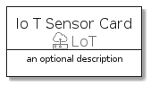
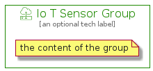

# IoTSensor


```text
aws-20210131/Resource/LoT/IoTSensor
```

```text
include('aws-20210131/Resource/LoT/IoTSensor')
```


| Illustration | IoTSensor | IoTSensorCard | IoTSensorGroup |
| :---: | :---: | :---: | :---: |
|  |  |  |  |


## IoTSensor

### Load remotely
```plantuml
@startuml
' configures the library
!global $LIB_BASE_LOCATION="https://github.com/tmorin/plantuml-libs/distribution"

' loads the library's bootstrap
!include $LIB_BASE_LOCATION/bootstrap.puml

' loads the package bootstrap
include('aws-20210131/bootstrap')

' loads the Item which embeds the element IoTSensor
include('aws-20210131/Resource/LoT/IoTSensor')

' renders the element
IoTSensor('IoTSensor', 'Io T Sensor', 'an optional tech label')
@enduml
```

### Load locally
```plantuml
@startuml
' configures the library
!global $INCLUSION_MODE="local"
!global $LIB_BASE_LOCATION="../../.."

' loads the library's bootstrap
!include $LIB_BASE_LOCATION/bootstrap.puml

' loads the package bootstrap
include('aws-20210131/bootstrap')

' loads the Item which embeds the element IoTSensor
include('aws-20210131/Resource/LoT/IoTSensor')

' renders the element
IoTSensor('IoTSensor', 'Io T Sensor', 'an optional tech label')
@enduml
```

## IoTSensorCard

### Load remotely
```plantuml
@startuml
' configures the library
!global $LIB_BASE_LOCATION="https://github.com/tmorin/plantuml-libs/distribution"

' loads the library's bootstrap
!include $LIB_BASE_LOCATION/bootstrap.puml

' loads the package bootstrap
include('aws-20210131/bootstrap')

' loads the Item which embeds the element IoTSensorCard
include('aws-20210131/Resource/LoT/IoTSensor')

' renders the element
IoTSensorCard('IoTSensorCard', 'Io T Sensor Card', 'an optional description')
@enduml
```

### Load locally
```plantuml
@startuml
' configures the library
!global $INCLUSION_MODE="local"
!global $LIB_BASE_LOCATION="../../.."

' loads the library's bootstrap
!include $LIB_BASE_LOCATION/bootstrap.puml

' loads the package bootstrap
include('aws-20210131/bootstrap')

' loads the Item which embeds the element IoTSensorCard
include('aws-20210131/Resource/LoT/IoTSensor')

' renders the element
IoTSensorCard('IoTSensorCard', 'Io T Sensor Card', 'an optional description')
@enduml
```

## IoTSensorGroup

### Load remotely
```plantuml
@startuml
' configures the library
!global $LIB_BASE_LOCATION="https://github.com/tmorin/plantuml-libs/distribution"

' loads the library's bootstrap
!include $LIB_BASE_LOCATION/bootstrap.puml

' loads the package bootstrap
include('aws-20210131/bootstrap')

' loads the Item which embeds the element IoTSensorGroup
include('aws-20210131/Resource/LoT/IoTSensor')

' renders the element
IoTSensorGroup('IoTSensorGroup', 'Io T Sensor Group', 'an optional tech label') {
    note as note
        the content of the group
    end note
}
@enduml
```

### Load locally
```plantuml
@startuml
' configures the library
!global $INCLUSION_MODE="local"
!global $LIB_BASE_LOCATION="../../.."

' loads the library's bootstrap
!include $LIB_BASE_LOCATION/bootstrap.puml

' loads the package bootstrap
include('aws-20210131/bootstrap')

' loads the Item which embeds the element IoTSensorGroup
include('aws-20210131/Resource/LoT/IoTSensor')

' renders the element
IoTSensorGroup('IoTSensorGroup', 'Io T Sensor Group', 'an optional tech label') {
    note as note
        the content of the group
    end note
}
@enduml
```

