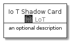
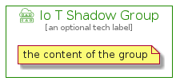

# IoTShadow


```text
aws-20210131/Resource/LoT/IoTShadow
```

```text
include('aws-20210131/Resource/LoT/IoTShadow')
```


| Illustration | IoTShadow | IoTShadowCard | IoTShadowGroup |
| :---: | :---: | :---: | :---: |
|  |  |  |  |


## IoTShadow

### Load remotely
```plantuml
@startuml
' configures the library
!global $LIB_BASE_LOCATION="https://github.com/tmorin/plantuml-libs/distribution"

' loads the library's bootstrap
!include $LIB_BASE_LOCATION/bootstrap.puml

' loads the package bootstrap
include('aws-20210131/bootstrap')

' loads the Item which embeds the element IoTShadow
include('aws-20210131/Resource/LoT/IoTShadow')

' renders the element
IoTShadow('IoTShadow', 'Io T Shadow', 'an optional tech label')
@enduml
```

### Load locally
```plantuml
@startuml
' configures the library
!global $INCLUSION_MODE="local"
!global $LIB_BASE_LOCATION="../../.."

' loads the library's bootstrap
!include $LIB_BASE_LOCATION/bootstrap.puml

' loads the package bootstrap
include('aws-20210131/bootstrap')

' loads the Item which embeds the element IoTShadow
include('aws-20210131/Resource/LoT/IoTShadow')

' renders the element
IoTShadow('IoTShadow', 'Io T Shadow', 'an optional tech label')
@enduml
```

## IoTShadowCard

### Load remotely
```plantuml
@startuml
' configures the library
!global $LIB_BASE_LOCATION="https://github.com/tmorin/plantuml-libs/distribution"

' loads the library's bootstrap
!include $LIB_BASE_LOCATION/bootstrap.puml

' loads the package bootstrap
include('aws-20210131/bootstrap')

' loads the Item which embeds the element IoTShadowCard
include('aws-20210131/Resource/LoT/IoTShadow')

' renders the element
IoTShadowCard('IoTShadowCard', 'Io T Shadow Card', 'an optional description')
@enduml
```

### Load locally
```plantuml
@startuml
' configures the library
!global $INCLUSION_MODE="local"
!global $LIB_BASE_LOCATION="../../.."

' loads the library's bootstrap
!include $LIB_BASE_LOCATION/bootstrap.puml

' loads the package bootstrap
include('aws-20210131/bootstrap')

' loads the Item which embeds the element IoTShadowCard
include('aws-20210131/Resource/LoT/IoTShadow')

' renders the element
IoTShadowCard('IoTShadowCard', 'Io T Shadow Card', 'an optional description')
@enduml
```

## IoTShadowGroup

### Load remotely
```plantuml
@startuml
' configures the library
!global $LIB_BASE_LOCATION="https://github.com/tmorin/plantuml-libs/distribution"

' loads the library's bootstrap
!include $LIB_BASE_LOCATION/bootstrap.puml

' loads the package bootstrap
include('aws-20210131/bootstrap')

' loads the Item which embeds the element IoTShadowGroup
include('aws-20210131/Resource/LoT/IoTShadow')

' renders the element
IoTShadowGroup('IoTShadowGroup', 'Io T Shadow Group', 'an optional tech label') {
    note as note
        the content of the group
    end note
}
@enduml
```

### Load locally
```plantuml
@startuml
' configures the library
!global $INCLUSION_MODE="local"
!global $LIB_BASE_LOCATION="../../.."

' loads the library's bootstrap
!include $LIB_BASE_LOCATION/bootstrap.puml

' loads the package bootstrap
include('aws-20210131/bootstrap')

' loads the Item which embeds the element IoTShadowGroup
include('aws-20210131/Resource/LoT/IoTShadow')

' renders the element
IoTShadowGroup('IoTShadowGroup', 'Io T Shadow Group', 'an optional tech label') {
    note as note
        the content of the group
    end note
}
@enduml
```

