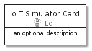
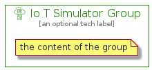

# IoTSimulator


```text
aws-20210131/Resource/LoT/IoTSimulator
```

```text
include('aws-20210131/Resource/LoT/IoTSimulator')
```


| Illustration | IoTSimulator | IoTSimulatorCard | IoTSimulatorGroup |
| :---: | :---: | :---: | :---: |
|  |  |  |  |


## IoTSimulator

### Load remotely
```plantuml
@startuml
' configures the library
!global $LIB_BASE_LOCATION="https://github.com/tmorin/plantuml-libs/distribution"

' loads the library's bootstrap
!include $LIB_BASE_LOCATION/bootstrap.puml

' loads the package bootstrap
include('aws-20210131/bootstrap')

' loads the Item which embeds the element IoTSimulator
include('aws-20210131/Resource/LoT/IoTSimulator')

' renders the element
IoTSimulator('IoTSimulator', 'Io T Simulator', 'an optional tech label')
@enduml
```

### Load locally
```plantuml
@startuml
' configures the library
!global $INCLUSION_MODE="local"
!global $LIB_BASE_LOCATION="../../.."

' loads the library's bootstrap
!include $LIB_BASE_LOCATION/bootstrap.puml

' loads the package bootstrap
include('aws-20210131/bootstrap')

' loads the Item which embeds the element IoTSimulator
include('aws-20210131/Resource/LoT/IoTSimulator')

' renders the element
IoTSimulator('IoTSimulator', 'Io T Simulator', 'an optional tech label')
@enduml
```

## IoTSimulatorCard

### Load remotely
```plantuml
@startuml
' configures the library
!global $LIB_BASE_LOCATION="https://github.com/tmorin/plantuml-libs/distribution"

' loads the library's bootstrap
!include $LIB_BASE_LOCATION/bootstrap.puml

' loads the package bootstrap
include('aws-20210131/bootstrap')

' loads the Item which embeds the element IoTSimulatorCard
include('aws-20210131/Resource/LoT/IoTSimulator')

' renders the element
IoTSimulatorCard('IoTSimulatorCard', 'Io T Simulator Card', 'an optional description')
@enduml
```

### Load locally
```plantuml
@startuml
' configures the library
!global $INCLUSION_MODE="local"
!global $LIB_BASE_LOCATION="../../.."

' loads the library's bootstrap
!include $LIB_BASE_LOCATION/bootstrap.puml

' loads the package bootstrap
include('aws-20210131/bootstrap')

' loads the Item which embeds the element IoTSimulatorCard
include('aws-20210131/Resource/LoT/IoTSimulator')

' renders the element
IoTSimulatorCard('IoTSimulatorCard', 'Io T Simulator Card', 'an optional description')
@enduml
```

## IoTSimulatorGroup

### Load remotely
```plantuml
@startuml
' configures the library
!global $LIB_BASE_LOCATION="https://github.com/tmorin/plantuml-libs/distribution"

' loads the library's bootstrap
!include $LIB_BASE_LOCATION/bootstrap.puml

' loads the package bootstrap
include('aws-20210131/bootstrap')

' loads the Item which embeds the element IoTSimulatorGroup
include('aws-20210131/Resource/LoT/IoTSimulator')

' renders the element
IoTSimulatorGroup('IoTSimulatorGroup', 'Io T Simulator Group', 'an optional tech label') {
    note as note
        the content of the group
    end note
}
@enduml
```

### Load locally
```plantuml
@startuml
' configures the library
!global $INCLUSION_MODE="local"
!global $LIB_BASE_LOCATION="../../.."

' loads the library's bootstrap
!include $LIB_BASE_LOCATION/bootstrap.puml

' loads the package bootstrap
include('aws-20210131/bootstrap')

' loads the Item which embeds the element IoTSimulatorGroup
include('aws-20210131/Resource/LoT/IoTSimulator')

' renders the element
IoTSimulatorGroup('IoTSimulatorGroup', 'Io T Simulator Group', 'an optional tech label') {
    note as note
        the content of the group
    end note
}
@enduml
```

