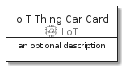
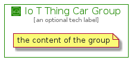

# IoTThingCar


```text
aws-20210131/Resource/LoT/IoTThingCar
```

```text
include('aws-20210131/Resource/LoT/IoTThingCar')
```


| Illustration | IoTThingCar | IoTThingCarCard | IoTThingCarGroup |
| :---: | :---: | :---: | :---: |
|  |  |  |  |


## IoTThingCar

### Load remotely
```plantuml
@startuml
' configures the library
!global $LIB_BASE_LOCATION="https://github.com/tmorin/plantuml-libs/distribution"

' loads the library's bootstrap
!include $LIB_BASE_LOCATION/bootstrap.puml

' loads the package bootstrap
include('aws-20210131/bootstrap')

' loads the Item which embeds the element IoTThingCar
include('aws-20210131/Resource/LoT/IoTThingCar')

' renders the element
IoTThingCar('IoTThingCar', 'Io T Thing Car', 'an optional tech label')
@enduml
```

### Load locally
```plantuml
@startuml
' configures the library
!global $INCLUSION_MODE="local"
!global $LIB_BASE_LOCATION="../../.."

' loads the library's bootstrap
!include $LIB_BASE_LOCATION/bootstrap.puml

' loads the package bootstrap
include('aws-20210131/bootstrap')

' loads the Item which embeds the element IoTThingCar
include('aws-20210131/Resource/LoT/IoTThingCar')

' renders the element
IoTThingCar('IoTThingCar', 'Io T Thing Car', 'an optional tech label')
@enduml
```

## IoTThingCarCard

### Load remotely
```plantuml
@startuml
' configures the library
!global $LIB_BASE_LOCATION="https://github.com/tmorin/plantuml-libs/distribution"

' loads the library's bootstrap
!include $LIB_BASE_LOCATION/bootstrap.puml

' loads the package bootstrap
include('aws-20210131/bootstrap')

' loads the Item which embeds the element IoTThingCarCard
include('aws-20210131/Resource/LoT/IoTThingCar')

' renders the element
IoTThingCarCard('IoTThingCarCard', 'Io T Thing Car Card', 'an optional description')
@enduml
```

### Load locally
```plantuml
@startuml
' configures the library
!global $INCLUSION_MODE="local"
!global $LIB_BASE_LOCATION="../../.."

' loads the library's bootstrap
!include $LIB_BASE_LOCATION/bootstrap.puml

' loads the package bootstrap
include('aws-20210131/bootstrap')

' loads the Item which embeds the element IoTThingCarCard
include('aws-20210131/Resource/LoT/IoTThingCar')

' renders the element
IoTThingCarCard('IoTThingCarCard', 'Io T Thing Car Card', 'an optional description')
@enduml
```

## IoTThingCarGroup

### Load remotely
```plantuml
@startuml
' configures the library
!global $LIB_BASE_LOCATION="https://github.com/tmorin/plantuml-libs/distribution"

' loads the library's bootstrap
!include $LIB_BASE_LOCATION/bootstrap.puml

' loads the package bootstrap
include('aws-20210131/bootstrap')

' loads the Item which embeds the element IoTThingCarGroup
include('aws-20210131/Resource/LoT/IoTThingCar')

' renders the element
IoTThingCarGroup('IoTThingCarGroup', 'Io T Thing Car Group', 'an optional tech label') {
    note as note
        the content of the group
    end note
}
@enduml
```

### Load locally
```plantuml
@startuml
' configures the library
!global $INCLUSION_MODE="local"
!global $LIB_BASE_LOCATION="../../.."

' loads the library's bootstrap
!include $LIB_BASE_LOCATION/bootstrap.puml

' loads the package bootstrap
include('aws-20210131/bootstrap')

' loads the Item which embeds the element IoTThingCarGroup
include('aws-20210131/Resource/LoT/IoTThingCar')

' renders the element
IoTThingCarGroup('IoTThingCarGroup', 'Io T Thing Car Group', 'an optional tech label') {
    note as note
        the content of the group
    end note
}
@enduml
```

