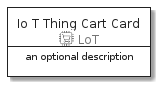
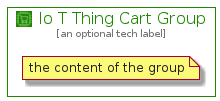

# IoTThingCart


```text
aws-20210131/Resource/LoT/IoTThingCart
```

```text
include('aws-20210131/Resource/LoT/IoTThingCart')
```


| Illustration | IoTThingCart | IoTThingCartCard | IoTThingCartGroup |
| :---: | :---: | :---: | :---: |
|  |  |  |  |


## IoTThingCart

### Load remotely
```plantuml
@startuml
' configures the library
!global $LIB_BASE_LOCATION="https://github.com/tmorin/plantuml-libs/distribution"

' loads the library's bootstrap
!include $LIB_BASE_LOCATION/bootstrap.puml

' loads the package bootstrap
include('aws-20210131/bootstrap')

' loads the Item which embeds the element IoTThingCart
include('aws-20210131/Resource/LoT/IoTThingCart')

' renders the element
IoTThingCart('IoTThingCart', 'Io T Thing Cart', 'an optional tech label')
@enduml
```

### Load locally
```plantuml
@startuml
' configures the library
!global $INCLUSION_MODE="local"
!global $LIB_BASE_LOCATION="../../.."

' loads the library's bootstrap
!include $LIB_BASE_LOCATION/bootstrap.puml

' loads the package bootstrap
include('aws-20210131/bootstrap')

' loads the Item which embeds the element IoTThingCart
include('aws-20210131/Resource/LoT/IoTThingCart')

' renders the element
IoTThingCart('IoTThingCart', 'Io T Thing Cart', 'an optional tech label')
@enduml
```

## IoTThingCartCard

### Load remotely
```plantuml
@startuml
' configures the library
!global $LIB_BASE_LOCATION="https://github.com/tmorin/plantuml-libs/distribution"

' loads the library's bootstrap
!include $LIB_BASE_LOCATION/bootstrap.puml

' loads the package bootstrap
include('aws-20210131/bootstrap')

' loads the Item which embeds the element IoTThingCartCard
include('aws-20210131/Resource/LoT/IoTThingCart')

' renders the element
IoTThingCartCard('IoTThingCartCard', 'Io T Thing Cart Card', 'an optional description')
@enduml
```

### Load locally
```plantuml
@startuml
' configures the library
!global $INCLUSION_MODE="local"
!global $LIB_BASE_LOCATION="../../.."

' loads the library's bootstrap
!include $LIB_BASE_LOCATION/bootstrap.puml

' loads the package bootstrap
include('aws-20210131/bootstrap')

' loads the Item which embeds the element IoTThingCartCard
include('aws-20210131/Resource/LoT/IoTThingCart')

' renders the element
IoTThingCartCard('IoTThingCartCard', 'Io T Thing Cart Card', 'an optional description')
@enduml
```

## IoTThingCartGroup

### Load remotely
```plantuml
@startuml
' configures the library
!global $LIB_BASE_LOCATION="https://github.com/tmorin/plantuml-libs/distribution"

' loads the library's bootstrap
!include $LIB_BASE_LOCATION/bootstrap.puml

' loads the package bootstrap
include('aws-20210131/bootstrap')

' loads the Item which embeds the element IoTThingCartGroup
include('aws-20210131/Resource/LoT/IoTThingCart')

' renders the element
IoTThingCartGroup('IoTThingCartGroup', 'Io T Thing Cart Group', 'an optional tech label') {
    note as note
        the content of the group
    end note
}
@enduml
```

### Load locally
```plantuml
@startuml
' configures the library
!global $INCLUSION_MODE="local"
!global $LIB_BASE_LOCATION="../../.."

' loads the library's bootstrap
!include $LIB_BASE_LOCATION/bootstrap.puml

' loads the package bootstrap
include('aws-20210131/bootstrap')

' loads the Item which embeds the element IoTThingCartGroup
include('aws-20210131/Resource/LoT/IoTThingCart')

' renders the element
IoTThingCartGroup('IoTThingCartGroup', 'Io T Thing Cart Group', 'an optional tech label') {
    note as note
        the content of the group
    end note
}
@enduml
```

