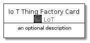
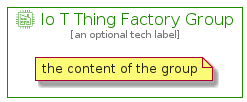

# IoTThingFactory


```text
aws-20210131/Resource/LoT/IoTThingFactory
```

```text
include('aws-20210131/Resource/LoT/IoTThingFactory')
```


| Illustration | IoTThingFactory | IoTThingFactoryCard | IoTThingFactoryGroup |
| :---: | :---: | :---: | :---: |
|  |  |  |  |


## IoTThingFactory

### Load remotely
```plantuml
@startuml
' configures the library
!global $LIB_BASE_LOCATION="https://github.com/tmorin/plantuml-libs/distribution"

' loads the library's bootstrap
!include $LIB_BASE_LOCATION/bootstrap.puml

' loads the package bootstrap
include('aws-20210131/bootstrap')

' loads the Item which embeds the element IoTThingFactory
include('aws-20210131/Resource/LoT/IoTThingFactory')

' renders the element
IoTThingFactory('IoTThingFactory', 'Io T Thing Factory', 'an optional tech label')
@enduml
```

### Load locally
```plantuml
@startuml
' configures the library
!global $INCLUSION_MODE="local"
!global $LIB_BASE_LOCATION="../../.."

' loads the library's bootstrap
!include $LIB_BASE_LOCATION/bootstrap.puml

' loads the package bootstrap
include('aws-20210131/bootstrap')

' loads the Item which embeds the element IoTThingFactory
include('aws-20210131/Resource/LoT/IoTThingFactory')

' renders the element
IoTThingFactory('IoTThingFactory', 'Io T Thing Factory', 'an optional tech label')
@enduml
```

## IoTThingFactoryCard

### Load remotely
```plantuml
@startuml
' configures the library
!global $LIB_BASE_LOCATION="https://github.com/tmorin/plantuml-libs/distribution"

' loads the library's bootstrap
!include $LIB_BASE_LOCATION/bootstrap.puml

' loads the package bootstrap
include('aws-20210131/bootstrap')

' loads the Item which embeds the element IoTThingFactoryCard
include('aws-20210131/Resource/LoT/IoTThingFactory')

' renders the element
IoTThingFactoryCard('IoTThingFactoryCard', 'Io T Thing Factory Card', 'an optional description')
@enduml
```

### Load locally
```plantuml
@startuml
' configures the library
!global $INCLUSION_MODE="local"
!global $LIB_BASE_LOCATION="../../.."

' loads the library's bootstrap
!include $LIB_BASE_LOCATION/bootstrap.puml

' loads the package bootstrap
include('aws-20210131/bootstrap')

' loads the Item which embeds the element IoTThingFactoryCard
include('aws-20210131/Resource/LoT/IoTThingFactory')

' renders the element
IoTThingFactoryCard('IoTThingFactoryCard', 'Io T Thing Factory Card', 'an optional description')
@enduml
```

## IoTThingFactoryGroup

### Load remotely
```plantuml
@startuml
' configures the library
!global $LIB_BASE_LOCATION="https://github.com/tmorin/plantuml-libs/distribution"

' loads the library's bootstrap
!include $LIB_BASE_LOCATION/bootstrap.puml

' loads the package bootstrap
include('aws-20210131/bootstrap')

' loads the Item which embeds the element IoTThingFactoryGroup
include('aws-20210131/Resource/LoT/IoTThingFactory')

' renders the element
IoTThingFactoryGroup('IoTThingFactoryGroup', 'Io T Thing Factory Group', 'an optional tech label') {
    note as note
        the content of the group
    end note
}
@enduml
```

### Load locally
```plantuml
@startuml
' configures the library
!global $INCLUSION_MODE="local"
!global $LIB_BASE_LOCATION="../../.."

' loads the library's bootstrap
!include $LIB_BASE_LOCATION/bootstrap.puml

' loads the package bootstrap
include('aws-20210131/bootstrap')

' loads the Item which embeds the element IoTThingFactoryGroup
include('aws-20210131/Resource/LoT/IoTThingFactory')

' renders the element
IoTThingFactoryGroup('IoTThingFactoryGroup', 'Io T Thing Factory Group', 'an optional tech label') {
    note as note
        the content of the group
    end note
}
@enduml
```

