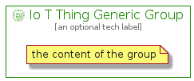

# IoTThingGeneric


```text
aws-20210131/Resource/LoT/IoTThingGeneric
```

```text
include('aws-20210131/Resource/LoT/IoTThingGeneric')
```


| Illustration | IoTThingGeneric | IoTThingGenericCard | IoTThingGenericGroup |
| :---: | :---: | :---: | :---: |
|  |  |  |  |


## IoTThingGeneric

### Load remotely
```plantuml
@startuml
' configures the library
!global $LIB_BASE_LOCATION="https://github.com/tmorin/plantuml-libs/distribution"

' loads the library's bootstrap
!include $LIB_BASE_LOCATION/bootstrap.puml

' loads the package bootstrap
include('aws-20210131/bootstrap')

' loads the Item which embeds the element IoTThingGeneric
include('aws-20210131/Resource/LoT/IoTThingGeneric')

' renders the element
IoTThingGeneric('IoTThingGeneric', 'Io T Thing Generic', 'an optional tech label')
@enduml
```

### Load locally
```plantuml
@startuml
' configures the library
!global $INCLUSION_MODE="local"
!global $LIB_BASE_LOCATION="../../.."

' loads the library's bootstrap
!include $LIB_BASE_LOCATION/bootstrap.puml

' loads the package bootstrap
include('aws-20210131/bootstrap')

' loads the Item which embeds the element IoTThingGeneric
include('aws-20210131/Resource/LoT/IoTThingGeneric')

' renders the element
IoTThingGeneric('IoTThingGeneric', 'Io T Thing Generic', 'an optional tech label')
@enduml
```

## IoTThingGenericCard

### Load remotely
```plantuml
@startuml
' configures the library
!global $LIB_BASE_LOCATION="https://github.com/tmorin/plantuml-libs/distribution"

' loads the library's bootstrap
!include $LIB_BASE_LOCATION/bootstrap.puml

' loads the package bootstrap
include('aws-20210131/bootstrap')

' loads the Item which embeds the element IoTThingGenericCard
include('aws-20210131/Resource/LoT/IoTThingGeneric')

' renders the element
IoTThingGenericCard('IoTThingGenericCard', 'Io T Thing Generic Card', 'an optional description')
@enduml
```

### Load locally
```plantuml
@startuml
' configures the library
!global $INCLUSION_MODE="local"
!global $LIB_BASE_LOCATION="../../.."

' loads the library's bootstrap
!include $LIB_BASE_LOCATION/bootstrap.puml

' loads the package bootstrap
include('aws-20210131/bootstrap')

' loads the Item which embeds the element IoTThingGenericCard
include('aws-20210131/Resource/LoT/IoTThingGeneric')

' renders the element
IoTThingGenericCard('IoTThingGenericCard', 'Io T Thing Generic Card', 'an optional description')
@enduml
```

## IoTThingGenericGroup

### Load remotely
```plantuml
@startuml
' configures the library
!global $LIB_BASE_LOCATION="https://github.com/tmorin/plantuml-libs/distribution"

' loads the library's bootstrap
!include $LIB_BASE_LOCATION/bootstrap.puml

' loads the package bootstrap
include('aws-20210131/bootstrap')

' loads the Item which embeds the element IoTThingGenericGroup
include('aws-20210131/Resource/LoT/IoTThingGeneric')

' renders the element
IoTThingGenericGroup('IoTThingGenericGroup', 'Io T Thing Generic Group', 'an optional tech label') {
    note as note
        the content of the group
    end note
}
@enduml
```

### Load locally
```plantuml
@startuml
' configures the library
!global $INCLUSION_MODE="local"
!global $LIB_BASE_LOCATION="../../.."

' loads the library's bootstrap
!include $LIB_BASE_LOCATION/bootstrap.puml

' loads the package bootstrap
include('aws-20210131/bootstrap')

' loads the Item which embeds the element IoTThingGenericGroup
include('aws-20210131/Resource/LoT/IoTThingGeneric')

' renders the element
IoTThingGenericGroup('IoTThingGenericGroup', 'Io T Thing Generic Group', 'an optional tech label') {
    note as note
        the content of the group
    end note
}
@enduml
```

