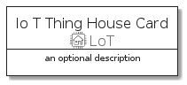
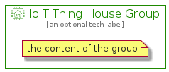

# IoTThingHouse


```text
aws-20210131/Resource/LoT/IoTThingHouse
```

```text
include('aws-20210131/Resource/LoT/IoTThingHouse')
```


| Illustration | IoTThingHouse | IoTThingHouseCard | IoTThingHouseGroup |
| :---: | :---: | :---: | :---: |
|  |  |  |  |


## IoTThingHouse

### Load remotely
```plantuml
@startuml
' configures the library
!global $LIB_BASE_LOCATION="https://github.com/tmorin/plantuml-libs/distribution"

' loads the library's bootstrap
!include $LIB_BASE_LOCATION/bootstrap.puml

' loads the package bootstrap
include('aws-20210131/bootstrap')

' loads the Item which embeds the element IoTThingHouse
include('aws-20210131/Resource/LoT/IoTThingHouse')

' renders the element
IoTThingHouse('IoTThingHouse', 'Io T Thing House', 'an optional tech label')
@enduml
```

### Load locally
```plantuml
@startuml
' configures the library
!global $INCLUSION_MODE="local"
!global $LIB_BASE_LOCATION="../../.."

' loads the library's bootstrap
!include $LIB_BASE_LOCATION/bootstrap.puml

' loads the package bootstrap
include('aws-20210131/bootstrap')

' loads the Item which embeds the element IoTThingHouse
include('aws-20210131/Resource/LoT/IoTThingHouse')

' renders the element
IoTThingHouse('IoTThingHouse', 'Io T Thing House', 'an optional tech label')
@enduml
```

## IoTThingHouseCard

### Load remotely
```plantuml
@startuml
' configures the library
!global $LIB_BASE_LOCATION="https://github.com/tmorin/plantuml-libs/distribution"

' loads the library's bootstrap
!include $LIB_BASE_LOCATION/bootstrap.puml

' loads the package bootstrap
include('aws-20210131/bootstrap')

' loads the Item which embeds the element IoTThingHouseCard
include('aws-20210131/Resource/LoT/IoTThingHouse')

' renders the element
IoTThingHouseCard('IoTThingHouseCard', 'Io T Thing House Card', 'an optional description')
@enduml
```

### Load locally
```plantuml
@startuml
' configures the library
!global $INCLUSION_MODE="local"
!global $LIB_BASE_LOCATION="../../.."

' loads the library's bootstrap
!include $LIB_BASE_LOCATION/bootstrap.puml

' loads the package bootstrap
include('aws-20210131/bootstrap')

' loads the Item which embeds the element IoTThingHouseCard
include('aws-20210131/Resource/LoT/IoTThingHouse')

' renders the element
IoTThingHouseCard('IoTThingHouseCard', 'Io T Thing House Card', 'an optional description')
@enduml
```

## IoTThingHouseGroup

### Load remotely
```plantuml
@startuml
' configures the library
!global $LIB_BASE_LOCATION="https://github.com/tmorin/plantuml-libs/distribution"

' loads the library's bootstrap
!include $LIB_BASE_LOCATION/bootstrap.puml

' loads the package bootstrap
include('aws-20210131/bootstrap')

' loads the Item which embeds the element IoTThingHouseGroup
include('aws-20210131/Resource/LoT/IoTThingHouse')

' renders the element
IoTThingHouseGroup('IoTThingHouseGroup', 'Io T Thing House Group', 'an optional tech label') {
    note as note
        the content of the group
    end note
}
@enduml
```

### Load locally
```plantuml
@startuml
' configures the library
!global $INCLUSION_MODE="local"
!global $LIB_BASE_LOCATION="../../.."

' loads the library's bootstrap
!include $LIB_BASE_LOCATION/bootstrap.puml

' loads the package bootstrap
include('aws-20210131/bootstrap')

' loads the Item which embeds the element IoTThingHouseGroup
include('aws-20210131/Resource/LoT/IoTThingHouse')

' renders the element
IoTThingHouseGroup('IoTThingHouseGroup', 'Io T Thing House Group', 'an optional tech label') {
    note as note
        the content of the group
    end note
}
@enduml
```

