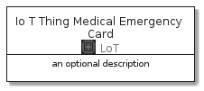
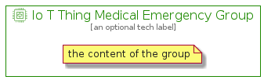

# IoTThingMedicalEmergency


```text
aws-20210131/Resource/LoT/IoTThingMedicalEmergency
```

```text
include('aws-20210131/Resource/LoT/IoTThingMedicalEmergency')
```


| Illustration | IoTThingMedicalEmergency | IoTThingMedicalEmergencyCard | IoTThingMedicalEmergencyGroup |
| :---: | :---: | :---: | :---: |
|  |  |  |  |


## IoTThingMedicalEmergency

### Load remotely
```plantuml
@startuml
' configures the library
!global $LIB_BASE_LOCATION="https://github.com/tmorin/plantuml-libs/distribution"

' loads the library's bootstrap
!include $LIB_BASE_LOCATION/bootstrap.puml

' loads the package bootstrap
include('aws-20210131/bootstrap')

' loads the Item which embeds the element IoTThingMedicalEmergency
include('aws-20210131/Resource/LoT/IoTThingMedicalEmergency')

' renders the element
IoTThingMedicalEmergency('IoTThingMedicalEmergency', 'Io T Thing Medical Emergency', 'an optional tech label')
@enduml
```

### Load locally
```plantuml
@startuml
' configures the library
!global $INCLUSION_MODE="local"
!global $LIB_BASE_LOCATION="../../.."

' loads the library's bootstrap
!include $LIB_BASE_LOCATION/bootstrap.puml

' loads the package bootstrap
include('aws-20210131/bootstrap')

' loads the Item which embeds the element IoTThingMedicalEmergency
include('aws-20210131/Resource/LoT/IoTThingMedicalEmergency')

' renders the element
IoTThingMedicalEmergency('IoTThingMedicalEmergency', 'Io T Thing Medical Emergency', 'an optional tech label')
@enduml
```

## IoTThingMedicalEmergencyCard

### Load remotely
```plantuml
@startuml
' configures the library
!global $LIB_BASE_LOCATION="https://github.com/tmorin/plantuml-libs/distribution"

' loads the library's bootstrap
!include $LIB_BASE_LOCATION/bootstrap.puml

' loads the package bootstrap
include('aws-20210131/bootstrap')

' loads the Item which embeds the element IoTThingMedicalEmergencyCard
include('aws-20210131/Resource/LoT/IoTThingMedicalEmergency')

' renders the element
IoTThingMedicalEmergencyCard('IoTThingMedicalEmergencyCard', 'Io T Thing Medical Emergency Card', 'an optional description')
@enduml
```

### Load locally
```plantuml
@startuml
' configures the library
!global $INCLUSION_MODE="local"
!global $LIB_BASE_LOCATION="../../.."

' loads the library's bootstrap
!include $LIB_BASE_LOCATION/bootstrap.puml

' loads the package bootstrap
include('aws-20210131/bootstrap')

' loads the Item which embeds the element IoTThingMedicalEmergencyCard
include('aws-20210131/Resource/LoT/IoTThingMedicalEmergency')

' renders the element
IoTThingMedicalEmergencyCard('IoTThingMedicalEmergencyCard', 'Io T Thing Medical Emergency Card', 'an optional description')
@enduml
```

## IoTThingMedicalEmergencyGroup

### Load remotely
```plantuml
@startuml
' configures the library
!global $LIB_BASE_LOCATION="https://github.com/tmorin/plantuml-libs/distribution"

' loads the library's bootstrap
!include $LIB_BASE_LOCATION/bootstrap.puml

' loads the package bootstrap
include('aws-20210131/bootstrap')

' loads the Item which embeds the element IoTThingMedicalEmergencyGroup
include('aws-20210131/Resource/LoT/IoTThingMedicalEmergency')

' renders the element
IoTThingMedicalEmergencyGroup('IoTThingMedicalEmergencyGroup', 'Io T Thing Medical Emergency Group', 'an optional tech label') {
    note as note
        the content of the group
    end note
}
@enduml
```

### Load locally
```plantuml
@startuml
' configures the library
!global $INCLUSION_MODE="local"
!global $LIB_BASE_LOCATION="../../.."

' loads the library's bootstrap
!include $LIB_BASE_LOCATION/bootstrap.puml

' loads the package bootstrap
include('aws-20210131/bootstrap')

' loads the Item which embeds the element IoTThingMedicalEmergencyGroup
include('aws-20210131/Resource/LoT/IoTThingMedicalEmergency')

' renders the element
IoTThingMedicalEmergencyGroup('IoTThingMedicalEmergencyGroup', 'Io T Thing Medical Emergency Group', 'an optional tech label') {
    note as note
        the content of the group
    end note
}
@enduml
```

