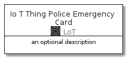
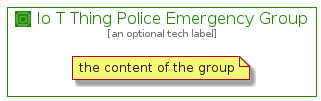

# IoTThingPoliceEmergency


```text
aws-20210131/Resource/LoT/IoTThingPoliceEmergency
```

```text
include('aws-20210131/Resource/LoT/IoTThingPoliceEmergency')
```


| Illustration | IoTThingPoliceEmergency | IoTThingPoliceEmergencyCard | IoTThingPoliceEmergencyGroup |
| :---: | :---: | :---: | :---: |
|  |  |  |  |


## IoTThingPoliceEmergency

### Load remotely
```plantuml
@startuml
' configures the library
!global $LIB_BASE_LOCATION="https://github.com/tmorin/plantuml-libs/distribution"

' loads the library's bootstrap
!include $LIB_BASE_LOCATION/bootstrap.puml

' loads the package bootstrap
include('aws-20210131/bootstrap')

' loads the Item which embeds the element IoTThingPoliceEmergency
include('aws-20210131/Resource/LoT/IoTThingPoliceEmergency')

' renders the element
IoTThingPoliceEmergency('IoTThingPoliceEmergency', 'Io T Thing Police Emergency', 'an optional tech label')
@enduml
```

### Load locally
```plantuml
@startuml
' configures the library
!global $INCLUSION_MODE="local"
!global $LIB_BASE_LOCATION="../../.."

' loads the library's bootstrap
!include $LIB_BASE_LOCATION/bootstrap.puml

' loads the package bootstrap
include('aws-20210131/bootstrap')

' loads the Item which embeds the element IoTThingPoliceEmergency
include('aws-20210131/Resource/LoT/IoTThingPoliceEmergency')

' renders the element
IoTThingPoliceEmergency('IoTThingPoliceEmergency', 'Io T Thing Police Emergency', 'an optional tech label')
@enduml
```

## IoTThingPoliceEmergencyCard

### Load remotely
```plantuml
@startuml
' configures the library
!global $LIB_BASE_LOCATION="https://github.com/tmorin/plantuml-libs/distribution"

' loads the library's bootstrap
!include $LIB_BASE_LOCATION/bootstrap.puml

' loads the package bootstrap
include('aws-20210131/bootstrap')

' loads the Item which embeds the element IoTThingPoliceEmergencyCard
include('aws-20210131/Resource/LoT/IoTThingPoliceEmergency')

' renders the element
IoTThingPoliceEmergencyCard('IoTThingPoliceEmergencyCard', 'Io T Thing Police Emergency Card', 'an optional description')
@enduml
```

### Load locally
```plantuml
@startuml
' configures the library
!global $INCLUSION_MODE="local"
!global $LIB_BASE_LOCATION="../../.."

' loads the library's bootstrap
!include $LIB_BASE_LOCATION/bootstrap.puml

' loads the package bootstrap
include('aws-20210131/bootstrap')

' loads the Item which embeds the element IoTThingPoliceEmergencyCard
include('aws-20210131/Resource/LoT/IoTThingPoliceEmergency')

' renders the element
IoTThingPoliceEmergencyCard('IoTThingPoliceEmergencyCard', 'Io T Thing Police Emergency Card', 'an optional description')
@enduml
```

## IoTThingPoliceEmergencyGroup

### Load remotely
```plantuml
@startuml
' configures the library
!global $LIB_BASE_LOCATION="https://github.com/tmorin/plantuml-libs/distribution"

' loads the library's bootstrap
!include $LIB_BASE_LOCATION/bootstrap.puml

' loads the package bootstrap
include('aws-20210131/bootstrap')

' loads the Item which embeds the element IoTThingPoliceEmergencyGroup
include('aws-20210131/Resource/LoT/IoTThingPoliceEmergency')

' renders the element
IoTThingPoliceEmergencyGroup('IoTThingPoliceEmergencyGroup', 'Io T Thing Police Emergency Group', 'an optional tech label') {
    note as note
        the content of the group
    end note
}
@enduml
```

### Load locally
```plantuml
@startuml
' configures the library
!global $INCLUSION_MODE="local"
!global $LIB_BASE_LOCATION="../../.."

' loads the library's bootstrap
!include $LIB_BASE_LOCATION/bootstrap.puml

' loads the package bootstrap
include('aws-20210131/bootstrap')

' loads the Item which embeds the element IoTThingPoliceEmergencyGroup
include('aws-20210131/Resource/LoT/IoTThingPoliceEmergency')

' renders the element
IoTThingPoliceEmergencyGroup('IoTThingPoliceEmergencyGroup', 'Io T Thing Police Emergency Group', 'an optional tech label') {
    note as note
        the content of the group
    end note
}
@enduml
```

