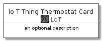
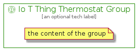

# IoTThingThermostat


```text
aws-20210131/Resource/LoT/IoTThingThermostat
```

```text
include('aws-20210131/Resource/LoT/IoTThingThermostat')
```


| Illustration | IoTThingThermostat | IoTThingThermostatCard | IoTThingThermostatGroup |
| :---: | :---: | :---: | :---: |
|  |  |  |  |


## IoTThingThermostat

### Load remotely
```plantuml
@startuml
' configures the library
!global $LIB_BASE_LOCATION="https://github.com/tmorin/plantuml-libs/distribution"

' loads the library's bootstrap
!include $LIB_BASE_LOCATION/bootstrap.puml

' loads the package bootstrap
include('aws-20210131/bootstrap')

' loads the Item which embeds the element IoTThingThermostat
include('aws-20210131/Resource/LoT/IoTThingThermostat')

' renders the element
IoTThingThermostat('IoTThingThermostat', 'Io T Thing Thermostat', 'an optional tech label')
@enduml
```

### Load locally
```plantuml
@startuml
' configures the library
!global $INCLUSION_MODE="local"
!global $LIB_BASE_LOCATION="../../.."

' loads the library's bootstrap
!include $LIB_BASE_LOCATION/bootstrap.puml

' loads the package bootstrap
include('aws-20210131/bootstrap')

' loads the Item which embeds the element IoTThingThermostat
include('aws-20210131/Resource/LoT/IoTThingThermostat')

' renders the element
IoTThingThermostat('IoTThingThermostat', 'Io T Thing Thermostat', 'an optional tech label')
@enduml
```

## IoTThingThermostatCard

### Load remotely
```plantuml
@startuml
' configures the library
!global $LIB_BASE_LOCATION="https://github.com/tmorin/plantuml-libs/distribution"

' loads the library's bootstrap
!include $LIB_BASE_LOCATION/bootstrap.puml

' loads the package bootstrap
include('aws-20210131/bootstrap')

' loads the Item which embeds the element IoTThingThermostatCard
include('aws-20210131/Resource/LoT/IoTThingThermostat')

' renders the element
IoTThingThermostatCard('IoTThingThermostatCard', 'Io T Thing Thermostat Card', 'an optional description')
@enduml
```

### Load locally
```plantuml
@startuml
' configures the library
!global $INCLUSION_MODE="local"
!global $LIB_BASE_LOCATION="../../.."

' loads the library's bootstrap
!include $LIB_BASE_LOCATION/bootstrap.puml

' loads the package bootstrap
include('aws-20210131/bootstrap')

' loads the Item which embeds the element IoTThingThermostatCard
include('aws-20210131/Resource/LoT/IoTThingThermostat')

' renders the element
IoTThingThermostatCard('IoTThingThermostatCard', 'Io T Thing Thermostat Card', 'an optional description')
@enduml
```

## IoTThingThermostatGroup

### Load remotely
```plantuml
@startuml
' configures the library
!global $LIB_BASE_LOCATION="https://github.com/tmorin/plantuml-libs/distribution"

' loads the library's bootstrap
!include $LIB_BASE_LOCATION/bootstrap.puml

' loads the package bootstrap
include('aws-20210131/bootstrap')

' loads the Item which embeds the element IoTThingThermostatGroup
include('aws-20210131/Resource/LoT/IoTThingThermostat')

' renders the element
IoTThingThermostatGroup('IoTThingThermostatGroup', 'Io T Thing Thermostat Group', 'an optional tech label') {
    note as note
        the content of the group
    end note
}
@enduml
```

### Load locally
```plantuml
@startuml
' configures the library
!global $INCLUSION_MODE="local"
!global $LIB_BASE_LOCATION="../../.."

' loads the library's bootstrap
!include $LIB_BASE_LOCATION/bootstrap.puml

' loads the package bootstrap
include('aws-20210131/bootstrap')

' loads the Item which embeds the element IoTThingThermostatGroup
include('aws-20210131/Resource/LoT/IoTThingThermostat')

' renders the element
IoTThingThermostatGroup('IoTThingThermostatGroup', 'Io T Thing Thermostat Group', 'an optional tech label') {
    note as note
        the content of the group
    end note
}
@enduml
```

