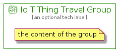

# IoTThingTravel


```text
aws-20210131/Resource/LoT/IoTThingTravel
```

```text
include('aws-20210131/Resource/LoT/IoTThingTravel')
```


| Illustration | IoTThingTravel | IoTThingTravelCard | IoTThingTravelGroup |
| :---: | :---: | :---: | :---: |
|  |  |  |  |


## IoTThingTravel

### Load remotely
```plantuml
@startuml
' configures the library
!global $LIB_BASE_LOCATION="https://github.com/tmorin/plantuml-libs/distribution"

' loads the library's bootstrap
!include $LIB_BASE_LOCATION/bootstrap.puml

' loads the package bootstrap
include('aws-20210131/bootstrap')

' loads the Item which embeds the element IoTThingTravel
include('aws-20210131/Resource/LoT/IoTThingTravel')

' renders the element
IoTThingTravel('IoTThingTravel', 'Io T Thing Travel', 'an optional tech label')
@enduml
```

### Load locally
```plantuml
@startuml
' configures the library
!global $INCLUSION_MODE="local"
!global $LIB_BASE_LOCATION="../../.."

' loads the library's bootstrap
!include $LIB_BASE_LOCATION/bootstrap.puml

' loads the package bootstrap
include('aws-20210131/bootstrap')

' loads the Item which embeds the element IoTThingTravel
include('aws-20210131/Resource/LoT/IoTThingTravel')

' renders the element
IoTThingTravel('IoTThingTravel', 'Io T Thing Travel', 'an optional tech label')
@enduml
```

## IoTThingTravelCard

### Load remotely
```plantuml
@startuml
' configures the library
!global $LIB_BASE_LOCATION="https://github.com/tmorin/plantuml-libs/distribution"

' loads the library's bootstrap
!include $LIB_BASE_LOCATION/bootstrap.puml

' loads the package bootstrap
include('aws-20210131/bootstrap')

' loads the Item which embeds the element IoTThingTravelCard
include('aws-20210131/Resource/LoT/IoTThingTravel')

' renders the element
IoTThingTravelCard('IoTThingTravelCard', 'Io T Thing Travel Card', 'an optional description')
@enduml
```

### Load locally
```plantuml
@startuml
' configures the library
!global $INCLUSION_MODE="local"
!global $LIB_BASE_LOCATION="../../.."

' loads the library's bootstrap
!include $LIB_BASE_LOCATION/bootstrap.puml

' loads the package bootstrap
include('aws-20210131/bootstrap')

' loads the Item which embeds the element IoTThingTravelCard
include('aws-20210131/Resource/LoT/IoTThingTravel')

' renders the element
IoTThingTravelCard('IoTThingTravelCard', 'Io T Thing Travel Card', 'an optional description')
@enduml
```

## IoTThingTravelGroup

### Load remotely
```plantuml
@startuml
' configures the library
!global $LIB_BASE_LOCATION="https://github.com/tmorin/plantuml-libs/distribution"

' loads the library's bootstrap
!include $LIB_BASE_LOCATION/bootstrap.puml

' loads the package bootstrap
include('aws-20210131/bootstrap')

' loads the Item which embeds the element IoTThingTravelGroup
include('aws-20210131/Resource/LoT/IoTThingTravel')

' renders the element
IoTThingTravelGroup('IoTThingTravelGroup', 'Io T Thing Travel Group', 'an optional tech label') {
    note as note
        the content of the group
    end note
}
@enduml
```

### Load locally
```plantuml
@startuml
' configures the library
!global $INCLUSION_MODE="local"
!global $LIB_BASE_LOCATION="../../.."

' loads the library's bootstrap
!include $LIB_BASE_LOCATION/bootstrap.puml

' loads the package bootstrap
include('aws-20210131/bootstrap')

' loads the Item which embeds the element IoTThingTravelGroup
include('aws-20210131/Resource/LoT/IoTThingTravel')

' renders the element
IoTThingTravelGroup('IoTThingTravelGroup', 'Io T Thing Travel Group', 'an optional tech label') {
    note as note
        the content of the group
    end note
}
@enduml
```

