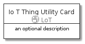

# IoTThingUtility


```text
aws-20210131/Resource/LoT/IoTThingUtility
```

```text
include('aws-20210131/Resource/LoT/IoTThingUtility')
```


| Illustration | IoTThingUtility | IoTThingUtilityCard | IoTThingUtilityGroup |
| :---: | :---: | :---: | :---: |
|  |  |  |  |


## IoTThingUtility

### Load remotely
```plantuml
@startuml
' configures the library
!global $LIB_BASE_LOCATION="https://github.com/tmorin/plantuml-libs/distribution"

' loads the library's bootstrap
!include $LIB_BASE_LOCATION/bootstrap.puml

' loads the package bootstrap
include('aws-20210131/bootstrap')

' loads the Item which embeds the element IoTThingUtility
include('aws-20210131/Resource/LoT/IoTThingUtility')

' renders the element
IoTThingUtility('IoTThingUtility', 'Io T Thing Utility', 'an optional tech label')
@enduml
```

### Load locally
```plantuml
@startuml
' configures the library
!global $INCLUSION_MODE="local"
!global $LIB_BASE_LOCATION="../../.."

' loads the library's bootstrap
!include $LIB_BASE_LOCATION/bootstrap.puml

' loads the package bootstrap
include('aws-20210131/bootstrap')

' loads the Item which embeds the element IoTThingUtility
include('aws-20210131/Resource/LoT/IoTThingUtility')

' renders the element
IoTThingUtility('IoTThingUtility', 'Io T Thing Utility', 'an optional tech label')
@enduml
```

## IoTThingUtilityCard

### Load remotely
```plantuml
@startuml
' configures the library
!global $LIB_BASE_LOCATION="https://github.com/tmorin/plantuml-libs/distribution"

' loads the library's bootstrap
!include $LIB_BASE_LOCATION/bootstrap.puml

' loads the package bootstrap
include('aws-20210131/bootstrap')

' loads the Item which embeds the element IoTThingUtilityCard
include('aws-20210131/Resource/LoT/IoTThingUtility')

' renders the element
IoTThingUtilityCard('IoTThingUtilityCard', 'Io T Thing Utility Card', 'an optional description')
@enduml
```

### Load locally
```plantuml
@startuml
' configures the library
!global $INCLUSION_MODE="local"
!global $LIB_BASE_LOCATION="../../.."

' loads the library's bootstrap
!include $LIB_BASE_LOCATION/bootstrap.puml

' loads the package bootstrap
include('aws-20210131/bootstrap')

' loads the Item which embeds the element IoTThingUtilityCard
include('aws-20210131/Resource/LoT/IoTThingUtility')

' renders the element
IoTThingUtilityCard('IoTThingUtilityCard', 'Io T Thing Utility Card', 'an optional description')
@enduml
```

## IoTThingUtilityGroup

### Load remotely
```plantuml
@startuml
' configures the library
!global $LIB_BASE_LOCATION="https://github.com/tmorin/plantuml-libs/distribution"

' loads the library's bootstrap
!include $LIB_BASE_LOCATION/bootstrap.puml

' loads the package bootstrap
include('aws-20210131/bootstrap')

' loads the Item which embeds the element IoTThingUtilityGroup
include('aws-20210131/Resource/LoT/IoTThingUtility')

' renders the element
IoTThingUtilityGroup('IoTThingUtilityGroup', 'Io T Thing Utility Group', 'an optional tech label') {
    note as note
        the content of the group
    end note
}
@enduml
```

### Load locally
```plantuml
@startuml
' configures the library
!global $INCLUSION_MODE="local"
!global $LIB_BASE_LOCATION="../../.."

' loads the library's bootstrap
!include $LIB_BASE_LOCATION/bootstrap.puml

' loads the package bootstrap
include('aws-20210131/bootstrap')

' loads the Item which embeds the element IoTThingUtilityGroup
include('aws-20210131/Resource/LoT/IoTThingUtility')

' renders the element
IoTThingUtilityGroup('IoTThingUtilityGroup', 'Io T Thing Utility Group', 'an optional tech label') {
    note as note
        the content of the group
    end note
}
@enduml
```

