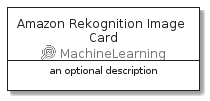
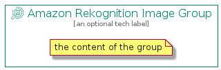

# AmazonRekognitionImage


```text
aws-20210131/Resource/MachineLearning/AmazonRekognitionImage
```

```text
include('aws-20210131/Resource/MachineLearning/AmazonRekognitionImage')
```


| Illustration | AmazonRekognitionImage | AmazonRekognitionImageCard | AmazonRekognitionImageGroup |
| :---: | :---: | :---: | :---: |
|  |  |  |  |


## AmazonRekognitionImage

### Load remotely
```plantuml
@startuml
' configures the library
!global $LIB_BASE_LOCATION="https://github.com/tmorin/plantuml-libs/distribution"

' loads the library's bootstrap
!include $LIB_BASE_LOCATION/bootstrap.puml

' loads the package bootstrap
include('aws-20210131/bootstrap')

' loads the Item which embeds the element AmazonRekognitionImage
include('aws-20210131/Resource/MachineLearning/AmazonRekognitionImage')

' renders the element
AmazonRekognitionImage('AmazonRekognitionImage', 'Amazon Rekognition Image', 'an optional tech label')
@enduml
```

### Load locally
```plantuml
@startuml
' configures the library
!global $INCLUSION_MODE="local"
!global $LIB_BASE_LOCATION="../../.."

' loads the library's bootstrap
!include $LIB_BASE_LOCATION/bootstrap.puml

' loads the package bootstrap
include('aws-20210131/bootstrap')

' loads the Item which embeds the element AmazonRekognitionImage
include('aws-20210131/Resource/MachineLearning/AmazonRekognitionImage')

' renders the element
AmazonRekognitionImage('AmazonRekognitionImage', 'Amazon Rekognition Image', 'an optional tech label')
@enduml
```

## AmazonRekognitionImageCard

### Load remotely
```plantuml
@startuml
' configures the library
!global $LIB_BASE_LOCATION="https://github.com/tmorin/plantuml-libs/distribution"

' loads the library's bootstrap
!include $LIB_BASE_LOCATION/bootstrap.puml

' loads the package bootstrap
include('aws-20210131/bootstrap')

' loads the Item which embeds the element AmazonRekognitionImageCard
include('aws-20210131/Resource/MachineLearning/AmazonRekognitionImage')

' renders the element
AmazonRekognitionImageCard('AmazonRekognitionImageCard', 'Amazon Rekognition Image Card', 'an optional description')
@enduml
```

### Load locally
```plantuml
@startuml
' configures the library
!global $INCLUSION_MODE="local"
!global $LIB_BASE_LOCATION="../../.."

' loads the library's bootstrap
!include $LIB_BASE_LOCATION/bootstrap.puml

' loads the package bootstrap
include('aws-20210131/bootstrap')

' loads the Item which embeds the element AmazonRekognitionImageCard
include('aws-20210131/Resource/MachineLearning/AmazonRekognitionImage')

' renders the element
AmazonRekognitionImageCard('AmazonRekognitionImageCard', 'Amazon Rekognition Image Card', 'an optional description')
@enduml
```

## AmazonRekognitionImageGroup

### Load remotely
```plantuml
@startuml
' configures the library
!global $LIB_BASE_LOCATION="https://github.com/tmorin/plantuml-libs/distribution"

' loads the library's bootstrap
!include $LIB_BASE_LOCATION/bootstrap.puml

' loads the package bootstrap
include('aws-20210131/bootstrap')

' loads the Item which embeds the element AmazonRekognitionImageGroup
include('aws-20210131/Resource/MachineLearning/AmazonRekognitionImage')

' renders the element
AmazonRekognitionImageGroup('AmazonRekognitionImageGroup', 'Amazon Rekognition Image Group', 'an optional tech label') {
    note as note
        the content of the group
    end note
}
@enduml
```

### Load locally
```plantuml
@startuml
' configures the library
!global $INCLUSION_MODE="local"
!global $LIB_BASE_LOCATION="../../.."

' loads the library's bootstrap
!include $LIB_BASE_LOCATION/bootstrap.puml

' loads the package bootstrap
include('aws-20210131/bootstrap')

' loads the Item which embeds the element AmazonRekognitionImageGroup
include('aws-20210131/Resource/MachineLearning/AmazonRekognitionImage')

' renders the element
AmazonRekognitionImageGroup('AmazonRekognitionImageGroup', 'Amazon Rekognition Image Group', 'an optional tech label') {
    note as note
        the content of the group
    end note
}
@enduml
```

