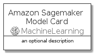
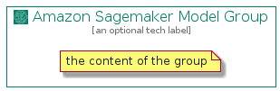

# AmazonSagemakerModel


```text
aws-20210131/Resource/MachineLearning/AmazonSagemakerModel
```

```text
include('aws-20210131/Resource/MachineLearning/AmazonSagemakerModel')
```


| Illustration | AmazonSagemakerModel | AmazonSagemakerModelCard | AmazonSagemakerModelGroup |
| :---: | :---: | :---: | :---: |
|  |  |  |  |


## AmazonSagemakerModel

### Load remotely
```plantuml
@startuml
' configures the library
!global $LIB_BASE_LOCATION="https://github.com/tmorin/plantuml-libs/distribution"

' loads the library's bootstrap
!include $LIB_BASE_LOCATION/bootstrap.puml

' loads the package bootstrap
include('aws-20210131/bootstrap')

' loads the Item which embeds the element AmazonSagemakerModel
include('aws-20210131/Resource/MachineLearning/AmazonSagemakerModel')

' renders the element
AmazonSagemakerModel('AmazonSagemakerModel', 'Amazon Sagemaker Model', 'an optional tech label')
@enduml
```

### Load locally
```plantuml
@startuml
' configures the library
!global $INCLUSION_MODE="local"
!global $LIB_BASE_LOCATION="../../.."

' loads the library's bootstrap
!include $LIB_BASE_LOCATION/bootstrap.puml

' loads the package bootstrap
include('aws-20210131/bootstrap')

' loads the Item which embeds the element AmazonSagemakerModel
include('aws-20210131/Resource/MachineLearning/AmazonSagemakerModel')

' renders the element
AmazonSagemakerModel('AmazonSagemakerModel', 'Amazon Sagemaker Model', 'an optional tech label')
@enduml
```

## AmazonSagemakerModelCard

### Load remotely
```plantuml
@startuml
' configures the library
!global $LIB_BASE_LOCATION="https://github.com/tmorin/plantuml-libs/distribution"

' loads the library's bootstrap
!include $LIB_BASE_LOCATION/bootstrap.puml

' loads the package bootstrap
include('aws-20210131/bootstrap')

' loads the Item which embeds the element AmazonSagemakerModelCard
include('aws-20210131/Resource/MachineLearning/AmazonSagemakerModel')

' renders the element
AmazonSagemakerModelCard('AmazonSagemakerModelCard', 'Amazon Sagemaker Model Card', 'an optional description')
@enduml
```

### Load locally
```plantuml
@startuml
' configures the library
!global $INCLUSION_MODE="local"
!global $LIB_BASE_LOCATION="../../.."

' loads the library's bootstrap
!include $LIB_BASE_LOCATION/bootstrap.puml

' loads the package bootstrap
include('aws-20210131/bootstrap')

' loads the Item which embeds the element AmazonSagemakerModelCard
include('aws-20210131/Resource/MachineLearning/AmazonSagemakerModel')

' renders the element
AmazonSagemakerModelCard('AmazonSagemakerModelCard', 'Amazon Sagemaker Model Card', 'an optional description')
@enduml
```

## AmazonSagemakerModelGroup

### Load remotely
```plantuml
@startuml
' configures the library
!global $LIB_BASE_LOCATION="https://github.com/tmorin/plantuml-libs/distribution"

' loads the library's bootstrap
!include $LIB_BASE_LOCATION/bootstrap.puml

' loads the package bootstrap
include('aws-20210131/bootstrap')

' loads the Item which embeds the element AmazonSagemakerModelGroup
include('aws-20210131/Resource/MachineLearning/AmazonSagemakerModel')

' renders the element
AmazonSagemakerModelGroup('AmazonSagemakerModelGroup', 'Amazon Sagemaker Model Group', 'an optional tech label') {
    note as note
        the content of the group
    end note
}
@enduml
```

### Load locally
```plantuml
@startuml
' configures the library
!global $INCLUSION_MODE="local"
!global $LIB_BASE_LOCATION="../../.."

' loads the library's bootstrap
!include $LIB_BASE_LOCATION/bootstrap.puml

' loads the package bootstrap
include('aws-20210131/bootstrap')

' loads the Item which embeds the element AmazonSagemakerModelGroup
include('aws-20210131/Resource/MachineLearning/AmazonSagemakerModel')

' renders the element
AmazonSagemakerModelGroup('AmazonSagemakerModelGroup', 'Amazon Sagemaker Model Group', 'an optional tech label') {
    note as note
        the content of the group
    end note
}
@enduml
```

