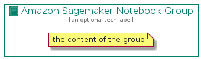

# AmazonSagemakerNotebook


```text
aws-20210131/Resource/MachineLearning/AmazonSagemakerNotebook
```

```text
include('aws-20210131/Resource/MachineLearning/AmazonSagemakerNotebook')
```


| Illustration | AmazonSagemakerNotebook | AmazonSagemakerNotebookCard | AmazonSagemakerNotebookGroup |
| :---: | :---: | :---: | :---: |
|  |  |  |  |


## AmazonSagemakerNotebook

### Load remotely
```plantuml
@startuml
' configures the library
!global $LIB_BASE_LOCATION="https://github.com/tmorin/plantuml-libs/distribution"

' loads the library's bootstrap
!include $LIB_BASE_LOCATION/bootstrap.puml

' loads the package bootstrap
include('aws-20210131/bootstrap')

' loads the Item which embeds the element AmazonSagemakerNotebook
include('aws-20210131/Resource/MachineLearning/AmazonSagemakerNotebook')

' renders the element
AmazonSagemakerNotebook('AmazonSagemakerNotebook', 'Amazon Sagemaker Notebook', 'an optional tech label')
@enduml
```

### Load locally
```plantuml
@startuml
' configures the library
!global $INCLUSION_MODE="local"
!global $LIB_BASE_LOCATION="../../.."

' loads the library's bootstrap
!include $LIB_BASE_LOCATION/bootstrap.puml

' loads the package bootstrap
include('aws-20210131/bootstrap')

' loads the Item which embeds the element AmazonSagemakerNotebook
include('aws-20210131/Resource/MachineLearning/AmazonSagemakerNotebook')

' renders the element
AmazonSagemakerNotebook('AmazonSagemakerNotebook', 'Amazon Sagemaker Notebook', 'an optional tech label')
@enduml
```

## AmazonSagemakerNotebookCard

### Load remotely
```plantuml
@startuml
' configures the library
!global $LIB_BASE_LOCATION="https://github.com/tmorin/plantuml-libs/distribution"

' loads the library's bootstrap
!include $LIB_BASE_LOCATION/bootstrap.puml

' loads the package bootstrap
include('aws-20210131/bootstrap')

' loads the Item which embeds the element AmazonSagemakerNotebookCard
include('aws-20210131/Resource/MachineLearning/AmazonSagemakerNotebook')

' renders the element
AmazonSagemakerNotebookCard('AmazonSagemakerNotebookCard', 'Amazon Sagemaker Notebook Card', 'an optional description')
@enduml
```

### Load locally
```plantuml
@startuml
' configures the library
!global $INCLUSION_MODE="local"
!global $LIB_BASE_LOCATION="../../.."

' loads the library's bootstrap
!include $LIB_BASE_LOCATION/bootstrap.puml

' loads the package bootstrap
include('aws-20210131/bootstrap')

' loads the Item which embeds the element AmazonSagemakerNotebookCard
include('aws-20210131/Resource/MachineLearning/AmazonSagemakerNotebook')

' renders the element
AmazonSagemakerNotebookCard('AmazonSagemakerNotebookCard', 'Amazon Sagemaker Notebook Card', 'an optional description')
@enduml
```

## AmazonSagemakerNotebookGroup

### Load remotely
```plantuml
@startuml
' configures the library
!global $LIB_BASE_LOCATION="https://github.com/tmorin/plantuml-libs/distribution"

' loads the library's bootstrap
!include $LIB_BASE_LOCATION/bootstrap.puml

' loads the package bootstrap
include('aws-20210131/bootstrap')

' loads the Item which embeds the element AmazonSagemakerNotebookGroup
include('aws-20210131/Resource/MachineLearning/AmazonSagemakerNotebook')

' renders the element
AmazonSagemakerNotebookGroup('AmazonSagemakerNotebookGroup', 'Amazon Sagemaker Notebook Group', 'an optional tech label') {
    note as note
        the content of the group
    end note
}
@enduml
```

### Load locally
```plantuml
@startuml
' configures the library
!global $INCLUSION_MODE="local"
!global $LIB_BASE_LOCATION="../../.."

' loads the library's bootstrap
!include $LIB_BASE_LOCATION/bootstrap.puml

' loads the package bootstrap
include('aws-20210131/bootstrap')

' loads the Item which embeds the element AmazonSagemakerNotebookGroup
include('aws-20210131/Resource/MachineLearning/AmazonSagemakerNotebook')

' renders the element
AmazonSagemakerNotebookGroup('AmazonSagemakerNotebookGroup', 'Amazon Sagemaker Notebook Group', 'an optional tech label') {
    note as note
        the content of the group
    end note
}
@enduml
```

