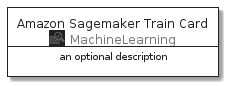
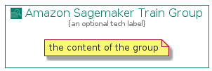

# AmazonSagemakerTrain


```text
aws-20210131/Resource/MachineLearning/AmazonSagemakerTrain
```

```text
include('aws-20210131/Resource/MachineLearning/AmazonSagemakerTrain')
```


| Illustration | AmazonSagemakerTrain | AmazonSagemakerTrainCard | AmazonSagemakerTrainGroup |
| :---: | :---: | :---: | :---: |
|  |  |  |  |


## AmazonSagemakerTrain

### Load remotely
```plantuml
@startuml
' configures the library
!global $LIB_BASE_LOCATION="https://github.com/tmorin/plantuml-libs/distribution"

' loads the library's bootstrap
!include $LIB_BASE_LOCATION/bootstrap.puml

' loads the package bootstrap
include('aws-20210131/bootstrap')

' loads the Item which embeds the element AmazonSagemakerTrain
include('aws-20210131/Resource/MachineLearning/AmazonSagemakerTrain')

' renders the element
AmazonSagemakerTrain('AmazonSagemakerTrain', 'Amazon Sagemaker Train', 'an optional tech label')
@enduml
```

### Load locally
```plantuml
@startuml
' configures the library
!global $INCLUSION_MODE="local"
!global $LIB_BASE_LOCATION="../../.."

' loads the library's bootstrap
!include $LIB_BASE_LOCATION/bootstrap.puml

' loads the package bootstrap
include('aws-20210131/bootstrap')

' loads the Item which embeds the element AmazonSagemakerTrain
include('aws-20210131/Resource/MachineLearning/AmazonSagemakerTrain')

' renders the element
AmazonSagemakerTrain('AmazonSagemakerTrain', 'Amazon Sagemaker Train', 'an optional tech label')
@enduml
```

## AmazonSagemakerTrainCard

### Load remotely
```plantuml
@startuml
' configures the library
!global $LIB_BASE_LOCATION="https://github.com/tmorin/plantuml-libs/distribution"

' loads the library's bootstrap
!include $LIB_BASE_LOCATION/bootstrap.puml

' loads the package bootstrap
include('aws-20210131/bootstrap')

' loads the Item which embeds the element AmazonSagemakerTrainCard
include('aws-20210131/Resource/MachineLearning/AmazonSagemakerTrain')

' renders the element
AmazonSagemakerTrainCard('AmazonSagemakerTrainCard', 'Amazon Sagemaker Train Card', 'an optional description')
@enduml
```

### Load locally
```plantuml
@startuml
' configures the library
!global $INCLUSION_MODE="local"
!global $LIB_BASE_LOCATION="../../.."

' loads the library's bootstrap
!include $LIB_BASE_LOCATION/bootstrap.puml

' loads the package bootstrap
include('aws-20210131/bootstrap')

' loads the Item which embeds the element AmazonSagemakerTrainCard
include('aws-20210131/Resource/MachineLearning/AmazonSagemakerTrain')

' renders the element
AmazonSagemakerTrainCard('AmazonSagemakerTrainCard', 'Amazon Sagemaker Train Card', 'an optional description')
@enduml
```

## AmazonSagemakerTrainGroup

### Load remotely
```plantuml
@startuml
' configures the library
!global $LIB_BASE_LOCATION="https://github.com/tmorin/plantuml-libs/distribution"

' loads the library's bootstrap
!include $LIB_BASE_LOCATION/bootstrap.puml

' loads the package bootstrap
include('aws-20210131/bootstrap')

' loads the Item which embeds the element AmazonSagemakerTrainGroup
include('aws-20210131/Resource/MachineLearning/AmazonSagemakerTrain')

' renders the element
AmazonSagemakerTrainGroup('AmazonSagemakerTrainGroup', 'Amazon Sagemaker Train Group', 'an optional tech label') {
    note as note
        the content of the group
    end note
}
@enduml
```

### Load locally
```plantuml
@startuml
' configures the library
!global $INCLUSION_MODE="local"
!global $LIB_BASE_LOCATION="../../.."

' loads the library's bootstrap
!include $LIB_BASE_LOCATION/bootstrap.puml

' loads the package bootstrap
include('aws-20210131/bootstrap')

' loads the Item which embeds the element AmazonSagemakerTrainGroup
include('aws-20210131/Resource/MachineLearning/AmazonSagemakerTrain')

' renders the element
AmazonSagemakerTrainGroup('AmazonSagemakerTrainGroup', 'Amazon Sagemaker Train Group', 'an optional tech label') {
    note as note
        the content of the group
    end note
}
@enduml
```

