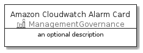
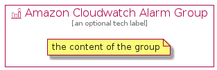

# AmazonCloudwatchAlarm


```text
aws-20210131/Resource/ManagementGovernance/AmazonCloudwatchAlarm
```

```text
include('aws-20210131/Resource/ManagementGovernance/AmazonCloudwatchAlarm')
```


| Illustration | AmazonCloudwatchAlarm | AmazonCloudwatchAlarmCard | AmazonCloudwatchAlarmGroup |
| :---: | :---: | :---: | :---: |
|  |  |  |  |


## AmazonCloudwatchAlarm

### Load remotely
```plantuml
@startuml
' configures the library
!global $LIB_BASE_LOCATION="https://github.com/tmorin/plantuml-libs/distribution"

' loads the library's bootstrap
!include $LIB_BASE_LOCATION/bootstrap.puml

' loads the package bootstrap
include('aws-20210131/bootstrap')

' loads the Item which embeds the element AmazonCloudwatchAlarm
include('aws-20210131/Resource/ManagementGovernance/AmazonCloudwatchAlarm')

' renders the element
AmazonCloudwatchAlarm('AmazonCloudwatchAlarm', 'Amazon Cloudwatch Alarm', 'an optional tech label')
@enduml
```

### Load locally
```plantuml
@startuml
' configures the library
!global $INCLUSION_MODE="local"
!global $LIB_BASE_LOCATION="../../.."

' loads the library's bootstrap
!include $LIB_BASE_LOCATION/bootstrap.puml

' loads the package bootstrap
include('aws-20210131/bootstrap')

' loads the Item which embeds the element AmazonCloudwatchAlarm
include('aws-20210131/Resource/ManagementGovernance/AmazonCloudwatchAlarm')

' renders the element
AmazonCloudwatchAlarm('AmazonCloudwatchAlarm', 'Amazon Cloudwatch Alarm', 'an optional tech label')
@enduml
```

## AmazonCloudwatchAlarmCard

### Load remotely
```plantuml
@startuml
' configures the library
!global $LIB_BASE_LOCATION="https://github.com/tmorin/plantuml-libs/distribution"

' loads the library's bootstrap
!include $LIB_BASE_LOCATION/bootstrap.puml

' loads the package bootstrap
include('aws-20210131/bootstrap')

' loads the Item which embeds the element AmazonCloudwatchAlarmCard
include('aws-20210131/Resource/ManagementGovernance/AmazonCloudwatchAlarm')

' renders the element
AmazonCloudwatchAlarmCard('AmazonCloudwatchAlarmCard', 'Amazon Cloudwatch Alarm Card', 'an optional description')
@enduml
```

### Load locally
```plantuml
@startuml
' configures the library
!global $INCLUSION_MODE="local"
!global $LIB_BASE_LOCATION="../../.."

' loads the library's bootstrap
!include $LIB_BASE_LOCATION/bootstrap.puml

' loads the package bootstrap
include('aws-20210131/bootstrap')

' loads the Item which embeds the element AmazonCloudwatchAlarmCard
include('aws-20210131/Resource/ManagementGovernance/AmazonCloudwatchAlarm')

' renders the element
AmazonCloudwatchAlarmCard('AmazonCloudwatchAlarmCard', 'Amazon Cloudwatch Alarm Card', 'an optional description')
@enduml
```

## AmazonCloudwatchAlarmGroup

### Load remotely
```plantuml
@startuml
' configures the library
!global $LIB_BASE_LOCATION="https://github.com/tmorin/plantuml-libs/distribution"

' loads the library's bootstrap
!include $LIB_BASE_LOCATION/bootstrap.puml

' loads the package bootstrap
include('aws-20210131/bootstrap')

' loads the Item which embeds the element AmazonCloudwatchAlarmGroup
include('aws-20210131/Resource/ManagementGovernance/AmazonCloudwatchAlarm')

' renders the element
AmazonCloudwatchAlarmGroup('AmazonCloudwatchAlarmGroup', 'Amazon Cloudwatch Alarm Group', 'an optional tech label') {
    note as note
        the content of the group
    end note
}
@enduml
```

### Load locally
```plantuml
@startuml
' configures the library
!global $INCLUSION_MODE="local"
!global $LIB_BASE_LOCATION="../../.."

' loads the library's bootstrap
!include $LIB_BASE_LOCATION/bootstrap.puml

' loads the package bootstrap
include('aws-20210131/bootstrap')

' loads the Item which embeds the element AmazonCloudwatchAlarmGroup
include('aws-20210131/Resource/ManagementGovernance/AmazonCloudwatchAlarm')

' renders the element
AmazonCloudwatchAlarmGroup('AmazonCloudwatchAlarmGroup', 'Amazon Cloudwatch Alarm Group', 'an optional tech label') {
    note as note
        the content of the group
    end note
}
@enduml
```

