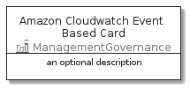

# AmazonCloudwatchEventBased


```text
aws-20210131/Resource/ManagementGovernance/AmazonCloudwatchEventBased
```

```text
include('aws-20210131/Resource/ManagementGovernance/AmazonCloudwatchEventBased')
```


| Illustration | AmazonCloudwatchEventBased | AmazonCloudwatchEventBasedCard | AmazonCloudwatchEventBasedGroup |
| :---: | :---: | :---: | :---: |
|  |  |  |  |


## AmazonCloudwatchEventBased

### Load remotely
```plantuml
@startuml
' configures the library
!global $LIB_BASE_LOCATION="https://github.com/tmorin/plantuml-libs/distribution"

' loads the library's bootstrap
!include $LIB_BASE_LOCATION/bootstrap.puml

' loads the package bootstrap
include('aws-20210131/bootstrap')

' loads the Item which embeds the element AmazonCloudwatchEventBased
include('aws-20210131/Resource/ManagementGovernance/AmazonCloudwatchEventBased')

' renders the element
AmazonCloudwatchEventBased('AmazonCloudwatchEventBased', 'Amazon Cloudwatch Event Based', 'an optional tech label')
@enduml
```

### Load locally
```plantuml
@startuml
' configures the library
!global $INCLUSION_MODE="local"
!global $LIB_BASE_LOCATION="../../.."

' loads the library's bootstrap
!include $LIB_BASE_LOCATION/bootstrap.puml

' loads the package bootstrap
include('aws-20210131/bootstrap')

' loads the Item which embeds the element AmazonCloudwatchEventBased
include('aws-20210131/Resource/ManagementGovernance/AmazonCloudwatchEventBased')

' renders the element
AmazonCloudwatchEventBased('AmazonCloudwatchEventBased', 'Amazon Cloudwatch Event Based', 'an optional tech label')
@enduml
```

## AmazonCloudwatchEventBasedCard

### Load remotely
```plantuml
@startuml
' configures the library
!global $LIB_BASE_LOCATION="https://github.com/tmorin/plantuml-libs/distribution"

' loads the library's bootstrap
!include $LIB_BASE_LOCATION/bootstrap.puml

' loads the package bootstrap
include('aws-20210131/bootstrap')

' loads the Item which embeds the element AmazonCloudwatchEventBasedCard
include('aws-20210131/Resource/ManagementGovernance/AmazonCloudwatchEventBased')

' renders the element
AmazonCloudwatchEventBasedCard('AmazonCloudwatchEventBasedCard', 'Amazon Cloudwatch Event Based Card', 'an optional description')
@enduml
```

### Load locally
```plantuml
@startuml
' configures the library
!global $INCLUSION_MODE="local"
!global $LIB_BASE_LOCATION="../../.."

' loads the library's bootstrap
!include $LIB_BASE_LOCATION/bootstrap.puml

' loads the package bootstrap
include('aws-20210131/bootstrap')

' loads the Item which embeds the element AmazonCloudwatchEventBasedCard
include('aws-20210131/Resource/ManagementGovernance/AmazonCloudwatchEventBased')

' renders the element
AmazonCloudwatchEventBasedCard('AmazonCloudwatchEventBasedCard', 'Amazon Cloudwatch Event Based Card', 'an optional description')
@enduml
```

## AmazonCloudwatchEventBasedGroup

### Load remotely
```plantuml
@startuml
' configures the library
!global $LIB_BASE_LOCATION="https://github.com/tmorin/plantuml-libs/distribution"

' loads the library's bootstrap
!include $LIB_BASE_LOCATION/bootstrap.puml

' loads the package bootstrap
include('aws-20210131/bootstrap')

' loads the Item which embeds the element AmazonCloudwatchEventBasedGroup
include('aws-20210131/Resource/ManagementGovernance/AmazonCloudwatchEventBased')

' renders the element
AmazonCloudwatchEventBasedGroup('AmazonCloudwatchEventBasedGroup', 'Amazon Cloudwatch Event Based Group', 'an optional tech label') {
    note as note
        the content of the group
    end note
}
@enduml
```

### Load locally
```plantuml
@startuml
' configures the library
!global $INCLUSION_MODE="local"
!global $LIB_BASE_LOCATION="../../.."

' loads the library's bootstrap
!include $LIB_BASE_LOCATION/bootstrap.puml

' loads the package bootstrap
include('aws-20210131/bootstrap')

' loads the Item which embeds the element AmazonCloudwatchEventBasedGroup
include('aws-20210131/Resource/ManagementGovernance/AmazonCloudwatchEventBased')

' renders the element
AmazonCloudwatchEventBasedGroup('AmazonCloudwatchEventBasedGroup', 'Amazon Cloudwatch Event Based Group', 'an optional tech label') {
    note as note
        the content of the group
    end note
}
@enduml
```

