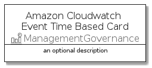

# AmazonCloudwatchEventTimeBased


```text
aws-20210131/Resource/ManagementGovernance/AmazonCloudwatchEventTimeBased
```

```text
include('aws-20210131/Resource/ManagementGovernance/AmazonCloudwatchEventTimeBased')
```


| Illustration | AmazonCloudwatchEventTimeBased | AmazonCloudwatchEventTimeBasedCard | AmazonCloudwatchEventTimeBasedGroup |
| :---: | :---: | :---: | :---: |
|  |  |  |  |


## AmazonCloudwatchEventTimeBased

### Load remotely
```plantuml
@startuml
' configures the library
!global $LIB_BASE_LOCATION="https://github.com/tmorin/plantuml-libs/distribution"

' loads the library's bootstrap
!include $LIB_BASE_LOCATION/bootstrap.puml

' loads the package bootstrap
include('aws-20210131/bootstrap')

' loads the Item which embeds the element AmazonCloudwatchEventTimeBased
include('aws-20210131/Resource/ManagementGovernance/AmazonCloudwatchEventTimeBased')

' renders the element
AmazonCloudwatchEventTimeBased('AmazonCloudwatchEventTimeBased', 'Amazon Cloudwatch Event Time Based', 'an optional tech label')
@enduml
```

### Load locally
```plantuml
@startuml
' configures the library
!global $INCLUSION_MODE="local"
!global $LIB_BASE_LOCATION="../../.."

' loads the library's bootstrap
!include $LIB_BASE_LOCATION/bootstrap.puml

' loads the package bootstrap
include('aws-20210131/bootstrap')

' loads the Item which embeds the element AmazonCloudwatchEventTimeBased
include('aws-20210131/Resource/ManagementGovernance/AmazonCloudwatchEventTimeBased')

' renders the element
AmazonCloudwatchEventTimeBased('AmazonCloudwatchEventTimeBased', 'Amazon Cloudwatch Event Time Based', 'an optional tech label')
@enduml
```

## AmazonCloudwatchEventTimeBasedCard

### Load remotely
```plantuml
@startuml
' configures the library
!global $LIB_BASE_LOCATION="https://github.com/tmorin/plantuml-libs/distribution"

' loads the library's bootstrap
!include $LIB_BASE_LOCATION/bootstrap.puml

' loads the package bootstrap
include('aws-20210131/bootstrap')

' loads the Item which embeds the element AmazonCloudwatchEventTimeBasedCard
include('aws-20210131/Resource/ManagementGovernance/AmazonCloudwatchEventTimeBased')

' renders the element
AmazonCloudwatchEventTimeBasedCard('AmazonCloudwatchEventTimeBasedCard', 'Amazon Cloudwatch Event Time Based Card', 'an optional description')
@enduml
```

### Load locally
```plantuml
@startuml
' configures the library
!global $INCLUSION_MODE="local"
!global $LIB_BASE_LOCATION="../../.."

' loads the library's bootstrap
!include $LIB_BASE_LOCATION/bootstrap.puml

' loads the package bootstrap
include('aws-20210131/bootstrap')

' loads the Item which embeds the element AmazonCloudwatchEventTimeBasedCard
include('aws-20210131/Resource/ManagementGovernance/AmazonCloudwatchEventTimeBased')

' renders the element
AmazonCloudwatchEventTimeBasedCard('AmazonCloudwatchEventTimeBasedCard', 'Amazon Cloudwatch Event Time Based Card', 'an optional description')
@enduml
```

## AmazonCloudwatchEventTimeBasedGroup

### Load remotely
```plantuml
@startuml
' configures the library
!global $LIB_BASE_LOCATION="https://github.com/tmorin/plantuml-libs/distribution"

' loads the library's bootstrap
!include $LIB_BASE_LOCATION/bootstrap.puml

' loads the package bootstrap
include('aws-20210131/bootstrap')

' loads the Item which embeds the element AmazonCloudwatchEventTimeBasedGroup
include('aws-20210131/Resource/ManagementGovernance/AmazonCloudwatchEventTimeBased')

' renders the element
AmazonCloudwatchEventTimeBasedGroup('AmazonCloudwatchEventTimeBasedGroup', 'Amazon Cloudwatch Event Time Based Group', 'an optional tech label') {
    note as note
        the content of the group
    end note
}
@enduml
```

### Load locally
```plantuml
@startuml
' configures the library
!global $INCLUSION_MODE="local"
!global $LIB_BASE_LOCATION="../../.."

' loads the library's bootstrap
!include $LIB_BASE_LOCATION/bootstrap.puml

' loads the package bootstrap
include('aws-20210131/bootstrap')

' loads the Item which embeds the element AmazonCloudwatchEventTimeBasedGroup
include('aws-20210131/Resource/ManagementGovernance/AmazonCloudwatchEventTimeBased')

' renders the element
AmazonCloudwatchEventTimeBasedGroup('AmazonCloudwatchEventTimeBasedGroup', 'Amazon Cloudwatch Event Time Based Group', 'an optional tech label') {
    note as note
        the content of the group
    end note
}
@enduml
```

