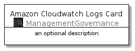
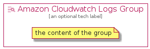

# AmazonCloudwatchLogs


```text
aws-20210131/Resource/ManagementGovernance/AmazonCloudwatchLogs
```

```text
include('aws-20210131/Resource/ManagementGovernance/AmazonCloudwatchLogs')
```


| Illustration | AmazonCloudwatchLogs | AmazonCloudwatchLogsCard | AmazonCloudwatchLogsGroup |
| :---: | :---: | :---: | :---: |
|  |  |  |  |


## AmazonCloudwatchLogs

### Load remotely
```plantuml
@startuml
' configures the library
!global $LIB_BASE_LOCATION="https://github.com/tmorin/plantuml-libs/distribution"

' loads the library's bootstrap
!include $LIB_BASE_LOCATION/bootstrap.puml

' loads the package bootstrap
include('aws-20210131/bootstrap')

' loads the Item which embeds the element AmazonCloudwatchLogs
include('aws-20210131/Resource/ManagementGovernance/AmazonCloudwatchLogs')

' renders the element
AmazonCloudwatchLogs('AmazonCloudwatchLogs', 'Amazon Cloudwatch Logs', 'an optional tech label')
@enduml
```

### Load locally
```plantuml
@startuml
' configures the library
!global $INCLUSION_MODE="local"
!global $LIB_BASE_LOCATION="../../.."

' loads the library's bootstrap
!include $LIB_BASE_LOCATION/bootstrap.puml

' loads the package bootstrap
include('aws-20210131/bootstrap')

' loads the Item which embeds the element AmazonCloudwatchLogs
include('aws-20210131/Resource/ManagementGovernance/AmazonCloudwatchLogs')

' renders the element
AmazonCloudwatchLogs('AmazonCloudwatchLogs', 'Amazon Cloudwatch Logs', 'an optional tech label')
@enduml
```

## AmazonCloudwatchLogsCard

### Load remotely
```plantuml
@startuml
' configures the library
!global $LIB_BASE_LOCATION="https://github.com/tmorin/plantuml-libs/distribution"

' loads the library's bootstrap
!include $LIB_BASE_LOCATION/bootstrap.puml

' loads the package bootstrap
include('aws-20210131/bootstrap')

' loads the Item which embeds the element AmazonCloudwatchLogsCard
include('aws-20210131/Resource/ManagementGovernance/AmazonCloudwatchLogs')

' renders the element
AmazonCloudwatchLogsCard('AmazonCloudwatchLogsCard', 'Amazon Cloudwatch Logs Card', 'an optional description')
@enduml
```

### Load locally
```plantuml
@startuml
' configures the library
!global $INCLUSION_MODE="local"
!global $LIB_BASE_LOCATION="../../.."

' loads the library's bootstrap
!include $LIB_BASE_LOCATION/bootstrap.puml

' loads the package bootstrap
include('aws-20210131/bootstrap')

' loads the Item which embeds the element AmazonCloudwatchLogsCard
include('aws-20210131/Resource/ManagementGovernance/AmazonCloudwatchLogs')

' renders the element
AmazonCloudwatchLogsCard('AmazonCloudwatchLogsCard', 'Amazon Cloudwatch Logs Card', 'an optional description')
@enduml
```

## AmazonCloudwatchLogsGroup

### Load remotely
```plantuml
@startuml
' configures the library
!global $LIB_BASE_LOCATION="https://github.com/tmorin/plantuml-libs/distribution"

' loads the library's bootstrap
!include $LIB_BASE_LOCATION/bootstrap.puml

' loads the package bootstrap
include('aws-20210131/bootstrap')

' loads the Item which embeds the element AmazonCloudwatchLogsGroup
include('aws-20210131/Resource/ManagementGovernance/AmazonCloudwatchLogs')

' renders the element
AmazonCloudwatchLogsGroup('AmazonCloudwatchLogsGroup', 'Amazon Cloudwatch Logs Group', 'an optional tech label') {
    note as note
        the content of the group
    end note
}
@enduml
```

### Load locally
```plantuml
@startuml
' configures the library
!global $INCLUSION_MODE="local"
!global $LIB_BASE_LOCATION="../../.."

' loads the library's bootstrap
!include $LIB_BASE_LOCATION/bootstrap.puml

' loads the package bootstrap
include('aws-20210131/bootstrap')

' loads the Item which embeds the element AmazonCloudwatchLogsGroup
include('aws-20210131/Resource/ManagementGovernance/AmazonCloudwatchLogs')

' renders the element
AmazonCloudwatchLogsGroup('AmazonCloudwatchLogsGroup', 'Amazon Cloudwatch Logs Group', 'an optional tech label') {
    note as note
        the content of the group
    end note
}
@enduml
```

