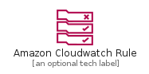
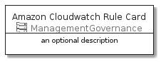
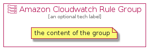

# AmazonCloudwatchRule


```text
aws-20210131/Resource/ManagementGovernance/AmazonCloudwatchRule
```

```text
include('aws-20210131/Resource/ManagementGovernance/AmazonCloudwatchRule')
```


| Illustration | AmazonCloudwatchRule | AmazonCloudwatchRuleCard | AmazonCloudwatchRuleGroup |
| :---: | :---: | :---: | :---: |
|  |  |  |  |


## AmazonCloudwatchRule

### Load remotely
```plantuml
@startuml
' configures the library
!global $LIB_BASE_LOCATION="https://github.com/tmorin/plantuml-libs/distribution"

' loads the library's bootstrap
!include $LIB_BASE_LOCATION/bootstrap.puml

' loads the package bootstrap
include('aws-20210131/bootstrap')

' loads the Item which embeds the element AmazonCloudwatchRule
include('aws-20210131/Resource/ManagementGovernance/AmazonCloudwatchRule')

' renders the element
AmazonCloudwatchRule('AmazonCloudwatchRule', 'Amazon Cloudwatch Rule', 'an optional tech label')
@enduml
```

### Load locally
```plantuml
@startuml
' configures the library
!global $INCLUSION_MODE="local"
!global $LIB_BASE_LOCATION="../../.."

' loads the library's bootstrap
!include $LIB_BASE_LOCATION/bootstrap.puml

' loads the package bootstrap
include('aws-20210131/bootstrap')

' loads the Item which embeds the element AmazonCloudwatchRule
include('aws-20210131/Resource/ManagementGovernance/AmazonCloudwatchRule')

' renders the element
AmazonCloudwatchRule('AmazonCloudwatchRule', 'Amazon Cloudwatch Rule', 'an optional tech label')
@enduml
```

## AmazonCloudwatchRuleCard

### Load remotely
```plantuml
@startuml
' configures the library
!global $LIB_BASE_LOCATION="https://github.com/tmorin/plantuml-libs/distribution"

' loads the library's bootstrap
!include $LIB_BASE_LOCATION/bootstrap.puml

' loads the package bootstrap
include('aws-20210131/bootstrap')

' loads the Item which embeds the element AmazonCloudwatchRuleCard
include('aws-20210131/Resource/ManagementGovernance/AmazonCloudwatchRule')

' renders the element
AmazonCloudwatchRuleCard('AmazonCloudwatchRuleCard', 'Amazon Cloudwatch Rule Card', 'an optional description')
@enduml
```

### Load locally
```plantuml
@startuml
' configures the library
!global $INCLUSION_MODE="local"
!global $LIB_BASE_LOCATION="../../.."

' loads the library's bootstrap
!include $LIB_BASE_LOCATION/bootstrap.puml

' loads the package bootstrap
include('aws-20210131/bootstrap')

' loads the Item which embeds the element AmazonCloudwatchRuleCard
include('aws-20210131/Resource/ManagementGovernance/AmazonCloudwatchRule')

' renders the element
AmazonCloudwatchRuleCard('AmazonCloudwatchRuleCard', 'Amazon Cloudwatch Rule Card', 'an optional description')
@enduml
```

## AmazonCloudwatchRuleGroup

### Load remotely
```plantuml
@startuml
' configures the library
!global $LIB_BASE_LOCATION="https://github.com/tmorin/plantuml-libs/distribution"

' loads the library's bootstrap
!include $LIB_BASE_LOCATION/bootstrap.puml

' loads the package bootstrap
include('aws-20210131/bootstrap')

' loads the Item which embeds the element AmazonCloudwatchRuleGroup
include('aws-20210131/Resource/ManagementGovernance/AmazonCloudwatchRule')

' renders the element
AmazonCloudwatchRuleGroup('AmazonCloudwatchRuleGroup', 'Amazon Cloudwatch Rule Group', 'an optional tech label') {
    note as note
        the content of the group
    end note
}
@enduml
```

### Load locally
```plantuml
@startuml
' configures the library
!global $INCLUSION_MODE="local"
!global $LIB_BASE_LOCATION="../../.."

' loads the library's bootstrap
!include $LIB_BASE_LOCATION/bootstrap.puml

' loads the package bootstrap
include('aws-20210131/bootstrap')

' loads the Item which embeds the element AmazonCloudwatchRuleGroup
include('aws-20210131/Resource/ManagementGovernance/AmazonCloudwatchRule')

' renders the element
AmazonCloudwatchRuleGroup('AmazonCloudwatchRuleGroup', 'Amazon Cloudwatch Rule Group', 'an optional tech label') {
    note as note
        the content of the group
    end note
}
@enduml
```

