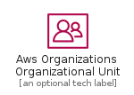
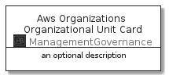
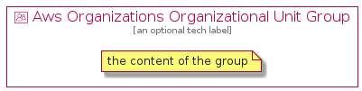

# AwsOrganizationsOrganizationalUnit


```text
aws-20210131/Resource/ManagementGovernance/AwsOrganizationsOrganizationalUnit
```

```text
include('aws-20210131/Resource/ManagementGovernance/AwsOrganizationsOrganizationalUnit')
```


| Illustration | AwsOrganizationsOrganizationalUnit | AwsOrganizationsOrganizationalUnitCard | AwsOrganizationsOrganizationalUnitGroup |
| :---: | :---: | :---: | :---: |
|  |  |  |  |


## AwsOrganizationsOrganizationalUnit

### Load remotely
```plantuml
@startuml
' configures the library
!global $LIB_BASE_LOCATION="https://github.com/tmorin/plantuml-libs/distribution"

' loads the library's bootstrap
!include $LIB_BASE_LOCATION/bootstrap.puml

' loads the package bootstrap
include('aws-20210131/bootstrap')

' loads the Item which embeds the element AwsOrganizationsOrganizationalUnit
include('aws-20210131/Resource/ManagementGovernance/AwsOrganizationsOrganizationalUnit')

' renders the element
AwsOrganizationsOrganizationalUnit('AwsOrganizationsOrganizationalUnit', 'Aws Organizations Organizational Unit', 'an optional tech label')
@enduml
```

### Load locally
```plantuml
@startuml
' configures the library
!global $INCLUSION_MODE="local"
!global $LIB_BASE_LOCATION="../../.."

' loads the library's bootstrap
!include $LIB_BASE_LOCATION/bootstrap.puml

' loads the package bootstrap
include('aws-20210131/bootstrap')

' loads the Item which embeds the element AwsOrganizationsOrganizationalUnit
include('aws-20210131/Resource/ManagementGovernance/AwsOrganizationsOrganizationalUnit')

' renders the element
AwsOrganizationsOrganizationalUnit('AwsOrganizationsOrganizationalUnit', 'Aws Organizations Organizational Unit', 'an optional tech label')
@enduml
```

## AwsOrganizationsOrganizationalUnitCard

### Load remotely
```plantuml
@startuml
' configures the library
!global $LIB_BASE_LOCATION="https://github.com/tmorin/plantuml-libs/distribution"

' loads the library's bootstrap
!include $LIB_BASE_LOCATION/bootstrap.puml

' loads the package bootstrap
include('aws-20210131/bootstrap')

' loads the Item which embeds the element AwsOrganizationsOrganizationalUnitCard
include('aws-20210131/Resource/ManagementGovernance/AwsOrganizationsOrganizationalUnit')

' renders the element
AwsOrganizationsOrganizationalUnitCard('AwsOrganizationsOrganizationalUnitCard', 'Aws Organizations Organizational Unit Card', 'an optional description')
@enduml
```

### Load locally
```plantuml
@startuml
' configures the library
!global $INCLUSION_MODE="local"
!global $LIB_BASE_LOCATION="../../.."

' loads the library's bootstrap
!include $LIB_BASE_LOCATION/bootstrap.puml

' loads the package bootstrap
include('aws-20210131/bootstrap')

' loads the Item which embeds the element AwsOrganizationsOrganizationalUnitCard
include('aws-20210131/Resource/ManagementGovernance/AwsOrganizationsOrganizationalUnit')

' renders the element
AwsOrganizationsOrganizationalUnitCard('AwsOrganizationsOrganizationalUnitCard', 'Aws Organizations Organizational Unit Card', 'an optional description')
@enduml
```

## AwsOrganizationsOrganizationalUnitGroup

### Load remotely
```plantuml
@startuml
' configures the library
!global $LIB_BASE_LOCATION="https://github.com/tmorin/plantuml-libs/distribution"

' loads the library's bootstrap
!include $LIB_BASE_LOCATION/bootstrap.puml

' loads the package bootstrap
include('aws-20210131/bootstrap')

' loads the Item which embeds the element AwsOrganizationsOrganizationalUnitGroup
include('aws-20210131/Resource/ManagementGovernance/AwsOrganizationsOrganizationalUnit')

' renders the element
AwsOrganizationsOrganizationalUnitGroup('AwsOrganizationsOrganizationalUnitGroup', 'Aws Organizations Organizational Unit Group', 'an optional tech label') {
    note as note
        the content of the group
    end note
}
@enduml
```

### Load locally
```plantuml
@startuml
' configures the library
!global $INCLUSION_MODE="local"
!global $LIB_BASE_LOCATION="../../.."

' loads the library's bootstrap
!include $LIB_BASE_LOCATION/bootstrap.puml

' loads the package bootstrap
include('aws-20210131/bootstrap')

' loads the Item which embeds the element AwsOrganizationsOrganizationalUnitGroup
include('aws-20210131/Resource/ManagementGovernance/AwsOrganizationsOrganizationalUnit')

' renders the element
AwsOrganizationsOrganizationalUnitGroup('AwsOrganizationsOrganizationalUnitGroup', 'Aws Organizations Organizational Unit Group', 'an optional tech label') {
    note as note
        the content of the group
    end note
}
@enduml
```

