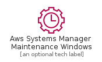
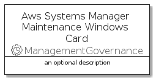
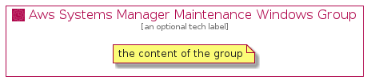

# AwsSystemsManagerMaintenanceWindows


```text
aws-20210131/Resource/ManagementGovernance/AwsSystemsManagerMaintenanceWindows
```

```text
include('aws-20210131/Resource/ManagementGovernance/AwsSystemsManagerMaintenanceWindows')
```


| Illustration | AwsSystemsManagerMaintenanceWindows | AwsSystemsManagerMaintenanceWindowsCard | AwsSystemsManagerMaintenanceWindowsGroup |
| :---: | :---: | :---: | :---: |
|  |  |  |  |


## AwsSystemsManagerMaintenanceWindows

### Load remotely
```plantuml
@startuml
' configures the library
!global $LIB_BASE_LOCATION="https://github.com/tmorin/plantuml-libs/distribution"

' loads the library's bootstrap
!include $LIB_BASE_LOCATION/bootstrap.puml

' loads the package bootstrap
include('aws-20210131/bootstrap')

' loads the Item which embeds the element AwsSystemsManagerMaintenanceWindows
include('aws-20210131/Resource/ManagementGovernance/AwsSystemsManagerMaintenanceWindows')

' renders the element
AwsSystemsManagerMaintenanceWindows('AwsSystemsManagerMaintenanceWindows', 'Aws Systems Manager Maintenance Windows', 'an optional tech label')
@enduml
```

### Load locally
```plantuml
@startuml
' configures the library
!global $INCLUSION_MODE="local"
!global $LIB_BASE_LOCATION="../../.."

' loads the library's bootstrap
!include $LIB_BASE_LOCATION/bootstrap.puml

' loads the package bootstrap
include('aws-20210131/bootstrap')

' loads the Item which embeds the element AwsSystemsManagerMaintenanceWindows
include('aws-20210131/Resource/ManagementGovernance/AwsSystemsManagerMaintenanceWindows')

' renders the element
AwsSystemsManagerMaintenanceWindows('AwsSystemsManagerMaintenanceWindows', 'Aws Systems Manager Maintenance Windows', 'an optional tech label')
@enduml
```

## AwsSystemsManagerMaintenanceWindowsCard

### Load remotely
```plantuml
@startuml
' configures the library
!global $LIB_BASE_LOCATION="https://github.com/tmorin/plantuml-libs/distribution"

' loads the library's bootstrap
!include $LIB_BASE_LOCATION/bootstrap.puml

' loads the package bootstrap
include('aws-20210131/bootstrap')

' loads the Item which embeds the element AwsSystemsManagerMaintenanceWindowsCard
include('aws-20210131/Resource/ManagementGovernance/AwsSystemsManagerMaintenanceWindows')

' renders the element
AwsSystemsManagerMaintenanceWindowsCard('AwsSystemsManagerMaintenanceWindowsCard', 'Aws Systems Manager Maintenance Windows Card', 'an optional description')
@enduml
```

### Load locally
```plantuml
@startuml
' configures the library
!global $INCLUSION_MODE="local"
!global $LIB_BASE_LOCATION="../../.."

' loads the library's bootstrap
!include $LIB_BASE_LOCATION/bootstrap.puml

' loads the package bootstrap
include('aws-20210131/bootstrap')

' loads the Item which embeds the element AwsSystemsManagerMaintenanceWindowsCard
include('aws-20210131/Resource/ManagementGovernance/AwsSystemsManagerMaintenanceWindows')

' renders the element
AwsSystemsManagerMaintenanceWindowsCard('AwsSystemsManagerMaintenanceWindowsCard', 'Aws Systems Manager Maintenance Windows Card', 'an optional description')
@enduml
```

## AwsSystemsManagerMaintenanceWindowsGroup

### Load remotely
```plantuml
@startuml
' configures the library
!global $LIB_BASE_LOCATION="https://github.com/tmorin/plantuml-libs/distribution"

' loads the library's bootstrap
!include $LIB_BASE_LOCATION/bootstrap.puml

' loads the package bootstrap
include('aws-20210131/bootstrap')

' loads the Item which embeds the element AwsSystemsManagerMaintenanceWindowsGroup
include('aws-20210131/Resource/ManagementGovernance/AwsSystemsManagerMaintenanceWindows')

' renders the element
AwsSystemsManagerMaintenanceWindowsGroup('AwsSystemsManagerMaintenanceWindowsGroup', 'Aws Systems Manager Maintenance Windows Group', 'an optional tech label') {
    note as note
        the content of the group
    end note
}
@enduml
```

### Load locally
```plantuml
@startuml
' configures the library
!global $INCLUSION_MODE="local"
!global $LIB_BASE_LOCATION="../../.."

' loads the library's bootstrap
!include $LIB_BASE_LOCATION/bootstrap.puml

' loads the package bootstrap
include('aws-20210131/bootstrap')

' loads the Item which embeds the element AwsSystemsManagerMaintenanceWindowsGroup
include('aws-20210131/Resource/ManagementGovernance/AwsSystemsManagerMaintenanceWindows')

' renders the element
AwsSystemsManagerMaintenanceWindowsGroup('AwsSystemsManagerMaintenanceWindowsGroup', 'Aws Systems Manager Maintenance Windows Group', 'an optional tech label') {
    note as note
        the content of the group
    end note
}
@enduml
```

