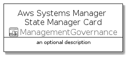
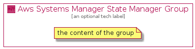

# AwsSystemsManagerStateManager


```text
aws-20210131/Resource/ManagementGovernance/AwsSystemsManagerStateManager
```

```text
include('aws-20210131/Resource/ManagementGovernance/AwsSystemsManagerStateManager')
```


| Illustration | AwsSystemsManagerStateManager | AwsSystemsManagerStateManagerCard | AwsSystemsManagerStateManagerGroup |
| :---: | :---: | :---: | :---: |
|  |  |  |  |


## AwsSystemsManagerStateManager

### Load remotely
```plantuml
@startuml
' configures the library
!global $LIB_BASE_LOCATION="https://github.com/tmorin/plantuml-libs/distribution"

' loads the library's bootstrap
!include $LIB_BASE_LOCATION/bootstrap.puml

' loads the package bootstrap
include('aws-20210131/bootstrap')

' loads the Item which embeds the element AwsSystemsManagerStateManager
include('aws-20210131/Resource/ManagementGovernance/AwsSystemsManagerStateManager')

' renders the element
AwsSystemsManagerStateManager('AwsSystemsManagerStateManager', 'Aws Systems Manager State Manager', 'an optional tech label')
@enduml
```

### Load locally
```plantuml
@startuml
' configures the library
!global $INCLUSION_MODE="local"
!global $LIB_BASE_LOCATION="../../.."

' loads the library's bootstrap
!include $LIB_BASE_LOCATION/bootstrap.puml

' loads the package bootstrap
include('aws-20210131/bootstrap')

' loads the Item which embeds the element AwsSystemsManagerStateManager
include('aws-20210131/Resource/ManagementGovernance/AwsSystemsManagerStateManager')

' renders the element
AwsSystemsManagerStateManager('AwsSystemsManagerStateManager', 'Aws Systems Manager State Manager', 'an optional tech label')
@enduml
```

## AwsSystemsManagerStateManagerCard

### Load remotely
```plantuml
@startuml
' configures the library
!global $LIB_BASE_LOCATION="https://github.com/tmorin/plantuml-libs/distribution"

' loads the library's bootstrap
!include $LIB_BASE_LOCATION/bootstrap.puml

' loads the package bootstrap
include('aws-20210131/bootstrap')

' loads the Item which embeds the element AwsSystemsManagerStateManagerCard
include('aws-20210131/Resource/ManagementGovernance/AwsSystemsManagerStateManager')

' renders the element
AwsSystemsManagerStateManagerCard('AwsSystemsManagerStateManagerCard', 'Aws Systems Manager State Manager Card', 'an optional description')
@enduml
```

### Load locally
```plantuml
@startuml
' configures the library
!global $INCLUSION_MODE="local"
!global $LIB_BASE_LOCATION="../../.."

' loads the library's bootstrap
!include $LIB_BASE_LOCATION/bootstrap.puml

' loads the package bootstrap
include('aws-20210131/bootstrap')

' loads the Item which embeds the element AwsSystemsManagerStateManagerCard
include('aws-20210131/Resource/ManagementGovernance/AwsSystemsManagerStateManager')

' renders the element
AwsSystemsManagerStateManagerCard('AwsSystemsManagerStateManagerCard', 'Aws Systems Manager State Manager Card', 'an optional description')
@enduml
```

## AwsSystemsManagerStateManagerGroup

### Load remotely
```plantuml
@startuml
' configures the library
!global $LIB_BASE_LOCATION="https://github.com/tmorin/plantuml-libs/distribution"

' loads the library's bootstrap
!include $LIB_BASE_LOCATION/bootstrap.puml

' loads the package bootstrap
include('aws-20210131/bootstrap')

' loads the Item which embeds the element AwsSystemsManagerStateManagerGroup
include('aws-20210131/Resource/ManagementGovernance/AwsSystemsManagerStateManager')

' renders the element
AwsSystemsManagerStateManagerGroup('AwsSystemsManagerStateManagerGroup', 'Aws Systems Manager State Manager Group', 'an optional tech label') {
    note as note
        the content of the group
    end note
}
@enduml
```

### Load locally
```plantuml
@startuml
' configures the library
!global $INCLUSION_MODE="local"
!global $LIB_BASE_LOCATION="../../.."

' loads the library's bootstrap
!include $LIB_BASE_LOCATION/bootstrap.puml

' loads the package bootstrap
include('aws-20210131/bootstrap')

' loads the Item which embeds the element AwsSystemsManagerStateManagerGroup
include('aws-20210131/Resource/ManagementGovernance/AwsSystemsManagerStateManager')

' renders the element
AwsSystemsManagerStateManagerGroup('AwsSystemsManagerStateManagerGroup', 'Aws Systems Manager State Manager Group', 'an optional tech label') {
    note as note
        the content of the group
    end note
}
@enduml
```

