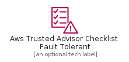
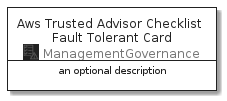

# AwsTrustedAdvisorChecklistFaultTolerant


```text
aws-20210131/Resource/ManagementGovernance/AwsTrustedAdvisorChecklistFaultTolerant
```

```text
include('aws-20210131/Resource/ManagementGovernance/AwsTrustedAdvisorChecklistFaultTolerant')
```


| Illustration | AwsTrustedAdvisorChecklistFaultTolerant | AwsTrustedAdvisorChecklistFaultTolerantCard | AwsTrustedAdvisorChecklistFaultTolerantGroup |
| :---: | :---: | :---: | :---: |
|  |  |  |  |


## AwsTrustedAdvisorChecklistFaultTolerant

### Load remotely
```plantuml
@startuml
' configures the library
!global $LIB_BASE_LOCATION="https://github.com/tmorin/plantuml-libs/distribution"

' loads the library's bootstrap
!include $LIB_BASE_LOCATION/bootstrap.puml

' loads the package bootstrap
include('aws-20210131/bootstrap')

' loads the Item which embeds the element AwsTrustedAdvisorChecklistFaultTolerant
include('aws-20210131/Resource/ManagementGovernance/AwsTrustedAdvisorChecklistFaultTolerant')

' renders the element
AwsTrustedAdvisorChecklistFaultTolerant('AwsTrustedAdvisorChecklistFaultTolerant', 'Aws Trusted Advisor Checklist Fault Tolerant', 'an optional tech label')
@enduml
```

### Load locally
```plantuml
@startuml
' configures the library
!global $INCLUSION_MODE="local"
!global $LIB_BASE_LOCATION="../../.."

' loads the library's bootstrap
!include $LIB_BASE_LOCATION/bootstrap.puml

' loads the package bootstrap
include('aws-20210131/bootstrap')

' loads the Item which embeds the element AwsTrustedAdvisorChecklistFaultTolerant
include('aws-20210131/Resource/ManagementGovernance/AwsTrustedAdvisorChecklistFaultTolerant')

' renders the element
AwsTrustedAdvisorChecklistFaultTolerant('AwsTrustedAdvisorChecklistFaultTolerant', 'Aws Trusted Advisor Checklist Fault Tolerant', 'an optional tech label')
@enduml
```

## AwsTrustedAdvisorChecklistFaultTolerantCard

### Load remotely
```plantuml
@startuml
' configures the library
!global $LIB_BASE_LOCATION="https://github.com/tmorin/plantuml-libs/distribution"

' loads the library's bootstrap
!include $LIB_BASE_LOCATION/bootstrap.puml

' loads the package bootstrap
include('aws-20210131/bootstrap')

' loads the Item which embeds the element AwsTrustedAdvisorChecklistFaultTolerantCard
include('aws-20210131/Resource/ManagementGovernance/AwsTrustedAdvisorChecklistFaultTolerant')

' renders the element
AwsTrustedAdvisorChecklistFaultTolerantCard('AwsTrustedAdvisorChecklistFaultTolerantCard', 'Aws Trusted Advisor Checklist Fault Tolerant Card', 'an optional description')
@enduml
```

### Load locally
```plantuml
@startuml
' configures the library
!global $INCLUSION_MODE="local"
!global $LIB_BASE_LOCATION="../../.."

' loads the library's bootstrap
!include $LIB_BASE_LOCATION/bootstrap.puml

' loads the package bootstrap
include('aws-20210131/bootstrap')

' loads the Item which embeds the element AwsTrustedAdvisorChecklistFaultTolerantCard
include('aws-20210131/Resource/ManagementGovernance/AwsTrustedAdvisorChecklistFaultTolerant')

' renders the element
AwsTrustedAdvisorChecklistFaultTolerantCard('AwsTrustedAdvisorChecklistFaultTolerantCard', 'Aws Trusted Advisor Checklist Fault Tolerant Card', 'an optional description')
@enduml
```

## AwsTrustedAdvisorChecklistFaultTolerantGroup

### Load remotely
```plantuml
@startuml
' configures the library
!global $LIB_BASE_LOCATION="https://github.com/tmorin/plantuml-libs/distribution"

' loads the library's bootstrap
!include $LIB_BASE_LOCATION/bootstrap.puml

' loads the package bootstrap
include('aws-20210131/bootstrap')

' loads the Item which embeds the element AwsTrustedAdvisorChecklistFaultTolerantGroup
include('aws-20210131/Resource/ManagementGovernance/AwsTrustedAdvisorChecklistFaultTolerant')

' renders the element
AwsTrustedAdvisorChecklistFaultTolerantGroup('AwsTrustedAdvisorChecklistFaultTolerantGroup', 'Aws Trusted Advisor Checklist Fault Tolerant Group', 'an optional tech label') {
    note as note
        the content of the group
    end note
}
@enduml
```

### Load locally
```plantuml
@startuml
' configures the library
!global $INCLUSION_MODE="local"
!global $LIB_BASE_LOCATION="../../.."

' loads the library's bootstrap
!include $LIB_BASE_LOCATION/bootstrap.puml

' loads the package bootstrap
include('aws-20210131/bootstrap')

' loads the Item which embeds the element AwsTrustedAdvisorChecklistFaultTolerantGroup
include('aws-20210131/Resource/ManagementGovernance/AwsTrustedAdvisorChecklistFaultTolerant')

' renders the element
AwsTrustedAdvisorChecklistFaultTolerantGroup('AwsTrustedAdvisorChecklistFaultTolerantGroup', 'Aws Trusted Advisor Checklist Fault Tolerant Group', 'an optional tech label') {
    note as note
        the content of the group
    end note
}
@enduml
```

