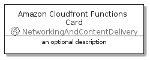

# AmazonCloudfrontFunctions


```text
aws-20210131/Resource/NetworkingAndContentDelivery/AmazonCloudfrontFunctions
```

```text
include('aws-20210131/Resource/NetworkingAndContentDelivery/AmazonCloudfrontFunctions')
```


| Illustration | AmazonCloudfrontFunctions | AmazonCloudfrontFunctionsCard | AmazonCloudfrontFunctionsGroup |
| :---: | :---: | :---: | :---: |
|  |  |  |  |


## AmazonCloudfrontFunctions

### Load remotely
```plantuml
@startuml
' configures the library
!global $LIB_BASE_LOCATION="https://github.com/tmorin/plantuml-libs/distribution"

' loads the library's bootstrap
!include $LIB_BASE_LOCATION/bootstrap.puml

' loads the package bootstrap
include('aws-20210131/bootstrap')

' loads the Item which embeds the element AmazonCloudfrontFunctions
include('aws-20210131/Resource/NetworkingAndContentDelivery/AmazonCloudfrontFunctions')

' renders the element
AmazonCloudfrontFunctions('AmazonCloudfrontFunctions', 'Amazon Cloudfront Functions', 'an optional tech label')
@enduml
```

### Load locally
```plantuml
@startuml
' configures the library
!global $INCLUSION_MODE="local"
!global $LIB_BASE_LOCATION="../../.."

' loads the library's bootstrap
!include $LIB_BASE_LOCATION/bootstrap.puml

' loads the package bootstrap
include('aws-20210131/bootstrap')

' loads the Item which embeds the element AmazonCloudfrontFunctions
include('aws-20210131/Resource/NetworkingAndContentDelivery/AmazonCloudfrontFunctions')

' renders the element
AmazonCloudfrontFunctions('AmazonCloudfrontFunctions', 'Amazon Cloudfront Functions', 'an optional tech label')
@enduml
```

## AmazonCloudfrontFunctionsCard

### Load remotely
```plantuml
@startuml
' configures the library
!global $LIB_BASE_LOCATION="https://github.com/tmorin/plantuml-libs/distribution"

' loads the library's bootstrap
!include $LIB_BASE_LOCATION/bootstrap.puml

' loads the package bootstrap
include('aws-20210131/bootstrap')

' loads the Item which embeds the element AmazonCloudfrontFunctionsCard
include('aws-20210131/Resource/NetworkingAndContentDelivery/AmazonCloudfrontFunctions')

' renders the element
AmazonCloudfrontFunctionsCard('AmazonCloudfrontFunctionsCard', 'Amazon Cloudfront Functions Card', 'an optional description')
@enduml
```

### Load locally
```plantuml
@startuml
' configures the library
!global $INCLUSION_MODE="local"
!global $LIB_BASE_LOCATION="../../.."

' loads the library's bootstrap
!include $LIB_BASE_LOCATION/bootstrap.puml

' loads the package bootstrap
include('aws-20210131/bootstrap')

' loads the Item which embeds the element AmazonCloudfrontFunctionsCard
include('aws-20210131/Resource/NetworkingAndContentDelivery/AmazonCloudfrontFunctions')

' renders the element
AmazonCloudfrontFunctionsCard('AmazonCloudfrontFunctionsCard', 'Amazon Cloudfront Functions Card', 'an optional description')
@enduml
```

## AmazonCloudfrontFunctionsGroup

### Load remotely
```plantuml
@startuml
' configures the library
!global $LIB_BASE_LOCATION="https://github.com/tmorin/plantuml-libs/distribution"

' loads the library's bootstrap
!include $LIB_BASE_LOCATION/bootstrap.puml

' loads the package bootstrap
include('aws-20210131/bootstrap')

' loads the Item which embeds the element AmazonCloudfrontFunctionsGroup
include('aws-20210131/Resource/NetworkingAndContentDelivery/AmazonCloudfrontFunctions')

' renders the element
AmazonCloudfrontFunctionsGroup('AmazonCloudfrontFunctionsGroup', 'Amazon Cloudfront Functions Group', 'an optional tech label') {
    note as note
        the content of the group
    end note
}
@enduml
```

### Load locally
```plantuml
@startuml
' configures the library
!global $INCLUSION_MODE="local"
!global $LIB_BASE_LOCATION="../../.."

' loads the library's bootstrap
!include $LIB_BASE_LOCATION/bootstrap.puml

' loads the package bootstrap
include('aws-20210131/bootstrap')

' loads the Item which embeds the element AmazonCloudfrontFunctionsGroup
include('aws-20210131/Resource/NetworkingAndContentDelivery/AmazonCloudfrontFunctions')

' renders the element
AmazonCloudfrontFunctionsGroup('AmazonCloudfrontFunctionsGroup', 'Amazon Cloudfront Functions Group', 'an optional tech label') {
    note as note
        the content of the group
    end note
}
@enduml
```

