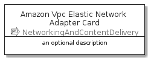

# AmazonVpcElasticNetworkAdapter


```text
aws-20210131/Resource/NetworkingAndContentDelivery/AmazonVpcElasticNetworkAdapter
```

```text
include('aws-20210131/Resource/NetworkingAndContentDelivery/AmazonVpcElasticNetworkAdapter')
```


| Illustration | AmazonVpcElasticNetworkAdapter | AmazonVpcElasticNetworkAdapterCard | AmazonVpcElasticNetworkAdapterGroup |
| :---: | :---: | :---: | :---: |
|  |  |  |  |


## AmazonVpcElasticNetworkAdapter

### Load remotely
```plantuml
@startuml
' configures the library
!global $LIB_BASE_LOCATION="https://github.com/tmorin/plantuml-libs/distribution"

' loads the library's bootstrap
!include $LIB_BASE_LOCATION/bootstrap.puml

' loads the package bootstrap
include('aws-20210131/bootstrap')

' loads the Item which embeds the element AmazonVpcElasticNetworkAdapter
include('aws-20210131/Resource/NetworkingAndContentDelivery/AmazonVpcElasticNetworkAdapter')

' renders the element
AmazonVpcElasticNetworkAdapter('AmazonVpcElasticNetworkAdapter', 'Amazon Vpc Elastic Network Adapter', 'an optional tech label')
@enduml
```

### Load locally
```plantuml
@startuml
' configures the library
!global $INCLUSION_MODE="local"
!global $LIB_BASE_LOCATION="../../.."

' loads the library's bootstrap
!include $LIB_BASE_LOCATION/bootstrap.puml

' loads the package bootstrap
include('aws-20210131/bootstrap')

' loads the Item which embeds the element AmazonVpcElasticNetworkAdapter
include('aws-20210131/Resource/NetworkingAndContentDelivery/AmazonVpcElasticNetworkAdapter')

' renders the element
AmazonVpcElasticNetworkAdapter('AmazonVpcElasticNetworkAdapter', 'Amazon Vpc Elastic Network Adapter', 'an optional tech label')
@enduml
```

## AmazonVpcElasticNetworkAdapterCard

### Load remotely
```plantuml
@startuml
' configures the library
!global $LIB_BASE_LOCATION="https://github.com/tmorin/plantuml-libs/distribution"

' loads the library's bootstrap
!include $LIB_BASE_LOCATION/bootstrap.puml

' loads the package bootstrap
include('aws-20210131/bootstrap')

' loads the Item which embeds the element AmazonVpcElasticNetworkAdapterCard
include('aws-20210131/Resource/NetworkingAndContentDelivery/AmazonVpcElasticNetworkAdapter')

' renders the element
AmazonVpcElasticNetworkAdapterCard('AmazonVpcElasticNetworkAdapterCard', 'Amazon Vpc Elastic Network Adapter Card', 'an optional description')
@enduml
```

### Load locally
```plantuml
@startuml
' configures the library
!global $INCLUSION_MODE="local"
!global $LIB_BASE_LOCATION="../../.."

' loads the library's bootstrap
!include $LIB_BASE_LOCATION/bootstrap.puml

' loads the package bootstrap
include('aws-20210131/bootstrap')

' loads the Item which embeds the element AmazonVpcElasticNetworkAdapterCard
include('aws-20210131/Resource/NetworkingAndContentDelivery/AmazonVpcElasticNetworkAdapter')

' renders the element
AmazonVpcElasticNetworkAdapterCard('AmazonVpcElasticNetworkAdapterCard', 'Amazon Vpc Elastic Network Adapter Card', 'an optional description')
@enduml
```

## AmazonVpcElasticNetworkAdapterGroup

### Load remotely
```plantuml
@startuml
' configures the library
!global $LIB_BASE_LOCATION="https://github.com/tmorin/plantuml-libs/distribution"

' loads the library's bootstrap
!include $LIB_BASE_LOCATION/bootstrap.puml

' loads the package bootstrap
include('aws-20210131/bootstrap')

' loads the Item which embeds the element AmazonVpcElasticNetworkAdapterGroup
include('aws-20210131/Resource/NetworkingAndContentDelivery/AmazonVpcElasticNetworkAdapter')

' renders the element
AmazonVpcElasticNetworkAdapterGroup('AmazonVpcElasticNetworkAdapterGroup', 'Amazon Vpc Elastic Network Adapter Group', 'an optional tech label') {
    note as note
        the content of the group
    end note
}
@enduml
```

### Load locally
```plantuml
@startuml
' configures the library
!global $INCLUSION_MODE="local"
!global $LIB_BASE_LOCATION="../../.."

' loads the library's bootstrap
!include $LIB_BASE_LOCATION/bootstrap.puml

' loads the package bootstrap
include('aws-20210131/bootstrap')

' loads the Item which embeds the element AmazonVpcElasticNetworkAdapterGroup
include('aws-20210131/Resource/NetworkingAndContentDelivery/AmazonVpcElasticNetworkAdapter')

' renders the element
AmazonVpcElasticNetworkAdapterGroup('AmazonVpcElasticNetworkAdapterGroup', 'Amazon Vpc Elastic Network Adapter Group', 'an optional tech label') {
    note as note
        the content of the group
    end note
}
@enduml
```

