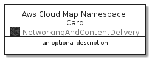
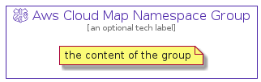

# AwsCloudMapNamespace


```text
aws-20210131/Resource/NetworkingAndContentDelivery/AwsCloudMapNamespace
```

```text
include('aws-20210131/Resource/NetworkingAndContentDelivery/AwsCloudMapNamespace')
```


| Illustration | AwsCloudMapNamespace | AwsCloudMapNamespaceCard | AwsCloudMapNamespaceGroup |
| :---: | :---: | :---: | :---: |
|  |  |  |  |


## AwsCloudMapNamespace

### Load remotely
```plantuml
@startuml
' configures the library
!global $LIB_BASE_LOCATION="https://github.com/tmorin/plantuml-libs/distribution"

' loads the library's bootstrap
!include $LIB_BASE_LOCATION/bootstrap.puml

' loads the package bootstrap
include('aws-20210131/bootstrap')

' loads the Item which embeds the element AwsCloudMapNamespace
include('aws-20210131/Resource/NetworkingAndContentDelivery/AwsCloudMapNamespace')

' renders the element
AwsCloudMapNamespace('AwsCloudMapNamespace', 'Aws Cloud Map Namespace', 'an optional tech label')
@enduml
```

### Load locally
```plantuml
@startuml
' configures the library
!global $INCLUSION_MODE="local"
!global $LIB_BASE_LOCATION="../../.."

' loads the library's bootstrap
!include $LIB_BASE_LOCATION/bootstrap.puml

' loads the package bootstrap
include('aws-20210131/bootstrap')

' loads the Item which embeds the element AwsCloudMapNamespace
include('aws-20210131/Resource/NetworkingAndContentDelivery/AwsCloudMapNamespace')

' renders the element
AwsCloudMapNamespace('AwsCloudMapNamespace', 'Aws Cloud Map Namespace', 'an optional tech label')
@enduml
```

## AwsCloudMapNamespaceCard

### Load remotely
```plantuml
@startuml
' configures the library
!global $LIB_BASE_LOCATION="https://github.com/tmorin/plantuml-libs/distribution"

' loads the library's bootstrap
!include $LIB_BASE_LOCATION/bootstrap.puml

' loads the package bootstrap
include('aws-20210131/bootstrap')

' loads the Item which embeds the element AwsCloudMapNamespaceCard
include('aws-20210131/Resource/NetworkingAndContentDelivery/AwsCloudMapNamespace')

' renders the element
AwsCloudMapNamespaceCard('AwsCloudMapNamespaceCard', 'Aws Cloud Map Namespace Card', 'an optional description')
@enduml
```

### Load locally
```plantuml
@startuml
' configures the library
!global $INCLUSION_MODE="local"
!global $LIB_BASE_LOCATION="../../.."

' loads the library's bootstrap
!include $LIB_BASE_LOCATION/bootstrap.puml

' loads the package bootstrap
include('aws-20210131/bootstrap')

' loads the Item which embeds the element AwsCloudMapNamespaceCard
include('aws-20210131/Resource/NetworkingAndContentDelivery/AwsCloudMapNamespace')

' renders the element
AwsCloudMapNamespaceCard('AwsCloudMapNamespaceCard', 'Aws Cloud Map Namespace Card', 'an optional description')
@enduml
```

## AwsCloudMapNamespaceGroup

### Load remotely
```plantuml
@startuml
' configures the library
!global $LIB_BASE_LOCATION="https://github.com/tmorin/plantuml-libs/distribution"

' loads the library's bootstrap
!include $LIB_BASE_LOCATION/bootstrap.puml

' loads the package bootstrap
include('aws-20210131/bootstrap')

' loads the Item which embeds the element AwsCloudMapNamespaceGroup
include('aws-20210131/Resource/NetworkingAndContentDelivery/AwsCloudMapNamespace')

' renders the element
AwsCloudMapNamespaceGroup('AwsCloudMapNamespaceGroup', 'Aws Cloud Map Namespace Group', 'an optional tech label') {
    note as note
        the content of the group
    end note
}
@enduml
```

### Load locally
```plantuml
@startuml
' configures the library
!global $INCLUSION_MODE="local"
!global $LIB_BASE_LOCATION="../../.."

' loads the library's bootstrap
!include $LIB_BASE_LOCATION/bootstrap.puml

' loads the package bootstrap
include('aws-20210131/bootstrap')

' loads the Item which embeds the element AwsCloudMapNamespaceGroup
include('aws-20210131/Resource/NetworkingAndContentDelivery/AwsCloudMapNamespace')

' renders the element
AwsCloudMapNamespaceGroup('AwsCloudMapNamespaceGroup', 'Aws Cloud Map Namespace Group', 'an optional tech label') {
    note as note
        the content of the group
    end note
}
@enduml
```

