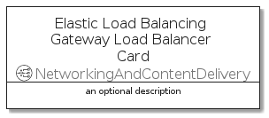

# ElasticLoadBalancingGatewayLoadBalancer


```text
aws-20210131/Resource/NetworkingAndContentDelivery/ElasticLoadBalancingGatewayLoadBalancer
```

```text
include('aws-20210131/Resource/NetworkingAndContentDelivery/ElasticLoadBalancingGatewayLoadBalancer')
```


| Illustration | ElasticLoadBalancingGatewayLoadBalancer | ElasticLoadBalancingGatewayLoadBalancerCard | ElasticLoadBalancingGatewayLoadBalancerGroup |
| :---: | :---: | :---: | :---: |
|  |  |  |  |


## ElasticLoadBalancingGatewayLoadBalancer

### Load remotely
```plantuml
@startuml
' configures the library
!global $LIB_BASE_LOCATION="https://github.com/tmorin/plantuml-libs/distribution"

' loads the library's bootstrap
!include $LIB_BASE_LOCATION/bootstrap.puml

' loads the package bootstrap
include('aws-20210131/bootstrap')

' loads the Item which embeds the element ElasticLoadBalancingGatewayLoadBalancer
include('aws-20210131/Resource/NetworkingAndContentDelivery/ElasticLoadBalancingGatewayLoadBalancer')

' renders the element
ElasticLoadBalancingGatewayLoadBalancer('ElasticLoadBalancingGatewayLoadBalancer', 'Elastic Load Balancing Gateway Load Balancer', 'an optional tech label')
@enduml
```

### Load locally
```plantuml
@startuml
' configures the library
!global $INCLUSION_MODE="local"
!global $LIB_BASE_LOCATION="../../.."

' loads the library's bootstrap
!include $LIB_BASE_LOCATION/bootstrap.puml

' loads the package bootstrap
include('aws-20210131/bootstrap')

' loads the Item which embeds the element ElasticLoadBalancingGatewayLoadBalancer
include('aws-20210131/Resource/NetworkingAndContentDelivery/ElasticLoadBalancingGatewayLoadBalancer')

' renders the element
ElasticLoadBalancingGatewayLoadBalancer('ElasticLoadBalancingGatewayLoadBalancer', 'Elastic Load Balancing Gateway Load Balancer', 'an optional tech label')
@enduml
```

## ElasticLoadBalancingGatewayLoadBalancerCard

### Load remotely
```plantuml
@startuml
' configures the library
!global $LIB_BASE_LOCATION="https://github.com/tmorin/plantuml-libs/distribution"

' loads the library's bootstrap
!include $LIB_BASE_LOCATION/bootstrap.puml

' loads the package bootstrap
include('aws-20210131/bootstrap')

' loads the Item which embeds the element ElasticLoadBalancingGatewayLoadBalancerCard
include('aws-20210131/Resource/NetworkingAndContentDelivery/ElasticLoadBalancingGatewayLoadBalancer')

' renders the element
ElasticLoadBalancingGatewayLoadBalancerCard('ElasticLoadBalancingGatewayLoadBalancerCard', 'Elastic Load Balancing Gateway Load Balancer Card', 'an optional description')
@enduml
```

### Load locally
```plantuml
@startuml
' configures the library
!global $INCLUSION_MODE="local"
!global $LIB_BASE_LOCATION="../../.."

' loads the library's bootstrap
!include $LIB_BASE_LOCATION/bootstrap.puml

' loads the package bootstrap
include('aws-20210131/bootstrap')

' loads the Item which embeds the element ElasticLoadBalancingGatewayLoadBalancerCard
include('aws-20210131/Resource/NetworkingAndContentDelivery/ElasticLoadBalancingGatewayLoadBalancer')

' renders the element
ElasticLoadBalancingGatewayLoadBalancerCard('ElasticLoadBalancingGatewayLoadBalancerCard', 'Elastic Load Balancing Gateway Load Balancer Card', 'an optional description')
@enduml
```

## ElasticLoadBalancingGatewayLoadBalancerGroup

### Load remotely
```plantuml
@startuml
' configures the library
!global $LIB_BASE_LOCATION="https://github.com/tmorin/plantuml-libs/distribution"

' loads the library's bootstrap
!include $LIB_BASE_LOCATION/bootstrap.puml

' loads the package bootstrap
include('aws-20210131/bootstrap')

' loads the Item which embeds the element ElasticLoadBalancingGatewayLoadBalancerGroup
include('aws-20210131/Resource/NetworkingAndContentDelivery/ElasticLoadBalancingGatewayLoadBalancer')

' renders the element
ElasticLoadBalancingGatewayLoadBalancerGroup('ElasticLoadBalancingGatewayLoadBalancerGroup', 'Elastic Load Balancing Gateway Load Balancer Group', 'an optional tech label') {
    note as note
        the content of the group
    end note
}
@enduml
```

### Load locally
```plantuml
@startuml
' configures the library
!global $INCLUSION_MODE="local"
!global $LIB_BASE_LOCATION="../../.."

' loads the library's bootstrap
!include $LIB_BASE_LOCATION/bootstrap.puml

' loads the package bootstrap
include('aws-20210131/bootstrap')

' loads the Item which embeds the element ElasticLoadBalancingGatewayLoadBalancerGroup
include('aws-20210131/Resource/NetworkingAndContentDelivery/ElasticLoadBalancingGatewayLoadBalancer')

' renders the element
ElasticLoadBalancingGatewayLoadBalancerGroup('ElasticLoadBalancingGatewayLoadBalancerGroup', 'Elastic Load Balancing Gateway Load Balancer Group', 'an optional tech label') {
    note as note
        the content of the group
    end note
}
@enduml
```

