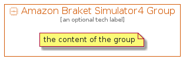

# AmazonBraketSimulator4


```text
aws-20210131/Resource/QuantumTechnologies/AmazonBraketSimulator4
```

```text
include('aws-20210131/Resource/QuantumTechnologies/AmazonBraketSimulator4')
```


| Illustration | AmazonBraketSimulator4 | AmazonBraketSimulator4Card | AmazonBraketSimulator4Group |
| :---: | :---: | :---: | :---: |
|  |  |  |  |


## AmazonBraketSimulator4

### Load remotely
```plantuml
@startuml
' configures the library
!global $LIB_BASE_LOCATION="https://github.com/tmorin/plantuml-libs/distribution"

' loads the library's bootstrap
!include $LIB_BASE_LOCATION/bootstrap.puml

' loads the package bootstrap
include('aws-20210131/bootstrap')

' loads the Item which embeds the element AmazonBraketSimulator4
include('aws-20210131/Resource/QuantumTechnologies/AmazonBraketSimulator4')

' renders the element
AmazonBraketSimulator4('AmazonBraketSimulator4', 'Amazon Braket Simulator4', 'an optional tech label')
@enduml
```

### Load locally
```plantuml
@startuml
' configures the library
!global $INCLUSION_MODE="local"
!global $LIB_BASE_LOCATION="../../.."

' loads the library's bootstrap
!include $LIB_BASE_LOCATION/bootstrap.puml

' loads the package bootstrap
include('aws-20210131/bootstrap')

' loads the Item which embeds the element AmazonBraketSimulator4
include('aws-20210131/Resource/QuantumTechnologies/AmazonBraketSimulator4')

' renders the element
AmazonBraketSimulator4('AmazonBraketSimulator4', 'Amazon Braket Simulator4', 'an optional tech label')
@enduml
```

## AmazonBraketSimulator4Card

### Load remotely
```plantuml
@startuml
' configures the library
!global $LIB_BASE_LOCATION="https://github.com/tmorin/plantuml-libs/distribution"

' loads the library's bootstrap
!include $LIB_BASE_LOCATION/bootstrap.puml

' loads the package bootstrap
include('aws-20210131/bootstrap')

' loads the Item which embeds the element AmazonBraketSimulator4Card
include('aws-20210131/Resource/QuantumTechnologies/AmazonBraketSimulator4')

' renders the element
AmazonBraketSimulator4Card('AmazonBraketSimulator4Card', 'Amazon Braket Simulator4 Card', 'an optional description')
@enduml
```

### Load locally
```plantuml
@startuml
' configures the library
!global $INCLUSION_MODE="local"
!global $LIB_BASE_LOCATION="../../.."

' loads the library's bootstrap
!include $LIB_BASE_LOCATION/bootstrap.puml

' loads the package bootstrap
include('aws-20210131/bootstrap')

' loads the Item which embeds the element AmazonBraketSimulator4Card
include('aws-20210131/Resource/QuantumTechnologies/AmazonBraketSimulator4')

' renders the element
AmazonBraketSimulator4Card('AmazonBraketSimulator4Card', 'Amazon Braket Simulator4 Card', 'an optional description')
@enduml
```

## AmazonBraketSimulator4Group

### Load remotely
```plantuml
@startuml
' configures the library
!global $LIB_BASE_LOCATION="https://github.com/tmorin/plantuml-libs/distribution"

' loads the library's bootstrap
!include $LIB_BASE_LOCATION/bootstrap.puml

' loads the package bootstrap
include('aws-20210131/bootstrap')

' loads the Item which embeds the element AmazonBraketSimulator4Group
include('aws-20210131/Resource/QuantumTechnologies/AmazonBraketSimulator4')

' renders the element
AmazonBraketSimulator4Group('AmazonBraketSimulator4Group', 'Amazon Braket Simulator4 Group', 'an optional tech label') {
    note as note
        the content of the group
    end note
}
@enduml
```

### Load locally
```plantuml
@startuml
' configures the library
!global $INCLUSION_MODE="local"
!global $LIB_BASE_LOCATION="../../.."

' loads the library's bootstrap
!include $LIB_BASE_LOCATION/bootstrap.puml

' loads the package bootstrap
include('aws-20210131/bootstrap')

' loads the Item which embeds the element AmazonBraketSimulator4Group
include('aws-20210131/Resource/QuantumTechnologies/AmazonBraketSimulator4')

' renders the element
AmazonBraketSimulator4Group('AmazonBraketSimulator4Group', 'Amazon Braket Simulator4 Group', 'an optional tech label') {
    note as note
        the content of the group
    end note
}
@enduml
```

