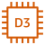

# Resource

The module contains 363 items.

- [Analytics](#family-analytics)
- [ApplicationIntegration](#family-applicationintegration)
- [Blockchain](#family-blockchain)
- [Compute](#family-compute)
- [Containers](#family-containers)
- [CustomerEngagement](#family-customerengagement)
- [Database](#family-database)
- [DeveloperTools](#family-developertools)
- [GeneralIcons](#family-generalicons)
- [GroupIcons](#family-groupicons)
- [LoT](#family-lot)
- [MachineLearning](#family-machinelearning)
- [ManagementGovernance](#family-managementgovernance)
- [MigrationAndTransfer](#family-migrationandtransfer)
- [NetworkingAndContentDelivery](#family-networkingandcontentdelivery)
- [QuantumTechnologies](#family-quantumtechnologies)
- [Robotics](#family-robotics)
- [SecurityIdentityAndCompliance](#family-securityidentityandcompliance)
- [Storage](#family-storage)

## Analytics
| |Name|
|:---:|---|
|  | [aws-20210131/Resource/Analytics/AmazonCloudSearchSearchDocuments](../../aws-20210131/Resource/Analytics/AmazonCloudSearchSearchDocuments.md) |
|  | [aws-20210131/Resource/Analytics/AmazonEmrCluster](../../aws-20210131/Resource/Analytics/AmazonEmrCluster.md) |
|  | [aws-20210131/Resource/Analytics/AmazonEmrEmrEngine](../../aws-20210131/Resource/Analytics/AmazonEmrEmrEngine.md) |
|  | [aws-20210131/Resource/Analytics/AmazonEmrHdfsCluster](../../aws-20210131/Resource/Analytics/AmazonEmrHdfsCluster.md) |
|  | [aws-20210131/Resource/Analytics/AmazonRedshiftDenseComputeNode](../../aws-20210131/Resource/Analytics/AmazonRedshiftDenseComputeNode.md) |
|  | [aws-20210131/Resource/Analytics/AmazonRedshiftDenseStorageNode](../../aws-20210131/Resource/Analytics/AmazonRedshiftDenseStorageNode.md) |
|  | [aws-20210131/Resource/Analytics/AmazonRedshiftRa3](../../aws-20210131/Resource/Analytics/AmazonRedshiftRa3.md) |
|  | [aws-20210131/Resource/Analytics/AwsGlueCrawler](../../aws-20210131/Resource/Analytics/AwsGlueCrawler.md) |
|  | [aws-20210131/Resource/Analytics/AwsGlueDataBrew](../../aws-20210131/Resource/Analytics/AwsGlueDataBrew.md) |
|  | [aws-20210131/Resource/Analytics/AwsGlueDataCatalog](../../aws-20210131/Resource/Analytics/AwsGlueDataCatalog.md) |
|  | [aws-20210131/Resource/Analytics/AwsLakeFormationDataLake](../../aws-20210131/Resource/Analytics/AwsLakeFormationDataLake.md) |
|  | [aws-20210131/Resource/Analytics/AwsRedshiftMl](../../aws-20210131/Resource/Analytics/AwsRedshiftMl.md) |

## ApplicationIntegration
| |Name|
|:---:|---|
|  | [aws-20210131/Resource/ApplicationIntegration/AmazonApiGatewayEndpoint](../../aws-20210131/Resource/ApplicationIntegration/AmazonApiGatewayEndpoint.md) |
|  | [aws-20210131/Resource/ApplicationIntegration/AmazonEventBridgeCustomEventBus](../../aws-20210131/Resource/ApplicationIntegration/AmazonEventBridgeCustomEventBus.md) |
|  | [aws-20210131/Resource/ApplicationIntegration/AmazonEventBridgeDefaultEventBus](../../aws-20210131/Resource/ApplicationIntegration/AmazonEventBridgeDefaultEventBus.md) |
|  | [aws-20210131/Resource/ApplicationIntegration/AmazonEventBridgeEvent](../../aws-20210131/Resource/ApplicationIntegration/AmazonEventBridgeEvent.md) |
|  | [aws-20210131/Resource/ApplicationIntegration/AmazonEventBridgeRule](../../aws-20210131/Resource/ApplicationIntegration/AmazonEventBridgeRule.md) |
|  | [aws-20210131/Resource/ApplicationIntegration/AmazonEventBridgeSaasPartnerEvent](../../aws-20210131/Resource/ApplicationIntegration/AmazonEventBridgeSaasPartnerEvent.md) |
|  | [aws-20210131/Resource/ApplicationIntegration/AmazonSimpleNotificationServiceEmailNotification](../../aws-20210131/Resource/ApplicationIntegration/AmazonSimpleNotificationServiceEmailNotification.md) |
|  | [aws-20210131/Resource/ApplicationIntegration/AmazonSimpleNotificationServiceHttpNotification](../../aws-20210131/Resource/ApplicationIntegration/AmazonSimpleNotificationServiceHttpNotification.md) |
|  | [aws-20210131/Resource/ApplicationIntegration/AmazonSimpleNotificationServiceTopic](../../aws-20210131/Resource/ApplicationIntegration/AmazonSimpleNotificationServiceTopic.md) |
|  | [aws-20210131/Resource/ApplicationIntegration/AmazonSimpleQueueServiceMessage](../../aws-20210131/Resource/ApplicationIntegration/AmazonSimpleQueueServiceMessage.md) |
|  | [aws-20210131/Resource/ApplicationIntegration/AmazonSimpleQueueServiceQueue](../../aws-20210131/Resource/ApplicationIntegration/AmazonSimpleQueueServiceQueue.md) |

## Blockchain
| |Name|
|:---:|---|
|  | [aws-20210131/Resource/Blockchain/AmazonManagedBlockchainBlockchain](../../aws-20210131/Resource/Blockchain/AmazonManagedBlockchainBlockchain.md) |

## Compute
| |Name|
|:---:|---|
|  | [aws-20210131/Resource/Compute/AmazonEc2A1Instance](../../aws-20210131/Resource/Compute/AmazonEc2A1Instance.md) |
|  | [aws-20210131/Resource/Compute/AmazonEc2AmiResource](../../aws-20210131/Resource/Compute/AmazonEc2AmiResource.md) |
|  | [aws-20210131/Resource/Compute/AmazonEc2AutoScaling](../../aws-20210131/Resource/Compute/AmazonEc2AutoScaling.md) |
|  | [aws-20210131/Resource/Compute/AmazonEc2AwsInferentia](../../aws-20210131/Resource/Compute/AmazonEc2AwsInferentia.md) |
|  | [aws-20210131/Resource/Compute/AmazonEc2C4Instance](../../aws-20210131/Resource/Compute/AmazonEc2C4Instance.md) |
|  | [aws-20210131/Resource/Compute/AmazonEc2C5AInstance](../../aws-20210131/Resource/Compute/AmazonEc2C5AInstance.md) |
|  | [aws-20210131/Resource/Compute/AmazonEc2C5AdInstance](../../aws-20210131/Resource/Compute/AmazonEc2C5AdInstance.md) |
|  | [aws-20210131/Resource/Compute/AmazonEc2C5DInstance](../../aws-20210131/Resource/Compute/AmazonEc2C5DInstance.md) |
|  | [aws-20210131/Resource/Compute/AmazonEc2C5Instance](../../aws-20210131/Resource/Compute/AmazonEc2C5Instance.md) |
|  | [aws-20210131/Resource/Compute/AmazonEc2C5NInstance](../../aws-20210131/Resource/Compute/AmazonEc2C5NInstance.md) |
|  | [aws-20210131/Resource/Compute/AmazonEc2C6GInstance](../../aws-20210131/Resource/Compute/AmazonEc2C6GInstance.md) |
|  | [aws-20210131/Resource/Compute/AmazonEc2C6GdInstance](../../aws-20210131/Resource/Compute/AmazonEc2C6GdInstance.md) |
|  | [aws-20210131/Resource/Compute/AmazonEc2D2Instance](../../aws-20210131/Resource/Compute/AmazonEc2D2Instance.md) |
|  | [aws-20210131/Resource/Compute/AmazonEc2D3EnInstance](../../aws-20210131/Resource/Compute/AmazonEc2D3EnInstance.md) |
|  | [aws-20210131/Resource/Compute/AmazonEc2D3Instance](../../aws-20210131/Resource/Compute/AmazonEc2D3Instance.md) |
|  | [aws-20210131/Resource/Compute/AmazonEc2DbInstance](../../aws-20210131/Resource/Compute/AmazonEc2DbInstance.md) |
|  | [aws-20210131/Resource/Compute/AmazonEc2ElasticIpAddress](../../aws-20210131/Resource/Compute/AmazonEc2ElasticIpAddress.md) |
|  | [aws-20210131/Resource/Compute/AmazonEc2F1Instance](../../aws-20210131/Resource/Compute/AmazonEc2F1Instance.md) |
|  | [aws-20210131/Resource/Compute/AmazonEc2G3Instance](../../aws-20210131/Resource/Compute/AmazonEc2G3Instance.md) |
|  | [aws-20210131/Resource/Compute/AmazonEc2G4AdInstance](../../aws-20210131/Resource/Compute/AmazonEc2G4AdInstance.md) |
|  | [aws-20210131/Resource/Compute/AmazonEc2G4DnInstance](../../aws-20210131/Resource/Compute/AmazonEc2G4DnInstance.md) |
|  | [aws-20210131/Resource/Compute/AmazonEc2H1Instance](../../aws-20210131/Resource/Compute/AmazonEc2H1Instance.md) |
|  | [aws-20210131/Resource/Compute/AmazonEc2HabanaGaudiInstance](../../aws-20210131/Resource/Compute/AmazonEc2HabanaGaudiInstance.md) |
|  | [aws-20210131/Resource/Compute/AmazonEc2HmiInstance](../../aws-20210131/Resource/Compute/AmazonEc2HmiInstance.md) |
|  | [aws-20210131/Resource/Compute/AmazonEc2I2Instance](../../aws-20210131/Resource/Compute/AmazonEc2I2Instance.md) |
|  | [aws-20210131/Resource/Compute/AmazonEc2I3EnInstance](../../aws-20210131/Resource/Compute/AmazonEc2I3EnInstance.md) |
|  | [aws-20210131/Resource/Compute/AmazonEc2I3Instance](../../aws-20210131/Resource/Compute/AmazonEc2I3Instance.md) |
|  | [aws-20210131/Resource/Compute/AmazonEc2Inf1Instance](../../aws-20210131/Resource/Compute/AmazonEc2Inf1Instance.md) |
|  | [aws-20210131/Resource/Compute/AmazonEc2Instance](../../aws-20210131/Resource/Compute/AmazonEc2Instance.md) |
|  | [aws-20210131/Resource/Compute/AmazonEc2InstanceWithCloudWatch](../../aws-20210131/Resource/Compute/AmazonEc2InstanceWithCloudWatch.md) |
|  | [aws-20210131/Resource/Compute/AmazonEc2Instances](../../aws-20210131/Resource/Compute/AmazonEc2Instances.md) |
|  | [aws-20210131/Resource/Compute/AmazonEc2M4Instance](../../aws-20210131/Resource/Compute/AmazonEc2M4Instance.md) |
|  | [aws-20210131/Resource/Compute/AmazonEc2M5AInstance](../../aws-20210131/Resource/Compute/AmazonEc2M5AInstance.md) |
|  | [aws-20210131/Resource/Compute/AmazonEc2M5DInstance](../../aws-20210131/Resource/Compute/AmazonEc2M5DInstance.md) |
|  | [aws-20210131/Resource/Compute/AmazonEc2M5DnInstance](../../aws-20210131/Resource/Compute/AmazonEc2M5DnInstance.md) |
|  | [aws-20210131/Resource/Compute/AmazonEc2M5Instance](../../aws-20210131/Resource/Compute/AmazonEc2M5Instance.md) |
|  | [aws-20210131/Resource/Compute/AmazonEc2M5NInstance](../../aws-20210131/Resource/Compute/AmazonEc2M5NInstance.md) |
|  | [aws-20210131/Resource/Compute/AmazonEc2M5ZnInstance](../../aws-20210131/Resource/Compute/AmazonEc2M5ZnInstance.md) |
|  | [aws-20210131/Resource/Compute/AmazonEc2M6GInstance](../../aws-20210131/Resource/Compute/AmazonEc2M6GInstance.md) |
|  | [aws-20210131/Resource/Compute/AmazonEc2M6GdInstance](../../aws-20210131/Resource/Compute/AmazonEc2M6GdInstance.md) |
|  | [aws-20210131/Resource/Compute/AmazonEc2MacInstance](../../aws-20210131/Resource/Compute/AmazonEc2MacInstance.md) |
|  | [aws-20210131/Resource/Compute/AmazonEc2P2Instance](../../aws-20210131/Resource/Compute/AmazonEc2P2Instance.md) |
|  | [aws-20210131/Resource/Compute/AmazonEc2P3DnInstance](../../aws-20210131/Resource/Compute/AmazonEc2P3DnInstance.md) |
|  | [aws-20210131/Resource/Compute/AmazonEc2P3Instance](../../aws-20210131/Resource/Compute/AmazonEc2P3Instance.md) |
|  | [aws-20210131/Resource/Compute/AmazonEc2P4DInstance](../../aws-20210131/Resource/Compute/AmazonEc2P4DInstance.md) |
|  | [aws-20210131/Resource/Compute/AmazonEc2P4Instance](../../aws-20210131/Resource/Compute/AmazonEc2P4Instance.md) |
|  | [aws-20210131/Resource/Compute/AmazonEc2R4Instance](../../aws-20210131/Resource/Compute/AmazonEc2R4Instance.md) |
|  | [aws-20210131/Resource/Compute/AmazonEc2R5AInstance](../../aws-20210131/Resource/Compute/AmazonEc2R5AInstance.md) |
|  | [aws-20210131/Resource/Compute/AmazonEc2R5AdInstance](../../aws-20210131/Resource/Compute/AmazonEc2R5AdInstance.md) |
|  | [aws-20210131/Resource/Compute/AmazonEc2R5BInstance](../../aws-20210131/Resource/Compute/AmazonEc2R5BInstance.md) |
|  | [aws-20210131/Resource/Compute/AmazonEc2R5DInstance](../../aws-20210131/Resource/Compute/AmazonEc2R5DInstance.md) |
|  | [aws-20210131/Resource/Compute/AmazonEc2R5GdInstance](../../aws-20210131/Resource/Compute/AmazonEc2R5GdInstance.md) |
|  | [aws-20210131/Resource/Compute/AmazonEc2R5Instance](../../aws-20210131/Resource/Compute/AmazonEc2R5Instance.md) |
|  | [aws-20210131/Resource/Compute/AmazonEc2R5NInstance](../../aws-20210131/Resource/Compute/AmazonEc2R5NInstance.md) |
|  | [aws-20210131/Resource/Compute/AmazonEc2R6GInstance](../../aws-20210131/Resource/Compute/AmazonEc2R6GInstance.md) |
|  | [aws-20210131/Resource/Compute/AmazonEc2RdnInstance](../../aws-20210131/Resource/Compute/AmazonEc2RdnInstance.md) |
|  | [aws-20210131/Resource/Compute/AmazonEc2Rescue](../../aws-20210131/Resource/Compute/AmazonEc2Rescue.md) |
|  | [aws-20210131/Resource/Compute/AmazonEc2SpotInstance](../../aws-20210131/Resource/Compute/AmazonEc2SpotInstance.md) |
|  | [aws-20210131/Resource/Compute/AmazonEc2T2Instance](../../aws-20210131/Resource/Compute/AmazonEc2T2Instance.md) |
|  | [aws-20210131/Resource/Compute/AmazonEc2T3AInstance](../../aws-20210131/Resource/Compute/AmazonEc2T3AInstance.md) |
|  | [aws-20210131/Resource/Compute/AmazonEc2T3Instance](../../aws-20210131/Resource/Compute/AmazonEc2T3Instance.md) |
|  | [aws-20210131/Resource/Compute/AmazonEc2T4GInstance](../../aws-20210131/Resource/Compute/AmazonEc2T4GInstance.md) |
|  | [aws-20210131/Resource/Compute/AmazonEc2TrainiumInstance](../../aws-20210131/Resource/Compute/AmazonEc2TrainiumInstance.md) |
|  | [aws-20210131/Resource/Compute/AmazonEc2X1EInstance](../../aws-20210131/Resource/Compute/AmazonEc2X1EInstance.md) |
|  | [aws-20210131/Resource/Compute/AmazonEc2X1Instance](../../aws-20210131/Resource/Compute/AmazonEc2X1Instance.md) |
|  | [aws-20210131/Resource/Compute/AmazonEc2Z1DInstance](../../aws-20210131/Resource/Compute/AmazonEc2Z1DInstance.md) |
|  | [aws-20210131/Resource/Compute/AmazonElasticBeanstalkApplication](../../aws-20210131/Resource/Compute/AmazonElasticBeanstalkApplication.md) |
|  | [aws-20210131/Resource/Compute/AmazonElasticBeanstalkDeployment](../../aws-20210131/Resource/Compute/AmazonElasticBeanstalkDeployment.md) |
|  | [aws-20210131/Resource/Compute/AmazonLambdaLambdaFunction](../../aws-20210131/Resource/Compute/AmazonLambdaLambdaFunction.md) |

## Containers
| |Name|
|:---:|---|
|  | [aws-20210131/Resource/Containers/AmazonEcsCopilotCli](../../aws-20210131/Resource/Containers/AmazonEcsCopilotCli.md) |
|  | [aws-20210131/Resource/Containers/AmazonElasticContainerRegistryImage](../../aws-20210131/Resource/Containers/AmazonElasticContainerRegistryImage.md) |
|  | [aws-20210131/Resource/Containers/AmazonElasticContainerRegistryRegistry](../../aws-20210131/Resource/Containers/AmazonElasticContainerRegistryRegistry.md) |
|  | [aws-20210131/Resource/Containers/AmazonElasticContainerServiceContainer1](../../aws-20210131/Resource/Containers/AmazonElasticContainerServiceContainer1.md) |
|  | [aws-20210131/Resource/Containers/AmazonElasticContainerServiceContainer2](../../aws-20210131/Resource/Containers/AmazonElasticContainerServiceContainer2.md) |
|  | [aws-20210131/Resource/Containers/AmazonElasticContainerServiceContainer3](../../aws-20210131/Resource/Containers/AmazonElasticContainerServiceContainer3.md) |
|  | [aws-20210131/Resource/Containers/AmazonElasticContainerServiceEcsAnywhere](../../aws-20210131/Resource/Containers/AmazonElasticContainerServiceEcsAnywhere.md) |
|  | [aws-20210131/Resource/Containers/AmazonElasticContainerServiceService](../../aws-20210131/Resource/Containers/AmazonElasticContainerServiceService.md) |
|  | [aws-20210131/Resource/Containers/AmazonElasticContainerServiceTask](../../aws-20210131/Resource/Containers/AmazonElasticContainerServiceTask.md) |

## CustomerEngagement
| |Name|
|:---:|---|
|  | [aws-20210131/Resource/CustomerEngagement/AmazonPinpointJourney](../../aws-20210131/Resource/CustomerEngagement/AmazonPinpointJourney.md) |
|  | [aws-20210131/Resource/CustomerEngagement/AmazonSimpleEmailServiceEmail](../../aws-20210131/Resource/CustomerEngagement/AmazonSimpleEmailServiceEmail.md) |

## Database
| |Name|
|:---:|---|
|  | [aws-20210131/Resource/Database/AmazonAuroraAmazonAuroraInstanceAlternate](../../aws-20210131/Resource/Database/AmazonAuroraAmazonAuroraInstanceAlternate.md) |
|  | [aws-20210131/Resource/Database/AmazonAuroraAmazonRdsInstance](../../aws-20210131/Resource/Database/AmazonAuroraAmazonRdsInstance.md) |
|  | [aws-20210131/Resource/Database/AmazonAuroraAmazonRdsInstanceAternate](../../aws-20210131/Resource/Database/AmazonAuroraAmazonRdsInstanceAternate.md) |
|  | [aws-20210131/Resource/Database/AmazonAuroraInstance](../../aws-20210131/Resource/Database/AmazonAuroraInstance.md) |
|  | [aws-20210131/Resource/Database/AmazonAuroraMariaDbInstance](../../aws-20210131/Resource/Database/AmazonAuroraMariaDbInstance.md) |
|  | [aws-20210131/Resource/Database/AmazonAuroraMariaDbInstanceAlternate](../../aws-20210131/Resource/Database/AmazonAuroraMariaDbInstanceAlternate.md) |
|  | [aws-20210131/Resource/Database/AmazonAuroraMySqlInstance](../../aws-20210131/Resource/Database/AmazonAuroraMySqlInstance.md) |
|  | [aws-20210131/Resource/Database/AmazonAuroraMySqlInstanceAlternate](../../aws-20210131/Resource/Database/AmazonAuroraMySqlInstanceAlternate.md) |
|  | [aws-20210131/Resource/Database/AmazonAuroraOracleInstance](../../aws-20210131/Resource/Database/AmazonAuroraOracleInstance.md) |
|  | [aws-20210131/Resource/Database/AmazonAuroraOracleInstanceAlternate](../../aws-20210131/Resource/Database/AmazonAuroraOracleInstanceAlternate.md) |
|  | [aws-20210131/Resource/Database/AmazonAuroraPiops](../../aws-20210131/Resource/Database/AmazonAuroraPiops.md) |
|  | [aws-20210131/Resource/Database/AmazonAuroraPostgreSqlInstance](../../aws-20210131/Resource/Database/AmazonAuroraPostgreSqlInstance.md) |
|  | [aws-20210131/Resource/Database/AmazonAuroraPostgreSqlInstanceAlternate](../../aws-20210131/Resource/Database/AmazonAuroraPostgreSqlInstanceAlternate.md) |
|  | [aws-20210131/Resource/Database/AmazonAuroraSqlServerInstance](../../aws-20210131/Resource/Database/AmazonAuroraSqlServerInstance.md) |
|  | [aws-20210131/Resource/Database/AmazonAuroraSqlServerInstanceAlternate](../../aws-20210131/Resource/Database/AmazonAuroraSqlServerInstanceAlternate.md) |
|  | [aws-20210131/Resource/Database/AmazonDynamoDbAmazonDynamoDbAccelerator](../../aws-20210131/Resource/Database/AmazonDynamoDbAmazonDynamoDbAccelerator.md) |
|  | [aws-20210131/Resource/Database/AmazonDynamoDbAttribute](../../aws-20210131/Resource/Database/AmazonDynamoDbAttribute.md) |
|  | [aws-20210131/Resource/Database/AmazonDynamoDbAttributes](../../aws-20210131/Resource/Database/AmazonDynamoDbAttributes.md) |
|  | [aws-20210131/Resource/Database/AmazonDynamoDbGlobalSecondaryIndex](../../aws-20210131/Resource/Database/AmazonDynamoDbGlobalSecondaryIndex.md) |
|  | [aws-20210131/Resource/Database/AmazonDynamoDbItem](../../aws-20210131/Resource/Database/AmazonDynamoDbItem.md) |
|  | [aws-20210131/Resource/Database/AmazonDynamoDbItems](../../aws-20210131/Resource/Database/AmazonDynamoDbItems.md) |
|  | [aws-20210131/Resource/Database/AmazonDynamoDbTable](../../aws-20210131/Resource/Database/AmazonDynamoDbTable.md) |
|  | [aws-20210131/Resource/Database/AmazonElastiCacheCacheNode](../../aws-20210131/Resource/Database/AmazonElastiCacheCacheNode.md) |
|  | [aws-20210131/Resource/Database/AmazonElastiCacheElastiCacheForMemcached](../../aws-20210131/Resource/Database/AmazonElastiCacheElastiCacheForMemcached.md) |
|  | [aws-20210131/Resource/Database/AmazonElastiCacheElastiCacheForRedis](../../aws-20210131/Resource/Database/AmazonElastiCacheElastiCacheForRedis.md) |
|  | [aws-20210131/Resource/Database/AmazonRdsProxy](../../aws-20210131/Resource/Database/AmazonRdsProxy.md) |
|  | [aws-20210131/Resource/Database/AmazonRdsProxyAlternate](../../aws-20210131/Resource/Database/AmazonRdsProxyAlternate.md) |
|  | [aws-20210131/Resource/Database/AwsDatabaseMigrationServiceDatabaseMigrationWorkflowJob](../../aws-20210131/Resource/Database/AwsDatabaseMigrationServiceDatabaseMigrationWorkflowJob.md) |

## DeveloperTools
| |Name|
|:---:|---|
|  | [aws-20210131/Resource/DeveloperTools/AwsCloud9Cloud9](../../aws-20210131/Resource/DeveloperTools/AwsCloud9Cloud9.md) |

## GeneralIcons
| |Name|
|:---:|---|
|  | [aws-20210131/Resource/GeneralIcons/Client](../../aws-20210131/Resource/GeneralIcons/Client.md) |
|  | [aws-20210131/Resource/GeneralIcons/Disk](../../aws-20210131/Resource/GeneralIcons/Disk.md) |
|  | [aws-20210131/Resource/GeneralIcons/Email](../../aws-20210131/Resource/GeneralIcons/Email.md) |
|  | [aws-20210131/Resource/GeneralIcons/Firewall](../../aws-20210131/Resource/GeneralIcons/Firewall.md) |
|  | [aws-20210131/Resource/GeneralIcons/Forums](../../aws-20210131/Resource/GeneralIcons/Forums.md) |
|  | [aws-20210131/Resource/GeneralIcons/General](../../aws-20210131/Resource/GeneralIcons/General.md) |
|  | [aws-20210131/Resource/GeneralIcons/GenericDatabase](../../aws-20210131/Resource/GeneralIcons/GenericDatabase.md) |
|  | [aws-20210131/Resource/GeneralIcons/Internet](../../aws-20210131/Resource/GeneralIcons/Internet.md) |
|  | [aws-20210131/Resource/GeneralIcons/InternetAlt1](../../aws-20210131/Resource/GeneralIcons/InternetAlt1.md) |
|  | [aws-20210131/Resource/GeneralIcons/InternetAlt2](../../aws-20210131/Resource/GeneralIcons/InternetAlt2.md) |
|  | [aws-20210131/Resource/GeneralIcons/MobileClient](../../aws-20210131/Resource/GeneralIcons/MobileClient.md) |
|  | [aws-20210131/Resource/GeneralIcons/Multimedia](../../aws-20210131/Resource/GeneralIcons/Multimedia.md) |
|  | [aws-20210131/Resource/GeneralIcons/OfficeBuilding](../../aws-20210131/Resource/GeneralIcons/OfficeBuilding.md) |
|  | [aws-20210131/Resource/GeneralIcons/SamlToken](../../aws-20210131/Resource/GeneralIcons/SamlToken.md) |
|  | [aws-20210131/Resource/GeneralIcons/Sdk](../../aws-20210131/Resource/GeneralIcons/Sdk.md) |
|  | [aws-20210131/Resource/GeneralIcons/SslPadlock](../../aws-20210131/Resource/GeneralIcons/SslPadlock.md) |
|  | [aws-20210131/Resource/GeneralIcons/TapeStorage](../../aws-20210131/Resource/GeneralIcons/TapeStorage.md) |
|  | [aws-20210131/Resource/GeneralIcons/Toolkit](../../aws-20210131/Resource/GeneralIcons/Toolkit.md) |
|  | [aws-20210131/Resource/GeneralIcons/TraditionalServer](../../aws-20210131/Resource/GeneralIcons/TraditionalServer.md) |
|  | [aws-20210131/Resource/GeneralIcons/User](../../aws-20210131/Resource/GeneralIcons/User.md) |
|  | [aws-20210131/Resource/GeneralIcons/Users](../../aws-20210131/Resource/GeneralIcons/Users.md) |

## GroupIcons
| |Name|
|:---:|---|
|  | [aws-20210131/Resource/GroupIcons/AutoScaling](../../aws-20210131/Resource/GroupIcons/AutoScaling.md) |
|  | [aws-20210131/Resource/GroupIcons/AwsCloud](../../aws-20210131/Resource/GroupIcons/AwsCloud.md) |
|  | [aws-20210131/Resource/GroupIcons/AwsStepFunction](../../aws-20210131/Resource/GroupIcons/AwsStepFunction.md) |
|  | [aws-20210131/Resource/GroupIcons/Cloud](../../aws-20210131/Resource/GroupIcons/Cloud.md) |
|  | [aws-20210131/Resource/GroupIcons/CorporateDataCenter](../../aws-20210131/Resource/GroupIcons/CorporateDataCenter.md) |
|  | [aws-20210131/Resource/GroupIcons/Ec2InstanceContainer](../../aws-20210131/Resource/GroupIcons/Ec2InstanceContainer.md) |
|  | [aws-20210131/Resource/GroupIcons/ElasticBeanstalkContainer](../../aws-20210131/Resource/GroupIcons/ElasticBeanstalkContainer.md) |
|  | [aws-20210131/Resource/GroupIcons/Region](../../aws-20210131/Resource/GroupIcons/Region.md) |
|  | [aws-20210131/Resource/GroupIcons/ServerContents](../../aws-20210131/Resource/GroupIcons/ServerContents.md) |
|  | [aws-20210131/Resource/GroupIcons/SpotFleet](../../aws-20210131/Resource/GroupIcons/SpotFleet.md) |
|  | [aws-20210131/Resource/GroupIcons/Vpc](../../aws-20210131/Resource/GroupIcons/Vpc.md) |
|  | [aws-20210131/Resource/GroupIcons/VpcSubnetPrivate](../../aws-20210131/Resource/GroupIcons/VpcSubnetPrivate.md) |
|  | [aws-20210131/Resource/GroupIcons/VpcSubnetPublic](../../aws-20210131/Resource/GroupIcons/VpcSubnetPublic.md) |

## LoT
| |Name|
|:---:|---|
|  | [aws-20210131/Resource/LoT/AmazonIoTLoRaWanProtocol](../../aws-20210131/Resource/LoT/AmazonIoTLoRaWanProtocol.md) |
|  | [aws-20210131/Resource/LoT/AmazonIoTSailboat](../../aws-20210131/Resource/LoT/AmazonIoTSailboat.md) |
|  | [aws-20210131/Resource/LoT/AwsIoTAnalyticsChannel](../../aws-20210131/Resource/LoT/AwsIoTAnalyticsChannel.md) |
|  | [aws-20210131/Resource/LoT/AwsIoTAnalyticsDataSet](../../aws-20210131/Resource/LoT/AwsIoTAnalyticsDataSet.md) |
|  | [aws-20210131/Resource/LoT/AwsIoTAnalyticsDataStore](../../aws-20210131/Resource/LoT/AwsIoTAnalyticsDataStore.md) |
|  | [aws-20210131/Resource/LoT/AwsIoTAnalyticsNotebook](../../aws-20210131/Resource/LoT/AwsIoTAnalyticsNotebook.md) |
|  | [aws-20210131/Resource/LoT/AwsIoTAnalyticsPipeline](../../aws-20210131/Resource/LoT/AwsIoTAnalyticsPipeline.md) |
|  | [aws-20210131/Resource/LoT/AwsIoTGreengrassConnector](../../aws-20210131/Resource/LoT/AwsIoTGreengrassConnector.md) |
|  | [aws-20210131/Resource/LoT/AwsLoTDeviceDefenderIoTDeviceJobs](../../aws-20210131/Resource/LoT/AwsLoTDeviceDefenderIoTDeviceJobs.md) |
|  | [aws-20210131/Resource/LoT/IoTAction](../../aws-20210131/Resource/LoT/IoTAction.md) |
|  | [aws-20210131/Resource/LoT/IoTActuator](../../aws-20210131/Resource/LoT/IoTActuator.md) |
|  | [aws-20210131/Resource/LoT/IoTAlexaEnabledDevice](../../aws-20210131/Resource/LoT/IoTAlexaEnabledDevice.md) |
|  | [aws-20210131/Resource/LoT/IoTAlexaSkill](../../aws-20210131/Resource/LoT/IoTAlexaSkill.md) |
|  | [aws-20210131/Resource/LoT/IoTAlexaVoiceService](../../aws-20210131/Resource/LoT/IoTAlexaVoiceService.md) |
|  | [aws-20210131/Resource/LoT/IoTCertificate](../../aws-20210131/Resource/LoT/IoTCertificate.md) |
|  | [aws-20210131/Resource/LoT/IoTDesiredState](../../aws-20210131/Resource/LoT/IoTDesiredState.md) |
|  | [aws-20210131/Resource/LoT/IoTDeviceGateway](../../aws-20210131/Resource/LoT/IoTDeviceGateway.md) |
|  | [aws-20210131/Resource/LoT/IoTEcho](../../aws-20210131/Resource/LoT/IoTEcho.md) |
|  | [aws-20210131/Resource/LoT/IoTFireTv](../../aws-20210131/Resource/LoT/IoTFireTv.md) |
|  | [aws-20210131/Resource/LoT/IoTFireTvStick](../../aws-20210131/Resource/LoT/IoTFireTvStick.md) |
|  | [aws-20210131/Resource/LoT/IoTHardwareBoard](../../aws-20210131/Resource/LoT/IoTHardwareBoard.md) |
|  | [aws-20210131/Resource/LoT/IoTHttp2Protocol](../../aws-20210131/Resource/LoT/IoTHttp2Protocol.md) |
|  | [aws-20210131/Resource/LoT/IoTHttpProtocol](../../aws-20210131/Resource/LoT/IoTHttpProtocol.md) |
|  | [aws-20210131/Resource/LoT/IoTLambdaFunction](../../aws-20210131/Resource/LoT/IoTLambdaFunction.md) |
|  | [aws-20210131/Resource/LoT/IoTMqttProtocol](../../aws-20210131/Resource/LoT/IoTMqttProtocol.md) |
|  | [aws-20210131/Resource/LoT/IoTOverAirUpdate](../../aws-20210131/Resource/LoT/IoTOverAirUpdate.md) |
|  | [aws-20210131/Resource/LoT/IoTPolicy](../../aws-20210131/Resource/LoT/IoTPolicy.md) |
|  | [aws-20210131/Resource/LoT/IoTReportedState](../../aws-20210131/Resource/LoT/IoTReportedState.md) |
|  | [aws-20210131/Resource/LoT/IoTRule](../../aws-20210131/Resource/LoT/IoTRule.md) |
|  | [aws-20210131/Resource/LoT/IoTSensor](../../aws-20210131/Resource/LoT/IoTSensor.md) |
|  | [aws-20210131/Resource/LoT/IoTServo](../../aws-20210131/Resource/LoT/IoTServo.md) |
|  | [aws-20210131/Resource/LoT/IoTShadow](../../aws-20210131/Resource/LoT/IoTShadow.md) |
|  | [aws-20210131/Resource/LoT/IoTSimulator](../../aws-20210131/Resource/LoT/IoTSimulator.md) |
|  | [aws-20210131/Resource/LoT/IoTThingBank](../../aws-20210131/Resource/LoT/IoTThingBank.md) |
|  | [aws-20210131/Resource/LoT/IoTThingBicycle](../../aws-20210131/Resource/LoT/IoTThingBicycle.md) |
|  | [aws-20210131/Resource/LoT/IoTThingCamera](../../aws-20210131/Resource/LoT/IoTThingCamera.md) |
|  | [aws-20210131/Resource/LoT/IoTThingCar](../../aws-20210131/Resource/LoT/IoTThingCar.md) |
|  | [aws-20210131/Resource/LoT/IoTThingCart](../../aws-20210131/Resource/LoT/IoTThingCart.md) |
|  | [aws-20210131/Resource/LoT/IoTThingCoffeePot](../../aws-20210131/Resource/LoT/IoTThingCoffeePot.md) |
|  | [aws-20210131/Resource/LoT/IoTThingDoorLock](../../aws-20210131/Resource/LoT/IoTThingDoorLock.md) |
|  | [aws-20210131/Resource/LoT/IoTThingFactory](../../aws-20210131/Resource/LoT/IoTThingFactory.md) |
|  | [aws-20210131/Resource/LoT/IoTThingGeneric](../../aws-20210131/Resource/LoT/IoTThingGeneric.md) |
|  | [aws-20210131/Resource/LoT/IoTThingHouse](../../aws-20210131/Resource/LoT/IoTThingHouse.md) |
|  | [aws-20210131/Resource/LoT/IoTThingLightbulb](../../aws-20210131/Resource/LoT/IoTThingLightbulb.md) |
|  | [aws-20210131/Resource/LoT/IoTThingMedicalEmergency](../../aws-20210131/Resource/LoT/IoTThingMedicalEmergency.md) |
|  | [aws-20210131/Resource/LoT/IoTThingPoliceEmergency](../../aws-20210131/Resource/LoT/IoTThingPoliceEmergency.md) |
|  | [aws-20210131/Resource/LoT/IoTThingThermostat](../../aws-20210131/Resource/LoT/IoTThingThermostat.md) |
|  | [aws-20210131/Resource/LoT/IoTThingTravel](../../aws-20210131/Resource/LoT/IoTThingTravel.md) |
|  | [aws-20210131/Resource/LoT/IoTThingUtility](../../aws-20210131/Resource/LoT/IoTThingUtility.md) |
|  | [aws-20210131/Resource/LoT/IoTThingWindfarm](../../aws-20210131/Resource/LoT/IoTThingWindfarm.md) |
|  | [aws-20210131/Resource/LoT/IoTTopic](../../aws-20210131/Resource/LoT/IoTTopic.md) |

## MachineLearning
| |Name|
|:---:|---|
|  | [aws-20210131/Resource/MachineLearning/AmazonDevOpsGuruInsights](../../aws-20210131/Resource/MachineLearning/AmazonDevOpsGuruInsights.md) |
|  | [aws-20210131/Resource/MachineLearning/AmazonRekognitionImage](../../aws-20210131/Resource/MachineLearning/AmazonRekognitionImage.md) |
|  | [aws-20210131/Resource/MachineLearning/AmazonRekognitionVideo](../../aws-20210131/Resource/MachineLearning/AmazonRekognitionVideo.md) |
|  | [aws-20210131/Resource/MachineLearning/AmazonSagemakerModel](../../aws-20210131/Resource/MachineLearning/AmazonSagemakerModel.md) |
|  | [aws-20210131/Resource/MachineLearning/AmazonSagemakerNotebook](../../aws-20210131/Resource/MachineLearning/AmazonSagemakerNotebook.md) |
|  | [aws-20210131/Resource/MachineLearning/AmazonSagemakerTrain](../../aws-20210131/Resource/MachineLearning/AmazonSagemakerTrain.md) |

## ManagementGovernance
| |Name|
|:---:|---|
|  | [aws-20210131/Resource/ManagementGovernance/AmazonCloudwatchAlarm](../../aws-20210131/Resource/ManagementGovernance/AmazonCloudwatchAlarm.md) |
|  | [aws-20210131/Resource/ManagementGovernance/AmazonCloudwatchEventBased](../../aws-20210131/Resource/ManagementGovernance/AmazonCloudwatchEventBased.md) |
|  | [aws-20210131/Resource/ManagementGovernance/AmazonCloudwatchEventTimeBased](../../aws-20210131/Resource/ManagementGovernance/AmazonCloudwatchEventTimeBased.md) |
|  | [aws-20210131/Resource/ManagementGovernance/AmazonCloudwatchLogs](../../aws-20210131/Resource/ManagementGovernance/AmazonCloudwatchLogs.md) |
|  | [aws-20210131/Resource/ManagementGovernance/AmazonCloudwatchRule](../../aws-20210131/Resource/ManagementGovernance/AmazonCloudwatchRule.md) |
|  | [aws-20210131/Resource/ManagementGovernance/AwsCloudFormationChangeSet](../../aws-20210131/Resource/ManagementGovernance/AwsCloudFormationChangeSet.md) |
|  | [aws-20210131/Resource/ManagementGovernance/AwsCloudFormationStack](../../aws-20210131/Resource/ManagementGovernance/AwsCloudFormationStack.md) |
|  | [aws-20210131/Resource/ManagementGovernance/AwsCloudFormationTemplate](../../aws-20210131/Resource/ManagementGovernance/AwsCloudFormationTemplate.md) |
|  | [aws-20210131/Resource/ManagementGovernance/AwsLicenseManagerApplicationDiscovery](../../aws-20210131/Resource/ManagementGovernance/AwsLicenseManagerApplicationDiscovery.md) |
|  | [aws-20210131/Resource/ManagementGovernance/AwsLicenseManagerLicenseBlending](../../aws-20210131/Resource/ManagementGovernance/AwsLicenseManagerLicenseBlending.md) |
|  | [aws-20210131/Resource/ManagementGovernance/AwsOpsWorksApps](../../aws-20210131/Resource/ManagementGovernance/AwsOpsWorksApps.md) |
|  | [aws-20210131/Resource/ManagementGovernance/AwsOpsWorksDeployments](../../aws-20210131/Resource/ManagementGovernance/AwsOpsWorksDeployments.md) |
|  | [aws-20210131/Resource/ManagementGovernance/AwsOpsWorksInstances](../../aws-20210131/Resource/ManagementGovernance/AwsOpsWorksInstances.md) |
|  | [aws-20210131/Resource/ManagementGovernance/AwsOpsWorksLayers](../../aws-20210131/Resource/ManagementGovernance/AwsOpsWorksLayers.md) |
|  | [aws-20210131/Resource/ManagementGovernance/AwsOpsWorksMonitoring](../../aws-20210131/Resource/ManagementGovernance/AwsOpsWorksMonitoring.md) |
|  | [aws-20210131/Resource/ManagementGovernance/AwsOpsWorksPermissions](../../aws-20210131/Resource/ManagementGovernance/AwsOpsWorksPermissions.md) |
|  | [aws-20210131/Resource/ManagementGovernance/AwsOpsWorksResources](../../aws-20210131/Resource/ManagementGovernance/AwsOpsWorksResources.md) |
|  | [aws-20210131/Resource/ManagementGovernance/AwsOpsWorksStack2](../../aws-20210131/Resource/ManagementGovernance/AwsOpsWorksStack2.md) |
|  | [aws-20210131/Resource/ManagementGovernance/AwsOrganizationsAccount](../../aws-20210131/Resource/ManagementGovernance/AwsOrganizationsAccount.md) |
|  | [aws-20210131/Resource/ManagementGovernance/AwsOrganizationsManagementAccount](../../aws-20210131/Resource/ManagementGovernance/AwsOrganizationsManagementAccount.md) |
|  | [aws-20210131/Resource/ManagementGovernance/AwsOrganizationsOrganizationalUnit](../../aws-20210131/Resource/ManagementGovernance/AwsOrganizationsOrganizationalUnit.md) |
|  | [aws-20210131/Resource/ManagementGovernance/AwsSystemsManagerAutomation](../../aws-20210131/Resource/ManagementGovernance/AwsSystemsManagerAutomation.md) |
|  | [aws-20210131/Resource/ManagementGovernance/AwsSystemsManagerDocuments](../../aws-20210131/Resource/ManagementGovernance/AwsSystemsManagerDocuments.md) |
|  | [aws-20210131/Resource/ManagementGovernance/AwsSystemsManagerInventory](../../aws-20210131/Resource/ManagementGovernance/AwsSystemsManagerInventory.md) |
|  | [aws-20210131/Resource/ManagementGovernance/AwsSystemsManagerMaintenanceWindows](../../aws-20210131/Resource/ManagementGovernance/AwsSystemsManagerMaintenanceWindows.md) |
|  | [aws-20210131/Resource/ManagementGovernance/AwsSystemsManagerOpsCenter](../../aws-20210131/Resource/ManagementGovernance/AwsSystemsManagerOpsCenter.md) |
|  | [aws-20210131/Resource/ManagementGovernance/AwsSystemsManagerParameterStore](../../aws-20210131/Resource/ManagementGovernance/AwsSystemsManagerParameterStore.md) |
|  | [aws-20210131/Resource/ManagementGovernance/AwsSystemsManagerPatchManager](../../aws-20210131/Resource/ManagementGovernance/AwsSystemsManagerPatchManager.md) |
|  | [aws-20210131/Resource/ManagementGovernance/AwsSystemsManagerRunCommand](../../aws-20210131/Resource/ManagementGovernance/AwsSystemsManagerRunCommand.md) |
|  | [aws-20210131/Resource/ManagementGovernance/AwsSystemsManagerStateManager](../../aws-20210131/Resource/ManagementGovernance/AwsSystemsManagerStateManager.md) |
|  | [aws-20210131/Resource/ManagementGovernance/AwsTrustedAdvisorChecklist](../../aws-20210131/Resource/ManagementGovernance/AwsTrustedAdvisorChecklist.md) |
|  | [aws-20210131/Resource/ManagementGovernance/AwsTrustedAdvisorChecklistCost](../../aws-20210131/Resource/ManagementGovernance/AwsTrustedAdvisorChecklistCost.md) |
|  | [aws-20210131/Resource/ManagementGovernance/AwsTrustedAdvisorChecklistFaultTolerant](../../aws-20210131/Resource/ManagementGovernance/AwsTrustedAdvisorChecklistFaultTolerant.md) |
|  | [aws-20210131/Resource/ManagementGovernance/AwsTrustedAdvisorChecklistPerformance](../../aws-20210131/Resource/ManagementGovernance/AwsTrustedAdvisorChecklistPerformance.md) |
|  | [aws-20210131/Resource/ManagementGovernance/AwsTrustedAdvisorChecklistSecurity](../../aws-20210131/Resource/ManagementGovernance/AwsTrustedAdvisorChecklistSecurity.md) |

## MigrationAndTransfer
| |Name|
|:---:|---|
|  | [aws-20210131/Resource/MigrationAndTransfer/AwsDatasyncAgent](../../aws-20210131/Resource/MigrationAndTransfer/AwsDatasyncAgent.md) |
|  | [aws-20210131/Resource/MigrationAndTransfer/AwsTransferFamilyAwsFtp](../../aws-20210131/Resource/MigrationAndTransfer/AwsTransferFamilyAwsFtp.md) |
|  | [aws-20210131/Resource/MigrationAndTransfer/AwsTransferFamilyAwsFtps](../../aws-20210131/Resource/MigrationAndTransfer/AwsTransferFamilyAwsFtps.md) |
|  | [aws-20210131/Resource/MigrationAndTransfer/AwsTransferFamilyAwsSftp](../../aws-20210131/Resource/MigrationAndTransfer/AwsTransferFamilyAwsSftp.md) |

## NetworkingAndContentDelivery
| |Name|
|:---:|---|
|  | [aws-20210131/Resource/NetworkingAndContentDelivery/AmazonCloudFrontDownloadDistribution](../../aws-20210131/Resource/NetworkingAndContentDelivery/AmazonCloudFrontDownloadDistribution.md) |
|  | [aws-20210131/Resource/NetworkingAndContentDelivery/AmazonCloudFrontEdgeLocation](../../aws-20210131/Resource/NetworkingAndContentDelivery/AmazonCloudFrontEdgeLocation.md) |
|  | [aws-20210131/Resource/NetworkingAndContentDelivery/AmazonCloudFrontStreamingDistribution](../../aws-20210131/Resource/NetworkingAndContentDelivery/AmazonCloudFrontStreamingDistribution.md) |
|  | [aws-20210131/Resource/NetworkingAndContentDelivery/AmazonCloudfrontFunctions](../../aws-20210131/Resource/NetworkingAndContentDelivery/AmazonCloudfrontFunctions.md) |
|  | [aws-20210131/Resource/NetworkingAndContentDelivery/AmazonRoute53HostedZone](../../aws-20210131/Resource/NetworkingAndContentDelivery/AmazonRoute53HostedZone.md) |
|  | [aws-20210131/Resource/NetworkingAndContentDelivery/AmazonRoute53RouteTable](../../aws-20210131/Resource/NetworkingAndContentDelivery/AmazonRoute53RouteTable.md) |
|  | [aws-20210131/Resource/NetworkingAndContentDelivery/AmazonVpcCustomerGateway](../../aws-20210131/Resource/NetworkingAndContentDelivery/AmazonVpcCustomerGateway.md) |
|  | [aws-20210131/Resource/NetworkingAndContentDelivery/AmazonVpcElasticNetworkAdapter](../../aws-20210131/Resource/NetworkingAndContentDelivery/AmazonVpcElasticNetworkAdapter.md) |
|  | [aws-20210131/Resource/NetworkingAndContentDelivery/AmazonVpcElasticNetworkInterface](../../aws-20210131/Resource/NetworkingAndContentDelivery/AmazonVpcElasticNetworkInterface.md) |
|  | [aws-20210131/Resource/NetworkingAndContentDelivery/AmazonVpcEndpoints](../../aws-20210131/Resource/NetworkingAndContentDelivery/AmazonVpcEndpoints.md) |
|  | [aws-20210131/Resource/NetworkingAndContentDelivery/AmazonVpcFlowLogs](../../aws-20210131/Resource/NetworkingAndContentDelivery/AmazonVpcFlowLogs.md) |
|  | [aws-20210131/Resource/NetworkingAndContentDelivery/AmazonVpcInternetGateway](../../aws-20210131/Resource/NetworkingAndContentDelivery/AmazonVpcInternetGateway.md) |
|  | [aws-20210131/Resource/NetworkingAndContentDelivery/AmazonVpcNatGateway](../../aws-20210131/Resource/NetworkingAndContentDelivery/AmazonVpcNatGateway.md) |
|  | [aws-20210131/Resource/NetworkingAndContentDelivery/AmazonVpcNetworkAccessControlList](../../aws-20210131/Resource/NetworkingAndContentDelivery/AmazonVpcNetworkAccessControlList.md) |
|  | [aws-20210131/Resource/NetworkingAndContentDelivery/AmazonVpcPeeringConnection](../../aws-20210131/Resource/NetworkingAndContentDelivery/AmazonVpcPeeringConnection.md) |
|  | [aws-20210131/Resource/NetworkingAndContentDelivery/AmazonVpcReachabilityAnalyzer](../../aws-20210131/Resource/NetworkingAndContentDelivery/AmazonVpcReachabilityAnalyzer.md) |
|  | [aws-20210131/Resource/NetworkingAndContentDelivery/AmazonVpcRouter](../../aws-20210131/Resource/NetworkingAndContentDelivery/AmazonVpcRouter.md) |
|  | [aws-20210131/Resource/NetworkingAndContentDelivery/AmazonVpcTrafficMirroring](../../aws-20210131/Resource/NetworkingAndContentDelivery/AmazonVpcTrafficMirroring.md) |
|  | [aws-20210131/Resource/NetworkingAndContentDelivery/AmazonVpcVpnConnection](../../aws-20210131/Resource/NetworkingAndContentDelivery/AmazonVpcVpnConnection.md) |
|  | [aws-20210131/Resource/NetworkingAndContentDelivery/AmazonVpcVpnGateway](../../aws-20210131/Resource/NetworkingAndContentDelivery/AmazonVpcVpnGateway.md) |
|  | [aws-20210131/Resource/NetworkingAndContentDelivery/AppMeshVirtualGateway](../../aws-20210131/Resource/NetworkingAndContentDelivery/AppMeshVirtualGateway.md) |
|  | [aws-20210131/Resource/NetworkingAndContentDelivery/AwsAppMeshMesh](../../aws-20210131/Resource/NetworkingAndContentDelivery/AwsAppMeshMesh.md) |
|  | [aws-20210131/Resource/NetworkingAndContentDelivery/AwsAppMeshVirtualNode](../../aws-20210131/Resource/NetworkingAndContentDelivery/AwsAppMeshVirtualNode.md) |
|  | [aws-20210131/Resource/NetworkingAndContentDelivery/AwsAppMeshVirtualRouter](../../aws-20210131/Resource/NetworkingAndContentDelivery/AwsAppMeshVirtualRouter.md) |
|  | [aws-20210131/Resource/NetworkingAndContentDelivery/AwsAppMeshVirtualService](../../aws-20210131/Resource/NetworkingAndContentDelivery/AwsAppMeshVirtualService.md) |
|  | [aws-20210131/Resource/NetworkingAndContentDelivery/AwsCloudMapNamespace](../../aws-20210131/Resource/NetworkingAndContentDelivery/AwsCloudMapNamespace.md) |
|  | [aws-20210131/Resource/NetworkingAndContentDelivery/AwsCloudMapResource](../../aws-20210131/Resource/NetworkingAndContentDelivery/AwsCloudMapResource.md) |
|  | [aws-20210131/Resource/NetworkingAndContentDelivery/AwsCloudMapService](../../aws-20210131/Resource/NetworkingAndContentDelivery/AwsCloudMapService.md) |
|  | [aws-20210131/Resource/NetworkingAndContentDelivery/AwsDirectConnectGateway](../../aws-20210131/Resource/NetworkingAndContentDelivery/AwsDirectConnectGateway.md) |
|  | [aws-20210131/Resource/NetworkingAndContentDelivery/ElasticLoadBalancingApplicationLoadBalancer](../../aws-20210131/Resource/NetworkingAndContentDelivery/ElasticLoadBalancingApplicationLoadBalancer.md) |
|  | [aws-20210131/Resource/NetworkingAndContentDelivery/ElasticLoadBalancingClassicLoadBalancer](../../aws-20210131/Resource/NetworkingAndContentDelivery/ElasticLoadBalancingClassicLoadBalancer.md) |
|  | [aws-20210131/Resource/NetworkingAndContentDelivery/ElasticLoadBalancingGatewayLoadBalancer](../../aws-20210131/Resource/NetworkingAndContentDelivery/ElasticLoadBalancingGatewayLoadBalancer.md) |
|  | [aws-20210131/Resource/NetworkingAndContentDelivery/ElasticLoadBalancingNetworkLoadBalancer](../../aws-20210131/Resource/NetworkingAndContentDelivery/ElasticLoadBalancingNetworkLoadBalancer.md) |

## QuantumTechnologies
| |Name|
|:---:|---|
|  | [aws-20210131/Resource/QuantumTechnologies/AmazonBraketChandelier](../../aws-20210131/Resource/QuantumTechnologies/AmazonBraketChandelier.md) |
|  | [aws-20210131/Resource/QuantumTechnologies/AmazonBraketChip](../../aws-20210131/Resource/QuantumTechnologies/AmazonBraketChip.md) |
|  | [aws-20210131/Resource/QuantumTechnologies/AmazonBraketQpu](../../aws-20210131/Resource/QuantumTechnologies/AmazonBraketQpu.md) |
|  | [aws-20210131/Resource/QuantumTechnologies/AmazonBraketSimulator](../../aws-20210131/Resource/QuantumTechnologies/AmazonBraketSimulator.md) |
|  | [aws-20210131/Resource/QuantumTechnologies/AmazonBraketSimulator1](../../aws-20210131/Resource/QuantumTechnologies/AmazonBraketSimulator1.md) |
|  | [aws-20210131/Resource/QuantumTechnologies/AmazonBraketSimulator2](../../aws-20210131/Resource/QuantumTechnologies/AmazonBraketSimulator2.md) |
|  | [aws-20210131/Resource/QuantumTechnologies/AmazonBraketSimulator3](../../aws-20210131/Resource/QuantumTechnologies/AmazonBraketSimulator3.md) |
|  | [aws-20210131/Resource/QuantumTechnologies/AmazonBraketSimulator4](../../aws-20210131/Resource/QuantumTechnologies/AmazonBraketSimulator4.md) |
|  | [aws-20210131/Resource/QuantumTechnologies/AmazonBraketStateVector](../../aws-20210131/Resource/QuantumTechnologies/AmazonBraketStateVector.md) |
|  | [aws-20210131/Resource/QuantumTechnologies/AmazonBraketTensorNetwork](../../aws-20210131/Resource/QuantumTechnologies/AmazonBraketTensorNetwork.md) |

## Robotics
| |Name|
|:---:|---|
|  | [aws-20210131/Resource/Robotics/AwsRoboMakerCloudExtensionsRos](../../aws-20210131/Resource/Robotics/AwsRoboMakerCloudExtensionsRos.md) |
|  | [aws-20210131/Resource/Robotics/AwsRoboMakerDevelopmentEnvironment](../../aws-20210131/Resource/Robotics/AwsRoboMakerDevelopmentEnvironment.md) |
|  | [aws-20210131/Resource/Robotics/AwsRoboMakerFleetManagement](../../aws-20210131/Resource/Robotics/AwsRoboMakerFleetManagement.md) |
|  | [aws-20210131/Resource/Robotics/AwsRoboMakerSimulation](../../aws-20210131/Resource/Robotics/AwsRoboMakerSimulation.md) |

## SecurityIdentityAndCompliance
| |Name|
|:---:|---|
|  | [aws-20210131/Resource/SecurityIdentityAndCompliance/AmazonInspectorAgent](../../aws-20210131/Resource/SecurityIdentityAndCompliance/AmazonInspectorAgent.md) |
|  | [aws-20210131/Resource/SecurityIdentityAndCompliance/AwsCertificateManagerCertificateAuthority](../../aws-20210131/Resource/SecurityIdentityAndCompliance/AwsCertificateManagerCertificateAuthority.md) |
|  | [aws-20210131/Resource/SecurityIdentityAndCompliance/AwsDirectoryServiceAdConnector](../../aws-20210131/Resource/SecurityIdentityAndCompliance/AwsDirectoryServiceAdConnector.md) |
|  | [aws-20210131/Resource/SecurityIdentityAndCompliance/AwsDirectoryServiceAwsManagedMicrosoftAd](../../aws-20210131/Resource/SecurityIdentityAndCompliance/AwsDirectoryServiceAwsManagedMicrosoftAd.md) |
|  | [aws-20210131/Resource/SecurityIdentityAndCompliance/AwsDirectoryServiceSimpleAd](../../aws-20210131/Resource/SecurityIdentityAndCompliance/AwsDirectoryServiceSimpleAd.md) |
|  | [aws-20210131/Resource/SecurityIdentityAndCompliance/AwsIdentityAccessManagementAddOn](../../aws-20210131/Resource/SecurityIdentityAndCompliance/AwsIdentityAccessManagementAddOn.md) |
|  | [aws-20210131/Resource/SecurityIdentityAndCompliance/AwsIdentityAccessManagementAwsIamAccessAnalyzer](../../aws-20210131/Resource/SecurityIdentityAndCompliance/AwsIdentityAccessManagementAwsIamAccessAnalyzer.md) |
|  | [aws-20210131/Resource/SecurityIdentityAndCompliance/AwsIdentityAccessManagementAwsSts](../../aws-20210131/Resource/SecurityIdentityAndCompliance/AwsIdentityAccessManagementAwsSts.md) |
|  | [aws-20210131/Resource/SecurityIdentityAndCompliance/AwsIdentityAccessManagementAwsStsAlternate](../../aws-20210131/Resource/SecurityIdentityAndCompliance/AwsIdentityAccessManagementAwsStsAlternate.md) |
|  | [aws-20210131/Resource/SecurityIdentityAndCompliance/AwsIdentityAccessManagementDataEncryptionKey](../../aws-20210131/Resource/SecurityIdentityAndCompliance/AwsIdentityAccessManagementDataEncryptionKey.md) |
|  | [aws-20210131/Resource/SecurityIdentityAndCompliance/AwsIdentityAccessManagementEncryptedData](../../aws-20210131/Resource/SecurityIdentityAndCompliance/AwsIdentityAccessManagementEncryptedData.md) |
|  | [aws-20210131/Resource/SecurityIdentityAndCompliance/AwsIdentityAccessManagementLongTermSecurityCredential](../../aws-20210131/Resource/SecurityIdentityAndCompliance/AwsIdentityAccessManagementLongTermSecurityCredential.md) |
|  | [aws-20210131/Resource/SecurityIdentityAndCompliance/AwsIdentityAccessManagementMfaToken](../../aws-20210131/Resource/SecurityIdentityAndCompliance/AwsIdentityAccessManagementMfaToken.md) |
|  | [aws-20210131/Resource/SecurityIdentityAndCompliance/AwsIdentityAccessManagementPermissions](../../aws-20210131/Resource/SecurityIdentityAndCompliance/AwsIdentityAccessManagementPermissions.md) |
|  | [aws-20210131/Resource/SecurityIdentityAndCompliance/AwsIdentityAccessManagementRole](../../aws-20210131/Resource/SecurityIdentityAndCompliance/AwsIdentityAccessManagementRole.md) |
|  | [aws-20210131/Resource/SecurityIdentityAndCompliance/AwsIdentityAccessManagementTemporarySecurityCredential](../../aws-20210131/Resource/SecurityIdentityAndCompliance/AwsIdentityAccessManagementTemporarySecurityCredential.md) |
|  | [aws-20210131/Resource/SecurityIdentityAndCompliance/AwsNetworkFirewallEndpoints](../../aws-20210131/Resource/SecurityIdentityAndCompliance/AwsNetworkFirewallEndpoints.md) |
|  | [aws-20210131/Resource/SecurityIdentityAndCompliance/AwsSecurityHubFinding](../../aws-20210131/Resource/SecurityIdentityAndCompliance/AwsSecurityHubFinding.md) |
|  | [aws-20210131/Resource/SecurityIdentityAndCompliance/AwsShieldAwsShieldAdvanced](../../aws-20210131/Resource/SecurityIdentityAndCompliance/AwsShieldAwsShieldAdvanced.md) |
|  | [aws-20210131/Resource/SecurityIdentityAndCompliance/AwsWafFilteringRule](../../aws-20210131/Resource/SecurityIdentityAndCompliance/AwsWafFilteringRule.md) |

## Storage
| |Name|
|:---:|---|
|  | [aws-20210131/Resource/Storage/AmazonElasticBlockStoreMultipleVolumes](../../aws-20210131/Resource/Storage/AmazonElasticBlockStoreMultipleVolumes.md) |
|  | [aws-20210131/Resource/Storage/AmazonElasticBlockStoreSnapshot](../../aws-20210131/Resource/Storage/AmazonElasticBlockStoreSnapshot.md) |
|  | [aws-20210131/Resource/Storage/AmazonElasticBlockStoreVolume](../../aws-20210131/Resource/Storage/AmazonElasticBlockStoreVolume.md) |
|  | [aws-20210131/Resource/Storage/AmazonElasticBlockStoreVolumeGp3](../../aws-20210131/Resource/Storage/AmazonElasticBlockStoreVolumeGp3.md) |
|  | [aws-20210131/Resource/Storage/AmazonElasticFileSystemFileSystem](../../aws-20210131/Resource/Storage/AmazonElasticFileSystemFileSystem.md) |
|  | [aws-20210131/Resource/Storage/AmazonElasticFileSystemInfrequentAccess](../../aws-20210131/Resource/Storage/AmazonElasticFileSystemInfrequentAccess.md) |
|  | [aws-20210131/Resource/Storage/AmazonElasticFileSystemOneZoneInfrequentAccess](../../aws-20210131/Resource/Storage/AmazonElasticFileSystemOneZoneInfrequentAccess.md) |
|  | [aws-20210131/Resource/Storage/AmazonElasticFileSystemOneZoneStandard](../../aws-20210131/Resource/Storage/AmazonElasticFileSystemOneZoneStandard.md) |
|  | [aws-20210131/Resource/Storage/AmazonElasticFileSystemStandard](../../aws-20210131/Resource/Storage/AmazonElasticFileSystemStandard.md) |
|  | [aws-20210131/Resource/Storage/AmazonSimpleStorageServiceBucket](../../aws-20210131/Resource/Storage/AmazonSimpleStorageServiceBucket.md) |
|  | [aws-20210131/Resource/Storage/AmazonSimpleStorageServiceBucketWithObjects](../../aws-20210131/Resource/Storage/AmazonSimpleStorageServiceBucketWithObjects.md) |
|  | [aws-20210131/Resource/Storage/AmazonSimpleStorageServiceGeneralAccessPoints](../../aws-20210131/Resource/Storage/AmazonSimpleStorageServiceGeneralAccessPoints.md) |
|  | [aws-20210131/Resource/Storage/AmazonSimpleStorageServiceGlacierArchive](../../aws-20210131/Resource/Storage/AmazonSimpleStorageServiceGlacierArchive.md) |
|  | [aws-20210131/Resource/Storage/AmazonSimpleStorageServiceGlacierVault](../../aws-20210131/Resource/Storage/AmazonSimpleStorageServiceGlacierVault.md) |
|  | [aws-20210131/Resource/Storage/AmazonSimpleStorageServiceObject](../../aws-20210131/Resource/Storage/AmazonSimpleStorageServiceObject.md) |
|  | [aws-20210131/Resource/Storage/AmazonSimpleStorageServiceS3Glacier](../../aws-20210131/Resource/Storage/AmazonSimpleStorageServiceS3Glacier.md) |
|  | [aws-20210131/Resource/Storage/AmazonSimpleStorageServiceS3GlacierDeepArchive](../../aws-20210131/Resource/Storage/AmazonSimpleStorageServiceS3GlacierDeepArchive.md) |
|  | [aws-20210131/Resource/Storage/AmazonSimpleStorageServiceS3IntelligentTiering](../../aws-20210131/Resource/Storage/AmazonSimpleStorageServiceS3IntelligentTiering.md) |
|  | [aws-20210131/Resource/Storage/AmazonSimpleStorageServiceS3OnOutposts](../../aws-20210131/Resource/Storage/AmazonSimpleStorageServiceS3OnOutposts.md) |
|  | [aws-20210131/Resource/Storage/AmazonSimpleStorageServiceS3OneZoneIa](../../aws-20210131/Resource/Storage/AmazonSimpleStorageServiceS3OneZoneIa.md) |
|  | [aws-20210131/Resource/Storage/AmazonSimpleStorageServiceS3Replication](../../aws-20210131/Resource/Storage/AmazonSimpleStorageServiceS3Replication.md) |
|  | [aws-20210131/Resource/Storage/AmazonSimpleStorageServiceS3ReplicationTimeControl](../../aws-20210131/Resource/Storage/AmazonSimpleStorageServiceS3ReplicationTimeControl.md) |
|  | [aws-20210131/Resource/Storage/AmazonSimpleStorageServiceS3Standard](../../aws-20210131/Resource/Storage/AmazonSimpleStorageServiceS3Standard.md) |
|  | [aws-20210131/Resource/Storage/AmazonSimpleStorageServiceS3StandardIa](../../aws-20210131/Resource/Storage/AmazonSimpleStorageServiceS3StandardIa.md) |
|  | [aws-20210131/Resource/Storage/AmazonSimpleStorageServiceS3StorageLens](../../aws-20210131/Resource/Storage/AmazonSimpleStorageServiceS3StorageLens.md) |
|  | [aws-20210131/Resource/Storage/AmazonSimpleStorageServiceVpcAccessPoints](../../aws-20210131/Resource/Storage/AmazonSimpleStorageServiceVpcAccessPoints.md) |
|  | [aws-20210131/Resource/Storage/AwsSnowballSnowballImportExport](../../aws-20210131/Resource/Storage/AwsSnowballSnowballImportExport.md) |
|  | [aws-20210131/Resource/Storage/AwsStorageGatewayCachedVolume](../../aws-20210131/Resource/Storage/AwsStorageGatewayCachedVolume.md) |
|  | [aws-20210131/Resource/Storage/AwsStorageGatewayFileGateway](../../aws-20210131/Resource/Storage/AwsStorageGatewayFileGateway.md) |
|  | [aws-20210131/Resource/Storage/AwsStorageGatewayNonCachedVolume](../../aws-20210131/Resource/Storage/AwsStorageGatewayNonCachedVolume.md) |
|  | [aws-20210131/Resource/Storage/AwsStorageGatewayTapeGateway](../../aws-20210131/Resource/Storage/AwsStorageGatewayTapeGateway.md) |
|  | [aws-20210131/Resource/Storage/AwsStorageGatewayVirtualTapeLibrary](../../aws-20210131/Resource/Storage/AwsStorageGatewayVirtualTapeLibrary.md) |
|  | [aws-20210131/Resource/Storage/AwsStorageGatewayVolumeGateway](../../aws-20210131/Resource/Storage/AwsStorageGatewayVolumeGateway.md) |

