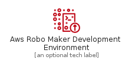
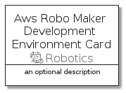
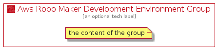

# AwsRoboMakerDevelopmentEnvironment


```text
aws-20210131/Resource/Robotics/AwsRoboMakerDevelopmentEnvironment
```

```text
include('aws-20210131/Resource/Robotics/AwsRoboMakerDevelopmentEnvironment')
```


| Illustration | AwsRoboMakerDevelopmentEnvironment | AwsRoboMakerDevelopmentEnvironmentCard | AwsRoboMakerDevelopmentEnvironmentGroup |
| :---: | :---: | :---: | :---: |
|  |  |  |  |


## AwsRoboMakerDevelopmentEnvironment

### Load remotely
```plantuml
@startuml
' configures the library
!global $LIB_BASE_LOCATION="https://github.com/tmorin/plantuml-libs/distribution"

' loads the library's bootstrap
!include $LIB_BASE_LOCATION/bootstrap.puml

' loads the package bootstrap
include('aws-20210131/bootstrap')

' loads the Item which embeds the element AwsRoboMakerDevelopmentEnvironment
include('aws-20210131/Resource/Robotics/AwsRoboMakerDevelopmentEnvironment')

' renders the element
AwsRoboMakerDevelopmentEnvironment('AwsRoboMakerDevelopmentEnvironment', 'Aws Robo Maker Development Environment', 'an optional tech label')
@enduml
```

### Load locally
```plantuml
@startuml
' configures the library
!global $INCLUSION_MODE="local"
!global $LIB_BASE_LOCATION="../../.."

' loads the library's bootstrap
!include $LIB_BASE_LOCATION/bootstrap.puml

' loads the package bootstrap
include('aws-20210131/bootstrap')

' loads the Item which embeds the element AwsRoboMakerDevelopmentEnvironment
include('aws-20210131/Resource/Robotics/AwsRoboMakerDevelopmentEnvironment')

' renders the element
AwsRoboMakerDevelopmentEnvironment('AwsRoboMakerDevelopmentEnvironment', 'Aws Robo Maker Development Environment', 'an optional tech label')
@enduml
```

## AwsRoboMakerDevelopmentEnvironmentCard

### Load remotely
```plantuml
@startuml
' configures the library
!global $LIB_BASE_LOCATION="https://github.com/tmorin/plantuml-libs/distribution"

' loads the library's bootstrap
!include $LIB_BASE_LOCATION/bootstrap.puml

' loads the package bootstrap
include('aws-20210131/bootstrap')

' loads the Item which embeds the element AwsRoboMakerDevelopmentEnvironmentCard
include('aws-20210131/Resource/Robotics/AwsRoboMakerDevelopmentEnvironment')

' renders the element
AwsRoboMakerDevelopmentEnvironmentCard('AwsRoboMakerDevelopmentEnvironmentCard', 'Aws Robo Maker Development Environment Card', 'an optional description')
@enduml
```

### Load locally
```plantuml
@startuml
' configures the library
!global $INCLUSION_MODE="local"
!global $LIB_BASE_LOCATION="../../.."

' loads the library's bootstrap
!include $LIB_BASE_LOCATION/bootstrap.puml

' loads the package bootstrap
include('aws-20210131/bootstrap')

' loads the Item which embeds the element AwsRoboMakerDevelopmentEnvironmentCard
include('aws-20210131/Resource/Robotics/AwsRoboMakerDevelopmentEnvironment')

' renders the element
AwsRoboMakerDevelopmentEnvironmentCard('AwsRoboMakerDevelopmentEnvironmentCard', 'Aws Robo Maker Development Environment Card', 'an optional description')
@enduml
```

## AwsRoboMakerDevelopmentEnvironmentGroup

### Load remotely
```plantuml
@startuml
' configures the library
!global $LIB_BASE_LOCATION="https://github.com/tmorin/plantuml-libs/distribution"

' loads the library's bootstrap
!include $LIB_BASE_LOCATION/bootstrap.puml

' loads the package bootstrap
include('aws-20210131/bootstrap')

' loads the Item which embeds the element AwsRoboMakerDevelopmentEnvironmentGroup
include('aws-20210131/Resource/Robotics/AwsRoboMakerDevelopmentEnvironment')

' renders the element
AwsRoboMakerDevelopmentEnvironmentGroup('AwsRoboMakerDevelopmentEnvironmentGroup', 'Aws Robo Maker Development Environment Group', 'an optional tech label') {
    note as note
        the content of the group
    end note
}
@enduml
```

### Load locally
```plantuml
@startuml
' configures the library
!global $INCLUSION_MODE="local"
!global $LIB_BASE_LOCATION="../../.."

' loads the library's bootstrap
!include $LIB_BASE_LOCATION/bootstrap.puml

' loads the package bootstrap
include('aws-20210131/bootstrap')

' loads the Item which embeds the element AwsRoboMakerDevelopmentEnvironmentGroup
include('aws-20210131/Resource/Robotics/AwsRoboMakerDevelopmentEnvironment')

' renders the element
AwsRoboMakerDevelopmentEnvironmentGroup('AwsRoboMakerDevelopmentEnvironmentGroup', 'Aws Robo Maker Development Environment Group', 'an optional tech label') {
    note as note
        the content of the group
    end note
}
@enduml
```

