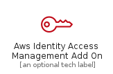
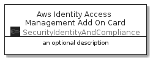

# AwsIdentityAccessManagementAddOn


```text
aws-20210131/Resource/SecurityIdentityAndCompliance/AwsIdentityAccessManagementAddOn
```

```text
include('aws-20210131/Resource/SecurityIdentityAndCompliance/AwsIdentityAccessManagementAddOn')
```


| Illustration | AwsIdentityAccessManagementAddOn | AwsIdentityAccessManagementAddOnCard | AwsIdentityAccessManagementAddOnGroup |
| :---: | :---: | :---: | :---: |
|  |  |  |  |


## AwsIdentityAccessManagementAddOn

### Load remotely
```plantuml
@startuml
' configures the library
!global $LIB_BASE_LOCATION="https://github.com/tmorin/plantuml-libs/distribution"

' loads the library's bootstrap
!include $LIB_BASE_LOCATION/bootstrap.puml

' loads the package bootstrap
include('aws-20210131/bootstrap')

' loads the Item which embeds the element AwsIdentityAccessManagementAddOn
include('aws-20210131/Resource/SecurityIdentityAndCompliance/AwsIdentityAccessManagementAddOn')

' renders the element
AwsIdentityAccessManagementAddOn('AwsIdentityAccessManagementAddOn', 'Aws Identity Access Management Add On', 'an optional tech label')
@enduml
```

### Load locally
```plantuml
@startuml
' configures the library
!global $INCLUSION_MODE="local"
!global $LIB_BASE_LOCATION="../../.."

' loads the library's bootstrap
!include $LIB_BASE_LOCATION/bootstrap.puml

' loads the package bootstrap
include('aws-20210131/bootstrap')

' loads the Item which embeds the element AwsIdentityAccessManagementAddOn
include('aws-20210131/Resource/SecurityIdentityAndCompliance/AwsIdentityAccessManagementAddOn')

' renders the element
AwsIdentityAccessManagementAddOn('AwsIdentityAccessManagementAddOn', 'Aws Identity Access Management Add On', 'an optional tech label')
@enduml
```

## AwsIdentityAccessManagementAddOnCard

### Load remotely
```plantuml
@startuml
' configures the library
!global $LIB_BASE_LOCATION="https://github.com/tmorin/plantuml-libs/distribution"

' loads the library's bootstrap
!include $LIB_BASE_LOCATION/bootstrap.puml

' loads the package bootstrap
include('aws-20210131/bootstrap')

' loads the Item which embeds the element AwsIdentityAccessManagementAddOnCard
include('aws-20210131/Resource/SecurityIdentityAndCompliance/AwsIdentityAccessManagementAddOn')

' renders the element
AwsIdentityAccessManagementAddOnCard('AwsIdentityAccessManagementAddOnCard', 'Aws Identity Access Management Add On Card', 'an optional description')
@enduml
```

### Load locally
```plantuml
@startuml
' configures the library
!global $INCLUSION_MODE="local"
!global $LIB_BASE_LOCATION="../../.."

' loads the library's bootstrap
!include $LIB_BASE_LOCATION/bootstrap.puml

' loads the package bootstrap
include('aws-20210131/bootstrap')

' loads the Item which embeds the element AwsIdentityAccessManagementAddOnCard
include('aws-20210131/Resource/SecurityIdentityAndCompliance/AwsIdentityAccessManagementAddOn')

' renders the element
AwsIdentityAccessManagementAddOnCard('AwsIdentityAccessManagementAddOnCard', 'Aws Identity Access Management Add On Card', 'an optional description')
@enduml
```

## AwsIdentityAccessManagementAddOnGroup

### Load remotely
```plantuml
@startuml
' configures the library
!global $LIB_BASE_LOCATION="https://github.com/tmorin/plantuml-libs/distribution"

' loads the library's bootstrap
!include $LIB_BASE_LOCATION/bootstrap.puml

' loads the package bootstrap
include('aws-20210131/bootstrap')

' loads the Item which embeds the element AwsIdentityAccessManagementAddOnGroup
include('aws-20210131/Resource/SecurityIdentityAndCompliance/AwsIdentityAccessManagementAddOn')

' renders the element
AwsIdentityAccessManagementAddOnGroup('AwsIdentityAccessManagementAddOnGroup', 'Aws Identity Access Management Add On Group', 'an optional tech label') {
    note as note
        the content of the group
    end note
}
@enduml
```

### Load locally
```plantuml
@startuml
' configures the library
!global $INCLUSION_MODE="local"
!global $LIB_BASE_LOCATION="../../.."

' loads the library's bootstrap
!include $LIB_BASE_LOCATION/bootstrap.puml

' loads the package bootstrap
include('aws-20210131/bootstrap')

' loads the Item which embeds the element AwsIdentityAccessManagementAddOnGroup
include('aws-20210131/Resource/SecurityIdentityAndCompliance/AwsIdentityAccessManagementAddOn')

' renders the element
AwsIdentityAccessManagementAddOnGroup('AwsIdentityAccessManagementAddOnGroup', 'Aws Identity Access Management Add On Group', 'an optional tech label') {
    note as note
        the content of the group
    end note
}
@enduml
```

