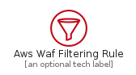
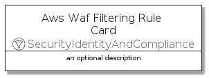
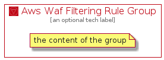

# AwsWafFilteringRule


```text
aws-20210131/Resource/SecurityIdentityAndCompliance/AwsWafFilteringRule
```

```text
include('aws-20210131/Resource/SecurityIdentityAndCompliance/AwsWafFilteringRule')
```


| Illustration | AwsWafFilteringRule | AwsWafFilteringRuleCard | AwsWafFilteringRuleGroup |
| :---: | :---: | :---: | :---: |
|  |  |  |  |


## AwsWafFilteringRule

### Load remotely
```plantuml
@startuml
' configures the library
!global $LIB_BASE_LOCATION="https://github.com/tmorin/plantuml-libs/distribution"

' loads the library's bootstrap
!include $LIB_BASE_LOCATION/bootstrap.puml

' loads the package bootstrap
include('aws-20210131/bootstrap')

' loads the Item which embeds the element AwsWafFilteringRule
include('aws-20210131/Resource/SecurityIdentityAndCompliance/AwsWafFilteringRule')

' renders the element
AwsWafFilteringRule('AwsWafFilteringRule', 'Aws Waf Filtering Rule', 'an optional tech label')
@enduml
```

### Load locally
```plantuml
@startuml
' configures the library
!global $INCLUSION_MODE="local"
!global $LIB_BASE_LOCATION="../../.."

' loads the library's bootstrap
!include $LIB_BASE_LOCATION/bootstrap.puml

' loads the package bootstrap
include('aws-20210131/bootstrap')

' loads the Item which embeds the element AwsWafFilteringRule
include('aws-20210131/Resource/SecurityIdentityAndCompliance/AwsWafFilteringRule')

' renders the element
AwsWafFilteringRule('AwsWafFilteringRule', 'Aws Waf Filtering Rule', 'an optional tech label')
@enduml
```

## AwsWafFilteringRuleCard

### Load remotely
```plantuml
@startuml
' configures the library
!global $LIB_BASE_LOCATION="https://github.com/tmorin/plantuml-libs/distribution"

' loads the library's bootstrap
!include $LIB_BASE_LOCATION/bootstrap.puml

' loads the package bootstrap
include('aws-20210131/bootstrap')

' loads the Item which embeds the element AwsWafFilteringRuleCard
include('aws-20210131/Resource/SecurityIdentityAndCompliance/AwsWafFilteringRule')

' renders the element
AwsWafFilteringRuleCard('AwsWafFilteringRuleCard', 'Aws Waf Filtering Rule Card', 'an optional description')
@enduml
```

### Load locally
```plantuml
@startuml
' configures the library
!global $INCLUSION_MODE="local"
!global $LIB_BASE_LOCATION="../../.."

' loads the library's bootstrap
!include $LIB_BASE_LOCATION/bootstrap.puml

' loads the package bootstrap
include('aws-20210131/bootstrap')

' loads the Item which embeds the element AwsWafFilteringRuleCard
include('aws-20210131/Resource/SecurityIdentityAndCompliance/AwsWafFilteringRule')

' renders the element
AwsWafFilteringRuleCard('AwsWafFilteringRuleCard', 'Aws Waf Filtering Rule Card', 'an optional description')
@enduml
```

## AwsWafFilteringRuleGroup

### Load remotely
```plantuml
@startuml
' configures the library
!global $LIB_BASE_LOCATION="https://github.com/tmorin/plantuml-libs/distribution"

' loads the library's bootstrap
!include $LIB_BASE_LOCATION/bootstrap.puml

' loads the package bootstrap
include('aws-20210131/bootstrap')

' loads the Item which embeds the element AwsWafFilteringRuleGroup
include('aws-20210131/Resource/SecurityIdentityAndCompliance/AwsWafFilteringRule')

' renders the element
AwsWafFilteringRuleGroup('AwsWafFilteringRuleGroup', 'Aws Waf Filtering Rule Group', 'an optional tech label') {
    note as note
        the content of the group
    end note
}
@enduml
```

### Load locally
```plantuml
@startuml
' configures the library
!global $INCLUSION_MODE="local"
!global $LIB_BASE_LOCATION="../../.."

' loads the library's bootstrap
!include $LIB_BASE_LOCATION/bootstrap.puml

' loads the package bootstrap
include('aws-20210131/bootstrap')

' loads the Item which embeds the element AwsWafFilteringRuleGroup
include('aws-20210131/Resource/SecurityIdentityAndCompliance/AwsWafFilteringRule')

' renders the element
AwsWafFilteringRuleGroup('AwsWafFilteringRuleGroup', 'Aws Waf Filtering Rule Group', 'an optional tech label') {
    note as note
        the content of the group
    end note
}
@enduml
```

