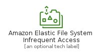
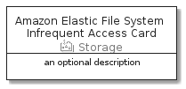

# AmazonElasticFileSystemInfrequentAccess


```text
aws-20210131/Resource/Storage/AmazonElasticFileSystemInfrequentAccess
```

```text
include('aws-20210131/Resource/Storage/AmazonElasticFileSystemInfrequentAccess')
```


| Illustration | AmazonElasticFileSystemInfrequentAccess | AmazonElasticFileSystemInfrequentAccessCard | AmazonElasticFileSystemInfrequentAccessGroup |
| :---: | :---: | :---: | :---: |
|  |  |  |  |


## AmazonElasticFileSystemInfrequentAccess

### Load remotely
```plantuml
@startuml
' configures the library
!global $LIB_BASE_LOCATION="https://github.com/tmorin/plantuml-libs/distribution"

' loads the library's bootstrap
!include $LIB_BASE_LOCATION/bootstrap.puml

' loads the package bootstrap
include('aws-20210131/bootstrap')

' loads the Item which embeds the element AmazonElasticFileSystemInfrequentAccess
include('aws-20210131/Resource/Storage/AmazonElasticFileSystemInfrequentAccess')

' renders the element
AmazonElasticFileSystemInfrequentAccess('AmazonElasticFileSystemInfrequentAccess', 'Amazon Elastic File System Infrequent Access', 'an optional tech label')
@enduml
```

### Load locally
```plantuml
@startuml
' configures the library
!global $INCLUSION_MODE="local"
!global $LIB_BASE_LOCATION="../../.."

' loads the library's bootstrap
!include $LIB_BASE_LOCATION/bootstrap.puml

' loads the package bootstrap
include('aws-20210131/bootstrap')

' loads the Item which embeds the element AmazonElasticFileSystemInfrequentAccess
include('aws-20210131/Resource/Storage/AmazonElasticFileSystemInfrequentAccess')

' renders the element
AmazonElasticFileSystemInfrequentAccess('AmazonElasticFileSystemInfrequentAccess', 'Amazon Elastic File System Infrequent Access', 'an optional tech label')
@enduml
```

## AmazonElasticFileSystemInfrequentAccessCard

### Load remotely
```plantuml
@startuml
' configures the library
!global $LIB_BASE_LOCATION="https://github.com/tmorin/plantuml-libs/distribution"

' loads the library's bootstrap
!include $LIB_BASE_LOCATION/bootstrap.puml

' loads the package bootstrap
include('aws-20210131/bootstrap')

' loads the Item which embeds the element AmazonElasticFileSystemInfrequentAccessCard
include('aws-20210131/Resource/Storage/AmazonElasticFileSystemInfrequentAccess')

' renders the element
AmazonElasticFileSystemInfrequentAccessCard('AmazonElasticFileSystemInfrequentAccessCard', 'Amazon Elastic File System Infrequent Access Card', 'an optional description')
@enduml
```

### Load locally
```plantuml
@startuml
' configures the library
!global $INCLUSION_MODE="local"
!global $LIB_BASE_LOCATION="../../.."

' loads the library's bootstrap
!include $LIB_BASE_LOCATION/bootstrap.puml

' loads the package bootstrap
include('aws-20210131/bootstrap')

' loads the Item which embeds the element AmazonElasticFileSystemInfrequentAccessCard
include('aws-20210131/Resource/Storage/AmazonElasticFileSystemInfrequentAccess')

' renders the element
AmazonElasticFileSystemInfrequentAccessCard('AmazonElasticFileSystemInfrequentAccessCard', 'Amazon Elastic File System Infrequent Access Card', 'an optional description')
@enduml
```

## AmazonElasticFileSystemInfrequentAccessGroup

### Load remotely
```plantuml
@startuml
' configures the library
!global $LIB_BASE_LOCATION="https://github.com/tmorin/plantuml-libs/distribution"

' loads the library's bootstrap
!include $LIB_BASE_LOCATION/bootstrap.puml

' loads the package bootstrap
include('aws-20210131/bootstrap')

' loads the Item which embeds the element AmazonElasticFileSystemInfrequentAccessGroup
include('aws-20210131/Resource/Storage/AmazonElasticFileSystemInfrequentAccess')

' renders the element
AmazonElasticFileSystemInfrequentAccessGroup('AmazonElasticFileSystemInfrequentAccessGroup', 'Amazon Elastic File System Infrequent Access Group', 'an optional tech label') {
    note as note
        the content of the group
    end note
}
@enduml
```

### Load locally
```plantuml
@startuml
' configures the library
!global $INCLUSION_MODE="local"
!global $LIB_BASE_LOCATION="../../.."

' loads the library's bootstrap
!include $LIB_BASE_LOCATION/bootstrap.puml

' loads the package bootstrap
include('aws-20210131/bootstrap')

' loads the Item which embeds the element AmazonElasticFileSystemInfrequentAccessGroup
include('aws-20210131/Resource/Storage/AmazonElasticFileSystemInfrequentAccess')

' renders the element
AmazonElasticFileSystemInfrequentAccessGroup('AmazonElasticFileSystemInfrequentAccessGroup', 'Amazon Elastic File System Infrequent Access Group', 'an optional tech label') {
    note as note
        the content of the group
    end note
}
@enduml
```

