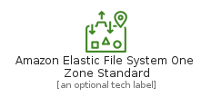
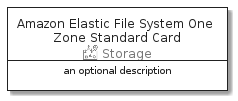

# AmazonElasticFileSystemOneZoneStandard


```text
aws-20210131/Resource/Storage/AmazonElasticFileSystemOneZoneStandard
```

```text
include('aws-20210131/Resource/Storage/AmazonElasticFileSystemOneZoneStandard')
```


| Illustration | AmazonElasticFileSystemOneZoneStandard | AmazonElasticFileSystemOneZoneStandardCard | AmazonElasticFileSystemOneZoneStandardGroup |
| :---: | :---: | :---: | :---: |
|  |  |  |  |


## AmazonElasticFileSystemOneZoneStandard

### Load remotely
```plantuml
@startuml
' configures the library
!global $LIB_BASE_LOCATION="https://github.com/tmorin/plantuml-libs/distribution"

' loads the library's bootstrap
!include $LIB_BASE_LOCATION/bootstrap.puml

' loads the package bootstrap
include('aws-20210131/bootstrap')

' loads the Item which embeds the element AmazonElasticFileSystemOneZoneStandard
include('aws-20210131/Resource/Storage/AmazonElasticFileSystemOneZoneStandard')

' renders the element
AmazonElasticFileSystemOneZoneStandard('AmazonElasticFileSystemOneZoneStandard', 'Amazon Elastic File System One Zone Standard', 'an optional tech label')
@enduml
```

### Load locally
```plantuml
@startuml
' configures the library
!global $INCLUSION_MODE="local"
!global $LIB_BASE_LOCATION="../../.."

' loads the library's bootstrap
!include $LIB_BASE_LOCATION/bootstrap.puml

' loads the package bootstrap
include('aws-20210131/bootstrap')

' loads the Item which embeds the element AmazonElasticFileSystemOneZoneStandard
include('aws-20210131/Resource/Storage/AmazonElasticFileSystemOneZoneStandard')

' renders the element
AmazonElasticFileSystemOneZoneStandard('AmazonElasticFileSystemOneZoneStandard', 'Amazon Elastic File System One Zone Standard', 'an optional tech label')
@enduml
```

## AmazonElasticFileSystemOneZoneStandardCard

### Load remotely
```plantuml
@startuml
' configures the library
!global $LIB_BASE_LOCATION="https://github.com/tmorin/plantuml-libs/distribution"

' loads the library's bootstrap
!include $LIB_BASE_LOCATION/bootstrap.puml

' loads the package bootstrap
include('aws-20210131/bootstrap')

' loads the Item which embeds the element AmazonElasticFileSystemOneZoneStandardCard
include('aws-20210131/Resource/Storage/AmazonElasticFileSystemOneZoneStandard')

' renders the element
AmazonElasticFileSystemOneZoneStandardCard('AmazonElasticFileSystemOneZoneStandardCard', 'Amazon Elastic File System One Zone Standard Card', 'an optional description')
@enduml
```

### Load locally
```plantuml
@startuml
' configures the library
!global $INCLUSION_MODE="local"
!global $LIB_BASE_LOCATION="../../.."

' loads the library's bootstrap
!include $LIB_BASE_LOCATION/bootstrap.puml

' loads the package bootstrap
include('aws-20210131/bootstrap')

' loads the Item which embeds the element AmazonElasticFileSystemOneZoneStandardCard
include('aws-20210131/Resource/Storage/AmazonElasticFileSystemOneZoneStandard')

' renders the element
AmazonElasticFileSystemOneZoneStandardCard('AmazonElasticFileSystemOneZoneStandardCard', 'Amazon Elastic File System One Zone Standard Card', 'an optional description')
@enduml
```

## AmazonElasticFileSystemOneZoneStandardGroup

### Load remotely
```plantuml
@startuml
' configures the library
!global $LIB_BASE_LOCATION="https://github.com/tmorin/plantuml-libs/distribution"

' loads the library's bootstrap
!include $LIB_BASE_LOCATION/bootstrap.puml

' loads the package bootstrap
include('aws-20210131/bootstrap')

' loads the Item which embeds the element AmazonElasticFileSystemOneZoneStandardGroup
include('aws-20210131/Resource/Storage/AmazonElasticFileSystemOneZoneStandard')

' renders the element
AmazonElasticFileSystemOneZoneStandardGroup('AmazonElasticFileSystemOneZoneStandardGroup', 'Amazon Elastic File System One Zone Standard Group', 'an optional tech label') {
    note as note
        the content of the group
    end note
}
@enduml
```

### Load locally
```plantuml
@startuml
' configures the library
!global $INCLUSION_MODE="local"
!global $LIB_BASE_LOCATION="../../.."

' loads the library's bootstrap
!include $LIB_BASE_LOCATION/bootstrap.puml

' loads the package bootstrap
include('aws-20210131/bootstrap')

' loads the Item which embeds the element AmazonElasticFileSystemOneZoneStandardGroup
include('aws-20210131/Resource/Storage/AmazonElasticFileSystemOneZoneStandard')

' renders the element
AmazonElasticFileSystemOneZoneStandardGroup('AmazonElasticFileSystemOneZoneStandardGroup', 'Amazon Elastic File System One Zone Standard Group', 'an optional tech label') {
    note as note
        the content of the group
    end note
}
@enduml
```

