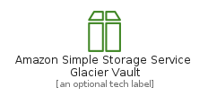
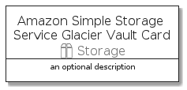
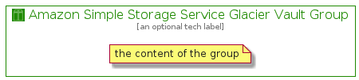

# AmazonSimpleStorageServiceGlacierVault


```text
aws-20210131/Resource/Storage/AmazonSimpleStorageServiceGlacierVault
```

```text
include('aws-20210131/Resource/Storage/AmazonSimpleStorageServiceGlacierVault')
```


| Illustration | AmazonSimpleStorageServiceGlacierVault | AmazonSimpleStorageServiceGlacierVaultCard | AmazonSimpleStorageServiceGlacierVaultGroup |
| :---: | :---: | :---: | :---: |
|  |  |  |  |


## AmazonSimpleStorageServiceGlacierVault

### Load remotely
```plantuml
@startuml
' configures the library
!global $LIB_BASE_LOCATION="https://github.com/tmorin/plantuml-libs/distribution"

' loads the library's bootstrap
!include $LIB_BASE_LOCATION/bootstrap.puml

' loads the package bootstrap
include('aws-20210131/bootstrap')

' loads the Item which embeds the element AmazonSimpleStorageServiceGlacierVault
include('aws-20210131/Resource/Storage/AmazonSimpleStorageServiceGlacierVault')

' renders the element
AmazonSimpleStorageServiceGlacierVault('AmazonSimpleStorageServiceGlacierVault', 'Amazon Simple Storage Service Glacier Vault', 'an optional tech label')
@enduml
```

### Load locally
```plantuml
@startuml
' configures the library
!global $INCLUSION_MODE="local"
!global $LIB_BASE_LOCATION="../../.."

' loads the library's bootstrap
!include $LIB_BASE_LOCATION/bootstrap.puml

' loads the package bootstrap
include('aws-20210131/bootstrap')

' loads the Item which embeds the element AmazonSimpleStorageServiceGlacierVault
include('aws-20210131/Resource/Storage/AmazonSimpleStorageServiceGlacierVault')

' renders the element
AmazonSimpleStorageServiceGlacierVault('AmazonSimpleStorageServiceGlacierVault', 'Amazon Simple Storage Service Glacier Vault', 'an optional tech label')
@enduml
```

## AmazonSimpleStorageServiceGlacierVaultCard

### Load remotely
```plantuml
@startuml
' configures the library
!global $LIB_BASE_LOCATION="https://github.com/tmorin/plantuml-libs/distribution"

' loads the library's bootstrap
!include $LIB_BASE_LOCATION/bootstrap.puml

' loads the package bootstrap
include('aws-20210131/bootstrap')

' loads the Item which embeds the element AmazonSimpleStorageServiceGlacierVaultCard
include('aws-20210131/Resource/Storage/AmazonSimpleStorageServiceGlacierVault')

' renders the element
AmazonSimpleStorageServiceGlacierVaultCard('AmazonSimpleStorageServiceGlacierVaultCard', 'Amazon Simple Storage Service Glacier Vault Card', 'an optional description')
@enduml
```

### Load locally
```plantuml
@startuml
' configures the library
!global $INCLUSION_MODE="local"
!global $LIB_BASE_LOCATION="../../.."

' loads the library's bootstrap
!include $LIB_BASE_LOCATION/bootstrap.puml

' loads the package bootstrap
include('aws-20210131/bootstrap')

' loads the Item which embeds the element AmazonSimpleStorageServiceGlacierVaultCard
include('aws-20210131/Resource/Storage/AmazonSimpleStorageServiceGlacierVault')

' renders the element
AmazonSimpleStorageServiceGlacierVaultCard('AmazonSimpleStorageServiceGlacierVaultCard', 'Amazon Simple Storage Service Glacier Vault Card', 'an optional description')
@enduml
```

## AmazonSimpleStorageServiceGlacierVaultGroup

### Load remotely
```plantuml
@startuml
' configures the library
!global $LIB_BASE_LOCATION="https://github.com/tmorin/plantuml-libs/distribution"

' loads the library's bootstrap
!include $LIB_BASE_LOCATION/bootstrap.puml

' loads the package bootstrap
include('aws-20210131/bootstrap')

' loads the Item which embeds the element AmazonSimpleStorageServiceGlacierVaultGroup
include('aws-20210131/Resource/Storage/AmazonSimpleStorageServiceGlacierVault')

' renders the element
AmazonSimpleStorageServiceGlacierVaultGroup('AmazonSimpleStorageServiceGlacierVaultGroup', 'Amazon Simple Storage Service Glacier Vault Group', 'an optional tech label') {
    note as note
        the content of the group
    end note
}
@enduml
```

### Load locally
```plantuml
@startuml
' configures the library
!global $INCLUSION_MODE="local"
!global $LIB_BASE_LOCATION="../../.."

' loads the library's bootstrap
!include $LIB_BASE_LOCATION/bootstrap.puml

' loads the package bootstrap
include('aws-20210131/bootstrap')

' loads the Item which embeds the element AmazonSimpleStorageServiceGlacierVaultGroup
include('aws-20210131/Resource/Storage/AmazonSimpleStorageServiceGlacierVault')

' renders the element
AmazonSimpleStorageServiceGlacierVaultGroup('AmazonSimpleStorageServiceGlacierVaultGroup', 'Amazon Simple Storage Service Glacier Vault Group', 'an optional tech label') {
    note as note
        the content of the group
    end note
}
@enduml
```

