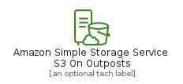
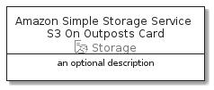

# AmazonSimpleStorageServiceS3OnOutposts


```text
aws-20210131/Resource/Storage/AmazonSimpleStorageServiceS3OnOutposts
```

```text
include('aws-20210131/Resource/Storage/AmazonSimpleStorageServiceS3OnOutposts')
```


| Illustration | AmazonSimpleStorageServiceS3OnOutposts | AmazonSimpleStorageServiceS3OnOutpostsCard | AmazonSimpleStorageServiceS3OnOutpostsGroup |
| :---: | :---: | :---: | :---: |
|  |  |  |  |


## AmazonSimpleStorageServiceS3OnOutposts

### Load remotely
```plantuml
@startuml
' configures the library
!global $LIB_BASE_LOCATION="https://github.com/tmorin/plantuml-libs/distribution"

' loads the library's bootstrap
!include $LIB_BASE_LOCATION/bootstrap.puml

' loads the package bootstrap
include('aws-20210131/bootstrap')

' loads the Item which embeds the element AmazonSimpleStorageServiceS3OnOutposts
include('aws-20210131/Resource/Storage/AmazonSimpleStorageServiceS3OnOutposts')

' renders the element
AmazonSimpleStorageServiceS3OnOutposts('AmazonSimpleStorageServiceS3OnOutposts', 'Amazon Simple Storage Service S3 On Outposts', 'an optional tech label')
@enduml
```

### Load locally
```plantuml
@startuml
' configures the library
!global $INCLUSION_MODE="local"
!global $LIB_BASE_LOCATION="../../.."

' loads the library's bootstrap
!include $LIB_BASE_LOCATION/bootstrap.puml

' loads the package bootstrap
include('aws-20210131/bootstrap')

' loads the Item which embeds the element AmazonSimpleStorageServiceS3OnOutposts
include('aws-20210131/Resource/Storage/AmazonSimpleStorageServiceS3OnOutposts')

' renders the element
AmazonSimpleStorageServiceS3OnOutposts('AmazonSimpleStorageServiceS3OnOutposts', 'Amazon Simple Storage Service S3 On Outposts', 'an optional tech label')
@enduml
```

## AmazonSimpleStorageServiceS3OnOutpostsCard

### Load remotely
```plantuml
@startuml
' configures the library
!global $LIB_BASE_LOCATION="https://github.com/tmorin/plantuml-libs/distribution"

' loads the library's bootstrap
!include $LIB_BASE_LOCATION/bootstrap.puml

' loads the package bootstrap
include('aws-20210131/bootstrap')

' loads the Item which embeds the element AmazonSimpleStorageServiceS3OnOutpostsCard
include('aws-20210131/Resource/Storage/AmazonSimpleStorageServiceS3OnOutposts')

' renders the element
AmazonSimpleStorageServiceS3OnOutpostsCard('AmazonSimpleStorageServiceS3OnOutpostsCard', 'Amazon Simple Storage Service S3 On Outposts Card', 'an optional description')
@enduml
```

### Load locally
```plantuml
@startuml
' configures the library
!global $INCLUSION_MODE="local"
!global $LIB_BASE_LOCATION="../../.."

' loads the library's bootstrap
!include $LIB_BASE_LOCATION/bootstrap.puml

' loads the package bootstrap
include('aws-20210131/bootstrap')

' loads the Item which embeds the element AmazonSimpleStorageServiceS3OnOutpostsCard
include('aws-20210131/Resource/Storage/AmazonSimpleStorageServiceS3OnOutposts')

' renders the element
AmazonSimpleStorageServiceS3OnOutpostsCard('AmazonSimpleStorageServiceS3OnOutpostsCard', 'Amazon Simple Storage Service S3 On Outposts Card', 'an optional description')
@enduml
```

## AmazonSimpleStorageServiceS3OnOutpostsGroup

### Load remotely
```plantuml
@startuml
' configures the library
!global $LIB_BASE_LOCATION="https://github.com/tmorin/plantuml-libs/distribution"

' loads the library's bootstrap
!include $LIB_BASE_LOCATION/bootstrap.puml

' loads the package bootstrap
include('aws-20210131/bootstrap')

' loads the Item which embeds the element AmazonSimpleStorageServiceS3OnOutpostsGroup
include('aws-20210131/Resource/Storage/AmazonSimpleStorageServiceS3OnOutposts')

' renders the element
AmazonSimpleStorageServiceS3OnOutpostsGroup('AmazonSimpleStorageServiceS3OnOutpostsGroup', 'Amazon Simple Storage Service S3 On Outposts Group', 'an optional tech label') {
    note as note
        the content of the group
    end note
}
@enduml
```

### Load locally
```plantuml
@startuml
' configures the library
!global $INCLUSION_MODE="local"
!global $LIB_BASE_LOCATION="../../.."

' loads the library's bootstrap
!include $LIB_BASE_LOCATION/bootstrap.puml

' loads the package bootstrap
include('aws-20210131/bootstrap')

' loads the Item which embeds the element AmazonSimpleStorageServiceS3OnOutpostsGroup
include('aws-20210131/Resource/Storage/AmazonSimpleStorageServiceS3OnOutposts')

' renders the element
AmazonSimpleStorageServiceS3OnOutpostsGroup('AmazonSimpleStorageServiceS3OnOutpostsGroup', 'Amazon Simple Storage Service S3 On Outposts Group', 'an optional tech label') {
    note as note
        the content of the group
    end note
}
@enduml
```

