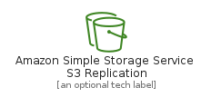
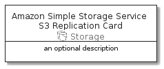

# AmazonSimpleStorageServiceS3Replication


```text
aws-20210131/Resource/Storage/AmazonSimpleStorageServiceS3Replication
```

```text
include('aws-20210131/Resource/Storage/AmazonSimpleStorageServiceS3Replication')
```


| Illustration | AmazonSimpleStorageServiceS3Replication | AmazonSimpleStorageServiceS3ReplicationCard | AmazonSimpleStorageServiceS3ReplicationGroup |
| :---: | :---: | :---: | :---: |
|  |  |  |  |


## AmazonSimpleStorageServiceS3Replication

### Load remotely
```plantuml
@startuml
' configures the library
!global $LIB_BASE_LOCATION="https://github.com/tmorin/plantuml-libs/distribution"

' loads the library's bootstrap
!include $LIB_BASE_LOCATION/bootstrap.puml

' loads the package bootstrap
include('aws-20210131/bootstrap')

' loads the Item which embeds the element AmazonSimpleStorageServiceS3Replication
include('aws-20210131/Resource/Storage/AmazonSimpleStorageServiceS3Replication')

' renders the element
AmazonSimpleStorageServiceS3Replication('AmazonSimpleStorageServiceS3Replication', 'Amazon Simple Storage Service S3 Replication', 'an optional tech label')
@enduml
```

### Load locally
```plantuml
@startuml
' configures the library
!global $INCLUSION_MODE="local"
!global $LIB_BASE_LOCATION="../../.."

' loads the library's bootstrap
!include $LIB_BASE_LOCATION/bootstrap.puml

' loads the package bootstrap
include('aws-20210131/bootstrap')

' loads the Item which embeds the element AmazonSimpleStorageServiceS3Replication
include('aws-20210131/Resource/Storage/AmazonSimpleStorageServiceS3Replication')

' renders the element
AmazonSimpleStorageServiceS3Replication('AmazonSimpleStorageServiceS3Replication', 'Amazon Simple Storage Service S3 Replication', 'an optional tech label')
@enduml
```

## AmazonSimpleStorageServiceS3ReplicationCard

### Load remotely
```plantuml
@startuml
' configures the library
!global $LIB_BASE_LOCATION="https://github.com/tmorin/plantuml-libs/distribution"

' loads the library's bootstrap
!include $LIB_BASE_LOCATION/bootstrap.puml

' loads the package bootstrap
include('aws-20210131/bootstrap')

' loads the Item which embeds the element AmazonSimpleStorageServiceS3ReplicationCard
include('aws-20210131/Resource/Storage/AmazonSimpleStorageServiceS3Replication')

' renders the element
AmazonSimpleStorageServiceS3ReplicationCard('AmazonSimpleStorageServiceS3ReplicationCard', 'Amazon Simple Storage Service S3 Replication Card', 'an optional description')
@enduml
```

### Load locally
```plantuml
@startuml
' configures the library
!global $INCLUSION_MODE="local"
!global $LIB_BASE_LOCATION="../../.."

' loads the library's bootstrap
!include $LIB_BASE_LOCATION/bootstrap.puml

' loads the package bootstrap
include('aws-20210131/bootstrap')

' loads the Item which embeds the element AmazonSimpleStorageServiceS3ReplicationCard
include('aws-20210131/Resource/Storage/AmazonSimpleStorageServiceS3Replication')

' renders the element
AmazonSimpleStorageServiceS3ReplicationCard('AmazonSimpleStorageServiceS3ReplicationCard', 'Amazon Simple Storage Service S3 Replication Card', 'an optional description')
@enduml
```

## AmazonSimpleStorageServiceS3ReplicationGroup

### Load remotely
```plantuml
@startuml
' configures the library
!global $LIB_BASE_LOCATION="https://github.com/tmorin/plantuml-libs/distribution"

' loads the library's bootstrap
!include $LIB_BASE_LOCATION/bootstrap.puml

' loads the package bootstrap
include('aws-20210131/bootstrap')

' loads the Item which embeds the element AmazonSimpleStorageServiceS3ReplicationGroup
include('aws-20210131/Resource/Storage/AmazonSimpleStorageServiceS3Replication')

' renders the element
AmazonSimpleStorageServiceS3ReplicationGroup('AmazonSimpleStorageServiceS3ReplicationGroup', 'Amazon Simple Storage Service S3 Replication Group', 'an optional tech label') {
    note as note
        the content of the group
    end note
}
@enduml
```

### Load locally
```plantuml
@startuml
' configures the library
!global $INCLUSION_MODE="local"
!global $LIB_BASE_LOCATION="../../.."

' loads the library's bootstrap
!include $LIB_BASE_LOCATION/bootstrap.puml

' loads the package bootstrap
include('aws-20210131/bootstrap')

' loads the Item which embeds the element AmazonSimpleStorageServiceS3ReplicationGroup
include('aws-20210131/Resource/Storage/AmazonSimpleStorageServiceS3Replication')

' renders the element
AmazonSimpleStorageServiceS3ReplicationGroup('AmazonSimpleStorageServiceS3ReplicationGroup', 'Amazon Simple Storage Service S3 Replication Group', 'an optional tech label') {
    note as note
        the content of the group
    end note
}
@enduml
```

