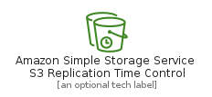
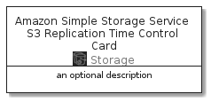

# AmazonSimpleStorageServiceS3ReplicationTimeControl


```text
aws-20210131/Resource/Storage/AmazonSimpleStorageServiceS3ReplicationTimeControl
```

```text
include('aws-20210131/Resource/Storage/AmazonSimpleStorageServiceS3ReplicationTimeControl')
```


| Illustration | AmazonSimpleStorageServiceS3ReplicationTimeControl | AmazonSimpleStorageServiceS3ReplicationTimeControlCard | AmazonSimpleStorageServiceS3ReplicationTimeControlGroup |
| :---: | :---: | :---: | :---: |
|  |  |  |  |


## AmazonSimpleStorageServiceS3ReplicationTimeControl

### Load remotely
```plantuml
@startuml
' configures the library
!global $LIB_BASE_LOCATION="https://github.com/tmorin/plantuml-libs/distribution"

' loads the library's bootstrap
!include $LIB_BASE_LOCATION/bootstrap.puml

' loads the package bootstrap
include('aws-20210131/bootstrap')

' loads the Item which embeds the element AmazonSimpleStorageServiceS3ReplicationTimeControl
include('aws-20210131/Resource/Storage/AmazonSimpleStorageServiceS3ReplicationTimeControl')

' renders the element
AmazonSimpleStorageServiceS3ReplicationTimeControl('AmazonSimpleStorageServiceS3ReplicationTimeControl', 'Amazon Simple Storage Service S3 Replication Time Control', 'an optional tech label')
@enduml
```

### Load locally
```plantuml
@startuml
' configures the library
!global $INCLUSION_MODE="local"
!global $LIB_BASE_LOCATION="../../.."

' loads the library's bootstrap
!include $LIB_BASE_LOCATION/bootstrap.puml

' loads the package bootstrap
include('aws-20210131/bootstrap')

' loads the Item which embeds the element AmazonSimpleStorageServiceS3ReplicationTimeControl
include('aws-20210131/Resource/Storage/AmazonSimpleStorageServiceS3ReplicationTimeControl')

' renders the element
AmazonSimpleStorageServiceS3ReplicationTimeControl('AmazonSimpleStorageServiceS3ReplicationTimeControl', 'Amazon Simple Storage Service S3 Replication Time Control', 'an optional tech label')
@enduml
```

## AmazonSimpleStorageServiceS3ReplicationTimeControlCard

### Load remotely
```plantuml
@startuml
' configures the library
!global $LIB_BASE_LOCATION="https://github.com/tmorin/plantuml-libs/distribution"

' loads the library's bootstrap
!include $LIB_BASE_LOCATION/bootstrap.puml

' loads the package bootstrap
include('aws-20210131/bootstrap')

' loads the Item which embeds the element AmazonSimpleStorageServiceS3ReplicationTimeControlCard
include('aws-20210131/Resource/Storage/AmazonSimpleStorageServiceS3ReplicationTimeControl')

' renders the element
AmazonSimpleStorageServiceS3ReplicationTimeControlCard('AmazonSimpleStorageServiceS3ReplicationTimeControlCard', 'Amazon Simple Storage Service S3 Replication Time Control Card', 'an optional description')
@enduml
```

### Load locally
```plantuml
@startuml
' configures the library
!global $INCLUSION_MODE="local"
!global $LIB_BASE_LOCATION="../../.."

' loads the library's bootstrap
!include $LIB_BASE_LOCATION/bootstrap.puml

' loads the package bootstrap
include('aws-20210131/bootstrap')

' loads the Item which embeds the element AmazonSimpleStorageServiceS3ReplicationTimeControlCard
include('aws-20210131/Resource/Storage/AmazonSimpleStorageServiceS3ReplicationTimeControl')

' renders the element
AmazonSimpleStorageServiceS3ReplicationTimeControlCard('AmazonSimpleStorageServiceS3ReplicationTimeControlCard', 'Amazon Simple Storage Service S3 Replication Time Control Card', 'an optional description')
@enduml
```

## AmazonSimpleStorageServiceS3ReplicationTimeControlGroup

### Load remotely
```plantuml
@startuml
' configures the library
!global $LIB_BASE_LOCATION="https://github.com/tmorin/plantuml-libs/distribution"

' loads the library's bootstrap
!include $LIB_BASE_LOCATION/bootstrap.puml

' loads the package bootstrap
include('aws-20210131/bootstrap')

' loads the Item which embeds the element AmazonSimpleStorageServiceS3ReplicationTimeControlGroup
include('aws-20210131/Resource/Storage/AmazonSimpleStorageServiceS3ReplicationTimeControl')

' renders the element
AmazonSimpleStorageServiceS3ReplicationTimeControlGroup('AmazonSimpleStorageServiceS3ReplicationTimeControlGroup', 'Amazon Simple Storage Service S3 Replication Time Control Group', 'an optional tech label') {
    note as note
        the content of the group
    end note
}
@enduml
```

### Load locally
```plantuml
@startuml
' configures the library
!global $INCLUSION_MODE="local"
!global $LIB_BASE_LOCATION="../../.."

' loads the library's bootstrap
!include $LIB_BASE_LOCATION/bootstrap.puml

' loads the package bootstrap
include('aws-20210131/bootstrap')

' loads the Item which embeds the element AmazonSimpleStorageServiceS3ReplicationTimeControlGroup
include('aws-20210131/Resource/Storage/AmazonSimpleStorageServiceS3ReplicationTimeControl')

' renders the element
AmazonSimpleStorageServiceS3ReplicationTimeControlGroup('AmazonSimpleStorageServiceS3ReplicationTimeControlGroup', 'Amazon Simple Storage Service S3 Replication Time Control Group', 'an optional tech label') {
    note as note
        the content of the group
    end note
}
@enduml
```

