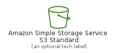
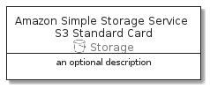

# AmazonSimpleStorageServiceS3Standard


```text
aws-20210131/Resource/Storage/AmazonSimpleStorageServiceS3Standard
```

```text
include('aws-20210131/Resource/Storage/AmazonSimpleStorageServiceS3Standard')
```


| Illustration | AmazonSimpleStorageServiceS3Standard | AmazonSimpleStorageServiceS3StandardCard | AmazonSimpleStorageServiceS3StandardGroup |
| :---: | :---: | :---: | :---: |
|  |  |  |  |


## AmazonSimpleStorageServiceS3Standard

### Load remotely
```plantuml
@startuml
' configures the library
!global $LIB_BASE_LOCATION="https://github.com/tmorin/plantuml-libs/distribution"

' loads the library's bootstrap
!include $LIB_BASE_LOCATION/bootstrap.puml

' loads the package bootstrap
include('aws-20210131/bootstrap')

' loads the Item which embeds the element AmazonSimpleStorageServiceS3Standard
include('aws-20210131/Resource/Storage/AmazonSimpleStorageServiceS3Standard')

' renders the element
AmazonSimpleStorageServiceS3Standard('AmazonSimpleStorageServiceS3Standard', 'Amazon Simple Storage Service S3 Standard', 'an optional tech label')
@enduml
```

### Load locally
```plantuml
@startuml
' configures the library
!global $INCLUSION_MODE="local"
!global $LIB_BASE_LOCATION="../../.."

' loads the library's bootstrap
!include $LIB_BASE_LOCATION/bootstrap.puml

' loads the package bootstrap
include('aws-20210131/bootstrap')

' loads the Item which embeds the element AmazonSimpleStorageServiceS3Standard
include('aws-20210131/Resource/Storage/AmazonSimpleStorageServiceS3Standard')

' renders the element
AmazonSimpleStorageServiceS3Standard('AmazonSimpleStorageServiceS3Standard', 'Amazon Simple Storage Service S3 Standard', 'an optional tech label')
@enduml
```

## AmazonSimpleStorageServiceS3StandardCard

### Load remotely
```plantuml
@startuml
' configures the library
!global $LIB_BASE_LOCATION="https://github.com/tmorin/plantuml-libs/distribution"

' loads the library's bootstrap
!include $LIB_BASE_LOCATION/bootstrap.puml

' loads the package bootstrap
include('aws-20210131/bootstrap')

' loads the Item which embeds the element AmazonSimpleStorageServiceS3StandardCard
include('aws-20210131/Resource/Storage/AmazonSimpleStorageServiceS3Standard')

' renders the element
AmazonSimpleStorageServiceS3StandardCard('AmazonSimpleStorageServiceS3StandardCard', 'Amazon Simple Storage Service S3 Standard Card', 'an optional description')
@enduml
```

### Load locally
```plantuml
@startuml
' configures the library
!global $INCLUSION_MODE="local"
!global $LIB_BASE_LOCATION="../../.."

' loads the library's bootstrap
!include $LIB_BASE_LOCATION/bootstrap.puml

' loads the package bootstrap
include('aws-20210131/bootstrap')

' loads the Item which embeds the element AmazonSimpleStorageServiceS3StandardCard
include('aws-20210131/Resource/Storage/AmazonSimpleStorageServiceS3Standard')

' renders the element
AmazonSimpleStorageServiceS3StandardCard('AmazonSimpleStorageServiceS3StandardCard', 'Amazon Simple Storage Service S3 Standard Card', 'an optional description')
@enduml
```

## AmazonSimpleStorageServiceS3StandardGroup

### Load remotely
```plantuml
@startuml
' configures the library
!global $LIB_BASE_LOCATION="https://github.com/tmorin/plantuml-libs/distribution"

' loads the library's bootstrap
!include $LIB_BASE_LOCATION/bootstrap.puml

' loads the package bootstrap
include('aws-20210131/bootstrap')

' loads the Item which embeds the element AmazonSimpleStorageServiceS3StandardGroup
include('aws-20210131/Resource/Storage/AmazonSimpleStorageServiceS3Standard')

' renders the element
AmazonSimpleStorageServiceS3StandardGroup('AmazonSimpleStorageServiceS3StandardGroup', 'Amazon Simple Storage Service S3 Standard Group', 'an optional tech label') {
    note as note
        the content of the group
    end note
}
@enduml
```

### Load locally
```plantuml
@startuml
' configures the library
!global $INCLUSION_MODE="local"
!global $LIB_BASE_LOCATION="../../.."

' loads the library's bootstrap
!include $LIB_BASE_LOCATION/bootstrap.puml

' loads the package bootstrap
include('aws-20210131/bootstrap')

' loads the Item which embeds the element AmazonSimpleStorageServiceS3StandardGroup
include('aws-20210131/Resource/Storage/AmazonSimpleStorageServiceS3Standard')

' renders the element
AmazonSimpleStorageServiceS3StandardGroup('AmazonSimpleStorageServiceS3StandardGroup', 'Amazon Simple Storage Service S3 Standard Group', 'an optional tech label') {
    note as note
        the content of the group
    end note
}
@enduml
```

