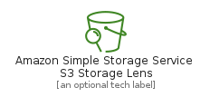
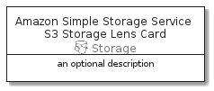
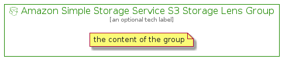

# AmazonSimpleStorageServiceS3StorageLens


```text
aws-20210131/Resource/Storage/AmazonSimpleStorageServiceS3StorageLens
```

```text
include('aws-20210131/Resource/Storage/AmazonSimpleStorageServiceS3StorageLens')
```


| Illustration | AmazonSimpleStorageServiceS3StorageLens | AmazonSimpleStorageServiceS3StorageLensCard | AmazonSimpleStorageServiceS3StorageLensGroup |
| :---: | :---: | :---: | :---: |
|  |  |  |  |


## AmazonSimpleStorageServiceS3StorageLens

### Load remotely
```plantuml
@startuml
' configures the library
!global $LIB_BASE_LOCATION="https://github.com/tmorin/plantuml-libs/distribution"

' loads the library's bootstrap
!include $LIB_BASE_LOCATION/bootstrap.puml

' loads the package bootstrap
include('aws-20210131/bootstrap')

' loads the Item which embeds the element AmazonSimpleStorageServiceS3StorageLens
include('aws-20210131/Resource/Storage/AmazonSimpleStorageServiceS3StorageLens')

' renders the element
AmazonSimpleStorageServiceS3StorageLens('AmazonSimpleStorageServiceS3StorageLens', 'Amazon Simple Storage Service S3 Storage Lens', 'an optional tech label')
@enduml
```

### Load locally
```plantuml
@startuml
' configures the library
!global $INCLUSION_MODE="local"
!global $LIB_BASE_LOCATION="../../.."

' loads the library's bootstrap
!include $LIB_BASE_LOCATION/bootstrap.puml

' loads the package bootstrap
include('aws-20210131/bootstrap')

' loads the Item which embeds the element AmazonSimpleStorageServiceS3StorageLens
include('aws-20210131/Resource/Storage/AmazonSimpleStorageServiceS3StorageLens')

' renders the element
AmazonSimpleStorageServiceS3StorageLens('AmazonSimpleStorageServiceS3StorageLens', 'Amazon Simple Storage Service S3 Storage Lens', 'an optional tech label')
@enduml
```

## AmazonSimpleStorageServiceS3StorageLensCard

### Load remotely
```plantuml
@startuml
' configures the library
!global $LIB_BASE_LOCATION="https://github.com/tmorin/plantuml-libs/distribution"

' loads the library's bootstrap
!include $LIB_BASE_LOCATION/bootstrap.puml

' loads the package bootstrap
include('aws-20210131/bootstrap')

' loads the Item which embeds the element AmazonSimpleStorageServiceS3StorageLensCard
include('aws-20210131/Resource/Storage/AmazonSimpleStorageServiceS3StorageLens')

' renders the element
AmazonSimpleStorageServiceS3StorageLensCard('AmazonSimpleStorageServiceS3StorageLensCard', 'Amazon Simple Storage Service S3 Storage Lens Card', 'an optional description')
@enduml
```

### Load locally
```plantuml
@startuml
' configures the library
!global $INCLUSION_MODE="local"
!global $LIB_BASE_LOCATION="../../.."

' loads the library's bootstrap
!include $LIB_BASE_LOCATION/bootstrap.puml

' loads the package bootstrap
include('aws-20210131/bootstrap')

' loads the Item which embeds the element AmazonSimpleStorageServiceS3StorageLensCard
include('aws-20210131/Resource/Storage/AmazonSimpleStorageServiceS3StorageLens')

' renders the element
AmazonSimpleStorageServiceS3StorageLensCard('AmazonSimpleStorageServiceS3StorageLensCard', 'Amazon Simple Storage Service S3 Storage Lens Card', 'an optional description')
@enduml
```

## AmazonSimpleStorageServiceS3StorageLensGroup

### Load remotely
```plantuml
@startuml
' configures the library
!global $LIB_BASE_LOCATION="https://github.com/tmorin/plantuml-libs/distribution"

' loads the library's bootstrap
!include $LIB_BASE_LOCATION/bootstrap.puml

' loads the package bootstrap
include('aws-20210131/bootstrap')

' loads the Item which embeds the element AmazonSimpleStorageServiceS3StorageLensGroup
include('aws-20210131/Resource/Storage/AmazonSimpleStorageServiceS3StorageLens')

' renders the element
AmazonSimpleStorageServiceS3StorageLensGroup('AmazonSimpleStorageServiceS3StorageLensGroup', 'Amazon Simple Storage Service S3 Storage Lens Group', 'an optional tech label') {
    note as note
        the content of the group
    end note
}
@enduml
```

### Load locally
```plantuml
@startuml
' configures the library
!global $INCLUSION_MODE="local"
!global $LIB_BASE_LOCATION="../../.."

' loads the library's bootstrap
!include $LIB_BASE_LOCATION/bootstrap.puml

' loads the package bootstrap
include('aws-20210131/bootstrap')

' loads the Item which embeds the element AmazonSimpleStorageServiceS3StorageLensGroup
include('aws-20210131/Resource/Storage/AmazonSimpleStorageServiceS3StorageLens')

' renders the element
AmazonSimpleStorageServiceS3StorageLensGroup('AmazonSimpleStorageServiceS3StorageLensGroup', 'Amazon Simple Storage Service S3 Storage Lens Group', 'an optional tech label') {
    note as note
        the content of the group
    end note
}
@enduml
```

