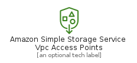
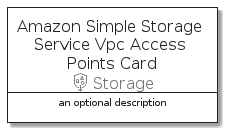

# AmazonSimpleStorageServiceVpcAccessPoints


```text
aws-20210131/Resource/Storage/AmazonSimpleStorageServiceVpcAccessPoints
```

```text
include('aws-20210131/Resource/Storage/AmazonSimpleStorageServiceVpcAccessPoints')
```


| Illustration | AmazonSimpleStorageServiceVpcAccessPoints | AmazonSimpleStorageServiceVpcAccessPointsCard | AmazonSimpleStorageServiceVpcAccessPointsGroup |
| :---: | :---: | :---: | :---: |
|  |  |  |  |


## AmazonSimpleStorageServiceVpcAccessPoints

### Load remotely
```plantuml
@startuml
' configures the library
!global $LIB_BASE_LOCATION="https://github.com/tmorin/plantuml-libs/distribution"

' loads the library's bootstrap
!include $LIB_BASE_LOCATION/bootstrap.puml

' loads the package bootstrap
include('aws-20210131/bootstrap')

' loads the Item which embeds the element AmazonSimpleStorageServiceVpcAccessPoints
include('aws-20210131/Resource/Storage/AmazonSimpleStorageServiceVpcAccessPoints')

' renders the element
AmazonSimpleStorageServiceVpcAccessPoints('AmazonSimpleStorageServiceVpcAccessPoints', 'Amazon Simple Storage Service Vpc Access Points', 'an optional tech label')
@enduml
```

### Load locally
```plantuml
@startuml
' configures the library
!global $INCLUSION_MODE="local"
!global $LIB_BASE_LOCATION="../../.."

' loads the library's bootstrap
!include $LIB_BASE_LOCATION/bootstrap.puml

' loads the package bootstrap
include('aws-20210131/bootstrap')

' loads the Item which embeds the element AmazonSimpleStorageServiceVpcAccessPoints
include('aws-20210131/Resource/Storage/AmazonSimpleStorageServiceVpcAccessPoints')

' renders the element
AmazonSimpleStorageServiceVpcAccessPoints('AmazonSimpleStorageServiceVpcAccessPoints', 'Amazon Simple Storage Service Vpc Access Points', 'an optional tech label')
@enduml
```

## AmazonSimpleStorageServiceVpcAccessPointsCard

### Load remotely
```plantuml
@startuml
' configures the library
!global $LIB_BASE_LOCATION="https://github.com/tmorin/plantuml-libs/distribution"

' loads the library's bootstrap
!include $LIB_BASE_LOCATION/bootstrap.puml

' loads the package bootstrap
include('aws-20210131/bootstrap')

' loads the Item which embeds the element AmazonSimpleStorageServiceVpcAccessPointsCard
include('aws-20210131/Resource/Storage/AmazonSimpleStorageServiceVpcAccessPoints')

' renders the element
AmazonSimpleStorageServiceVpcAccessPointsCard('AmazonSimpleStorageServiceVpcAccessPointsCard', 'Amazon Simple Storage Service Vpc Access Points Card', 'an optional description')
@enduml
```

### Load locally
```plantuml
@startuml
' configures the library
!global $INCLUSION_MODE="local"
!global $LIB_BASE_LOCATION="../../.."

' loads the library's bootstrap
!include $LIB_BASE_LOCATION/bootstrap.puml

' loads the package bootstrap
include('aws-20210131/bootstrap')

' loads the Item which embeds the element AmazonSimpleStorageServiceVpcAccessPointsCard
include('aws-20210131/Resource/Storage/AmazonSimpleStorageServiceVpcAccessPoints')

' renders the element
AmazonSimpleStorageServiceVpcAccessPointsCard('AmazonSimpleStorageServiceVpcAccessPointsCard', 'Amazon Simple Storage Service Vpc Access Points Card', 'an optional description')
@enduml
```

## AmazonSimpleStorageServiceVpcAccessPointsGroup

### Load remotely
```plantuml
@startuml
' configures the library
!global $LIB_BASE_LOCATION="https://github.com/tmorin/plantuml-libs/distribution"

' loads the library's bootstrap
!include $LIB_BASE_LOCATION/bootstrap.puml

' loads the package bootstrap
include('aws-20210131/bootstrap')

' loads the Item which embeds the element AmazonSimpleStorageServiceVpcAccessPointsGroup
include('aws-20210131/Resource/Storage/AmazonSimpleStorageServiceVpcAccessPoints')

' renders the element
AmazonSimpleStorageServiceVpcAccessPointsGroup('AmazonSimpleStorageServiceVpcAccessPointsGroup', 'Amazon Simple Storage Service Vpc Access Points Group', 'an optional tech label') {
    note as note
        the content of the group
    end note
}
@enduml
```

### Load locally
```plantuml
@startuml
' configures the library
!global $INCLUSION_MODE="local"
!global $LIB_BASE_LOCATION="../../.."

' loads the library's bootstrap
!include $LIB_BASE_LOCATION/bootstrap.puml

' loads the package bootstrap
include('aws-20210131/bootstrap')

' loads the Item which embeds the element AmazonSimpleStorageServiceVpcAccessPointsGroup
include('aws-20210131/Resource/Storage/AmazonSimpleStorageServiceVpcAccessPoints')

' renders the element
AmazonSimpleStorageServiceVpcAccessPointsGroup('AmazonSimpleStorageServiceVpcAccessPointsGroup', 'Amazon Simple Storage Service Vpc Access Points Group', 'an optional tech label') {
    note as note
        the content of the group
    end note
}
@enduml
```

