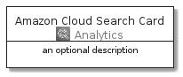
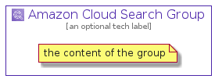

# AmazonCloudSearch


```text
aws-20210730/Architecture/Analytics/AmazonCloudSearch
```

```text
include('aws-20210730/Architecture/Analytics/AmazonCloudSearch')
```


| Illustration | AmazonCloudSearch | AmazonCloudSearchCard | AmazonCloudSearchGroup |
| :---: | :---: | :---: | :---: |
|  |  |  |  |


## AmazonCloudSearch

### Load remotely
```plantuml
@startuml
' configures the library
!global $LIB_BASE_LOCATION="https://raw.githubusercontent.com/tmorin/plantuml-libs/master/distribution"

' loads the library's bootstrap
!include $LIB_BASE_LOCATION/bootstrap.puml

' loads the package bootstrap
include('aws-20210730/bootstrap')

' loads the Item which embeds the element AmazonCloudSearch
include('aws-20210730/Architecture/Analytics/AmazonCloudSearch')

' renders the element
AmazonCloudSearch('AmazonCloudSearch', 'Amazon Cloud Search', 'an optional tech label')
@enduml
```

### Load locally
```plantuml
@startuml
' configures the library
!global $INCLUSION_MODE="local"
!global $LIB_BASE_LOCATION="../../.."

' loads the library's bootstrap
!include $LIB_BASE_LOCATION/bootstrap.puml

' loads the package bootstrap
include('aws-20210730/bootstrap')

' loads the Item which embeds the element AmazonCloudSearch
include('aws-20210730/Architecture/Analytics/AmazonCloudSearch')

' renders the element
AmazonCloudSearch('AmazonCloudSearch', 'Amazon Cloud Search', 'an optional tech label')
@enduml
```

## AmazonCloudSearchCard

### Load remotely
```plantuml
@startuml
' configures the library
!global $LIB_BASE_LOCATION="https://raw.githubusercontent.com/tmorin/plantuml-libs/master/distribution"

' loads the library's bootstrap
!include $LIB_BASE_LOCATION/bootstrap.puml

' loads the package bootstrap
include('aws-20210730/bootstrap')

' loads the Item which embeds the element AmazonCloudSearchCard
include('aws-20210730/Architecture/Analytics/AmazonCloudSearch')

' renders the element
AmazonCloudSearchCard('AmazonCloudSearchCard', 'Amazon Cloud Search Card', 'an optional description')
@enduml
```

### Load locally
```plantuml
@startuml
' configures the library
!global $INCLUSION_MODE="local"
!global $LIB_BASE_LOCATION="../../.."

' loads the library's bootstrap
!include $LIB_BASE_LOCATION/bootstrap.puml

' loads the package bootstrap
include('aws-20210730/bootstrap')

' loads the Item which embeds the element AmazonCloudSearchCard
include('aws-20210730/Architecture/Analytics/AmazonCloudSearch')

' renders the element
AmazonCloudSearchCard('AmazonCloudSearchCard', 'Amazon Cloud Search Card', 'an optional description')
@enduml
```

## AmazonCloudSearchGroup

### Load remotely
```plantuml
@startuml
' configures the library
!global $LIB_BASE_LOCATION="https://raw.githubusercontent.com/tmorin/plantuml-libs/master/distribution"

' loads the library's bootstrap
!include $LIB_BASE_LOCATION/bootstrap.puml

' loads the package bootstrap
include('aws-20210730/bootstrap')

' loads the Item which embeds the element AmazonCloudSearchGroup
include('aws-20210730/Architecture/Analytics/AmazonCloudSearch')

' renders the element
AmazonCloudSearchGroup('AmazonCloudSearchGroup', 'Amazon Cloud Search Group', 'an optional tech label') {
    note as note
        the content of the group
    end note
}
@enduml
```

### Load locally
```plantuml
@startuml
' configures the library
!global $INCLUSION_MODE="local"
!global $LIB_BASE_LOCATION="../../.."

' loads the library's bootstrap
!include $LIB_BASE_LOCATION/bootstrap.puml

' loads the package bootstrap
include('aws-20210730/bootstrap')

' loads the Item which embeds the element AmazonCloudSearchGroup
include('aws-20210730/Architecture/Analytics/AmazonCloudSearch')

' renders the element
AmazonCloudSearchGroup('AmazonCloudSearchGroup', 'Amazon Cloud Search Group', 'an optional tech label') {
    note as note
        the content of the group
    end note
}
@enduml
```

