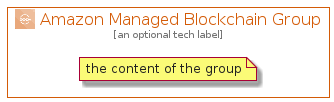

# AmazonManagedBlockchain


```text
aws-20210730/Architecture/Blockchain/AmazonManagedBlockchain
```

```text
include('aws-20210730/Architecture/Blockchain/AmazonManagedBlockchain')
```


| Illustration | AmazonManagedBlockchain | AmazonManagedBlockchainCard | AmazonManagedBlockchainGroup |
| :---: | :---: | :---: | :---: |
|  |  |  |  |


## AmazonManagedBlockchain

### Load remotely
```plantuml
@startuml
' configures the library
!global $LIB_BASE_LOCATION="https://raw.githubusercontent.com/tmorin/plantuml-libs/master/distribution"

' loads the library's bootstrap
!include $LIB_BASE_LOCATION/bootstrap.puml

' loads the package bootstrap
include('aws-20210730/bootstrap')

' loads the Item which embeds the element AmazonManagedBlockchain
include('aws-20210730/Architecture/Blockchain/AmazonManagedBlockchain')

' renders the element
AmazonManagedBlockchain('AmazonManagedBlockchain', 'Amazon Managed Blockchain', 'an optional tech label')
@enduml
```

### Load locally
```plantuml
@startuml
' configures the library
!global $INCLUSION_MODE="local"
!global $LIB_BASE_LOCATION="../../.."

' loads the library's bootstrap
!include $LIB_BASE_LOCATION/bootstrap.puml

' loads the package bootstrap
include('aws-20210730/bootstrap')

' loads the Item which embeds the element AmazonManagedBlockchain
include('aws-20210730/Architecture/Blockchain/AmazonManagedBlockchain')

' renders the element
AmazonManagedBlockchain('AmazonManagedBlockchain', 'Amazon Managed Blockchain', 'an optional tech label')
@enduml
```

## AmazonManagedBlockchainCard

### Load remotely
```plantuml
@startuml
' configures the library
!global $LIB_BASE_LOCATION="https://raw.githubusercontent.com/tmorin/plantuml-libs/master/distribution"

' loads the library's bootstrap
!include $LIB_BASE_LOCATION/bootstrap.puml

' loads the package bootstrap
include('aws-20210730/bootstrap')

' loads the Item which embeds the element AmazonManagedBlockchainCard
include('aws-20210730/Architecture/Blockchain/AmazonManagedBlockchain')

' renders the element
AmazonManagedBlockchainCard('AmazonManagedBlockchainCard', 'Amazon Managed Blockchain Card', 'an optional description')
@enduml
```

### Load locally
```plantuml
@startuml
' configures the library
!global $INCLUSION_MODE="local"
!global $LIB_BASE_LOCATION="../../.."

' loads the library's bootstrap
!include $LIB_BASE_LOCATION/bootstrap.puml

' loads the package bootstrap
include('aws-20210730/bootstrap')

' loads the Item which embeds the element AmazonManagedBlockchainCard
include('aws-20210730/Architecture/Blockchain/AmazonManagedBlockchain')

' renders the element
AmazonManagedBlockchainCard('AmazonManagedBlockchainCard', 'Amazon Managed Blockchain Card', 'an optional description')
@enduml
```

## AmazonManagedBlockchainGroup

### Load remotely
```plantuml
@startuml
' configures the library
!global $LIB_BASE_LOCATION="https://raw.githubusercontent.com/tmorin/plantuml-libs/master/distribution"

' loads the library's bootstrap
!include $LIB_BASE_LOCATION/bootstrap.puml

' loads the package bootstrap
include('aws-20210730/bootstrap')

' loads the Item which embeds the element AmazonManagedBlockchainGroup
include('aws-20210730/Architecture/Blockchain/AmazonManagedBlockchain')

' renders the element
AmazonManagedBlockchainGroup('AmazonManagedBlockchainGroup', 'Amazon Managed Blockchain Group', 'an optional tech label') {
    note as note
        the content of the group
    end note
}
@enduml
```

### Load locally
```plantuml
@startuml
' configures the library
!global $INCLUSION_MODE="local"
!global $LIB_BASE_LOCATION="../../.."

' loads the library's bootstrap
!include $LIB_BASE_LOCATION/bootstrap.puml

' loads the package bootstrap
include('aws-20210730/bootstrap')

' loads the Item which embeds the element AmazonManagedBlockchainGroup
include('aws-20210730/Architecture/Blockchain/AmazonManagedBlockchain')

' renders the element
AmazonManagedBlockchainGroup('AmazonManagedBlockchainGroup', 'Amazon Managed Blockchain Group', 'an optional tech label') {
    note as note
        the content of the group
    end note
}
@enduml
```

